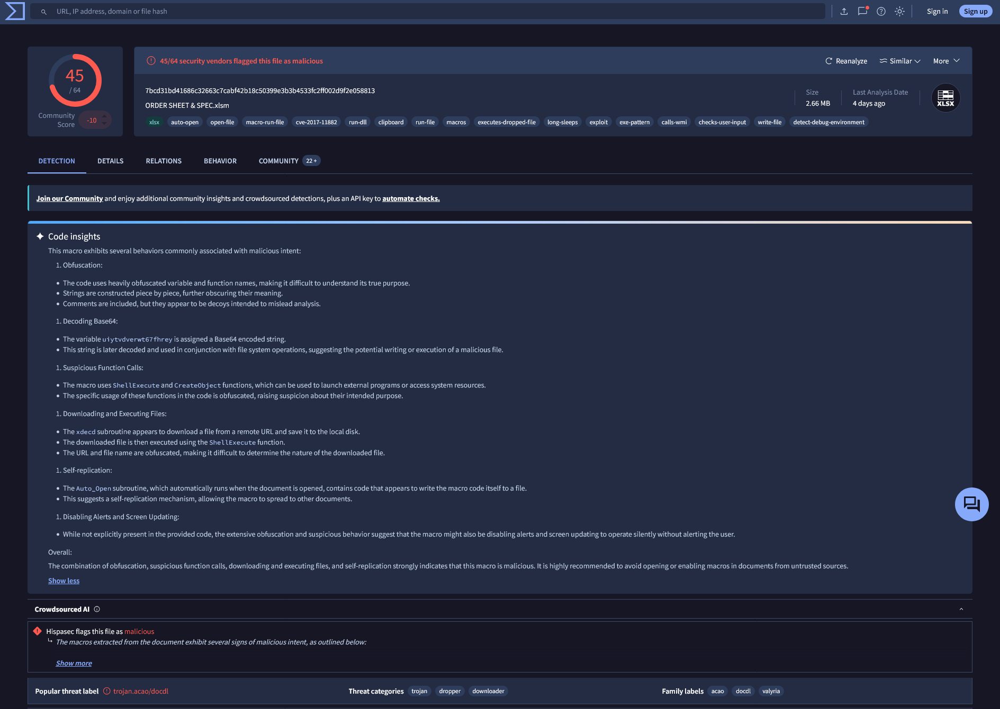
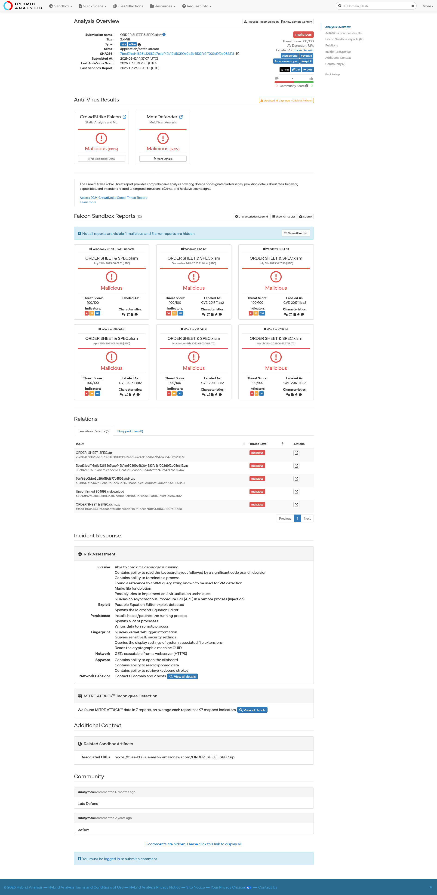
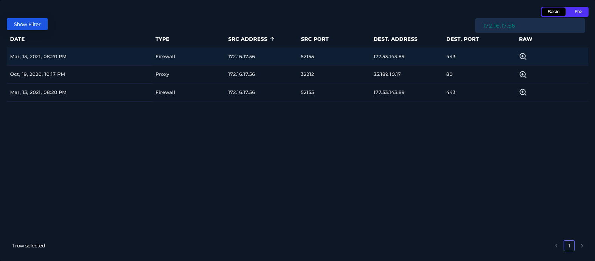
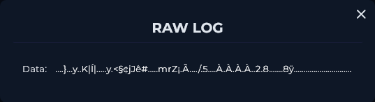
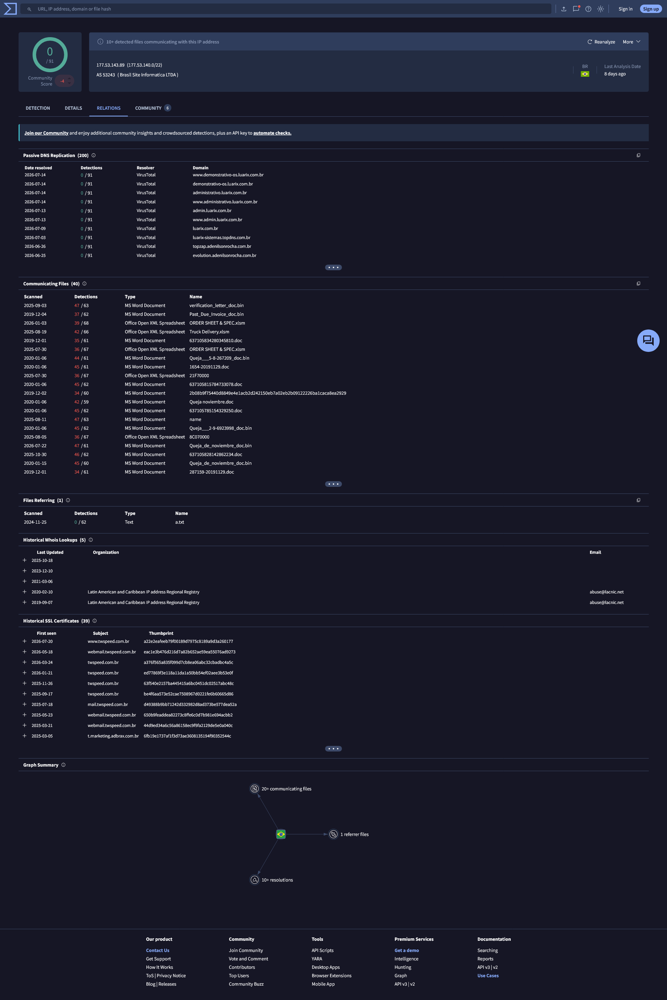
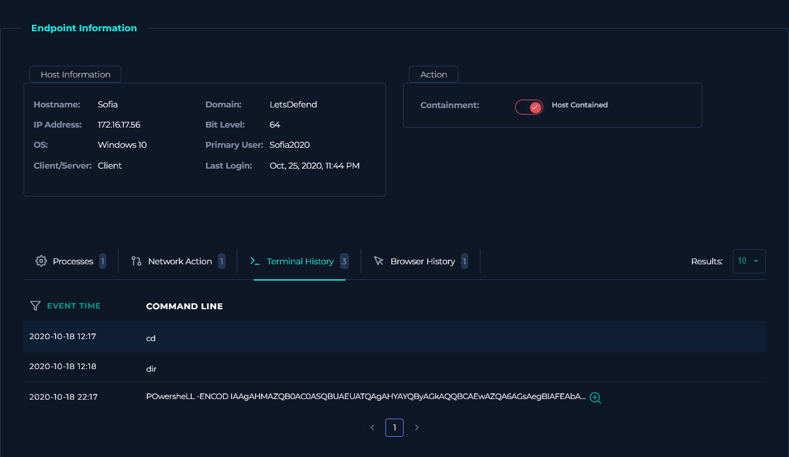
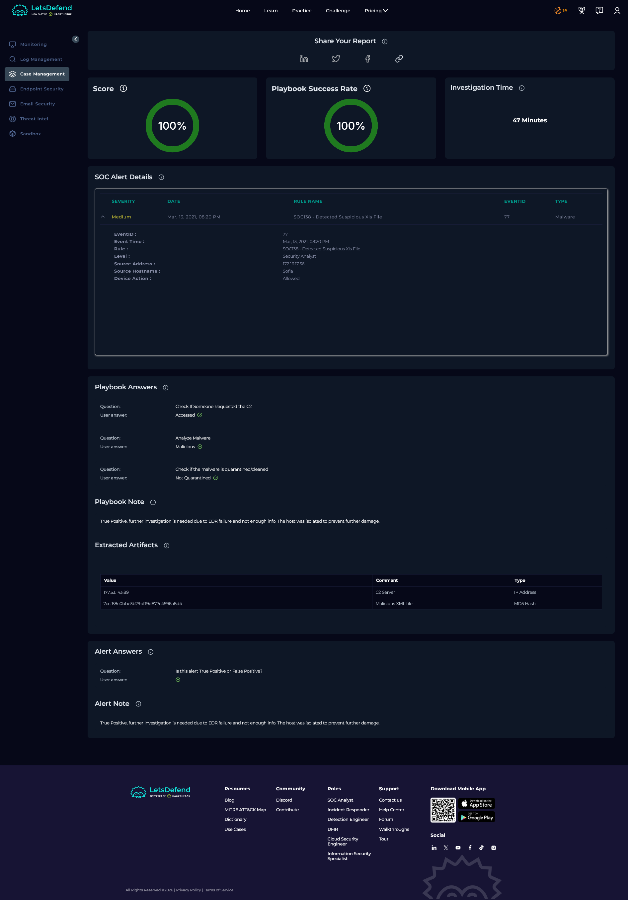

# SOC138 — Detected Suspicious Xls File

| Field | Value |
| --- | --- |
| **Platform** | LetsDefend |
| **Alert ID** | 77 |
| **Alert Time** | March 13, 2021 — 08:20 PM |
| **Category** | Malware / Execution |
| **Verdict** | True Positive — Host Compromised |
| **Status** | Closed |

---

## Executive Summary

An EDR alert fired on host `Sofia` (`172.16.17.56`) for a suspicious macro-enabled Excel file named `ORDER SHEET & SPEC.xlsm`. The file hash confirmed a malicious dropper across multiple sources, tagged for CVE-2017-11882, obfuscation, self-replication, and second-stage payload delivery. SIEM confirmed two outbound HTTPS connections from Sofia to `177.53.143.89` at the exact time of the alert. The endpoint returned no process or browser history matching the incident date. It's unclear whether the EDR agent failed or the host was cleaned before investigation, so the host was isolated and escalated. The delivery method for the file was not determined from available logs.

---

## Kill Chain

### 1. File Hash Verification

The alert provided the MD5 hash `7ccf88c0bbe3b29bf19d877c4596a8d4` for `ORDER SHEET & SPEC.xlsm`.

| Source | Result |
| --- | --- |
| LetsDefend TI | No data returned. |
| VirusTotal | 45/64 vendors flagged the file as malicious. Tags: `xlsx`, `auto-open`, `open-file`, `macro-run-file`, `cve-2017-11882`, `run-dll`, `clipboard`, `run-file`, `macros`, `executes-dropped-file`, `long-sleeps`, `exploit`, `exe-pattern`, `calls-wmi`, `checks-user-input`, `write-file`, `detect-debug-environment`. Popular threat label: Trojan.acao/doc8. Threat categories: trojan, dropper, downloader. Family labels: acao, doc8, valyria. |
| Hybrid Analysis | Confirmed malicious. CrowdStrike Falcon and MetaDefender both returned malicious verdicts. Falcon Sandbox ran the file across six different Windows environments, all returned malicious results labeled CVE-2017-11882. Risk Assessment flagged evasion, exploit, persistence, fingerprinting, network, and spyware behaviors. |

VirusTotal's code insights broke down what the macro actually does:

- **Obfuscation:** Heavily obfuscated variable and function names, strings constructed piece by piece, decoy comments to mislead analysis.
- **Base64 decoding:** A variable is assigned a Base64 string that gets decoded and used with file system operations, consistent with writing or executing a dropped payload.
- **Suspicious function calls:** `Shell Execute` and `CreateObject` used to launch external programs or access system resources, both obfuscated.
- **Download and execute:** The macro downloads a file from a remote URL, saves it to disk, and runs it using `Shell Execute`. The URL and filename are obfuscated.
- **Self-replication:** The `Auto_Open` subroutine, which fires automatically when the document opens, contains code that writes the macro itself to other files. This means the macro can spread to other Office documents on the same host.
- **Silent operation:** Extensive obfuscation and suspicious behavior patterns suggest the macro disables alerts and screen updating to run without notifying the user.

This is the same CVE-2017-11882 vulnerability seen in SOC114. In that case the exploit was delivered via a phishing email attachment. Here the file was already on the host and the delivery method is unknown, but the underlying exploit technique is identical: a crafted Office document abusing the legacy Microsoft Equation Editor to achieve code execution without macros needing to be manually enabled.

---

### 2. Delivery Vector

No email analysis was performed for this alert. The alert type is an EDR file detection on an internal host, not an inbound email event. There is no sender address, SMTP IP, or Email Security Gateway record associated with this alert. How `ORDER SHEET & SPEC.xlsm` arrived on Sofia's machine was not determined from available logs. This is an open gap.

---

### 3. SIEM Log Analysis

Searched Log Management using source IP `172.16.17.56`. Three logs returned.

| Date | Type | Source | Src Port | Destination | Dst Port |
| --- | --- | --- | --- | --- | --- |
| Mar 13, 2021, 08:20 PM | Firewall | 172.16.17.56 | 52155 | 177.53.143.89 | 443 |
| Mar 13, 2021, 08:20 PM | Firewall | 172.16.17.56 | 52155 | 177.53.143.89 | 443 |
| Oct 19, 2020, 10:17 PM | Proxy | 172.16.17.56 | 32212 | 35.189.10.17 | 80 |

The two March 13 firewall entries are what matter here. Both show Sofia making an outbound HTTPS connection to `177.53.143.89:443` at exactly the time the alert fired. The raw logs came back encoded and unreadable in the platform, but the connection itself is confirmed. Both entries are duplicates of the same connection rather than two separate sessions, a logging artifact rather than two distinct events.

The October 2020 proxy entry is from five months before the alert, hits a completely different destination, and has no connection to this incident. Left in for completeness, not treated as related.

I queried `177.53.143.89` in VirusTotal. Zero vendor detections, community score slightly negative. The IP resolves to Brazil Site Informática LTDA (AS 53242). Passive DNS shows over 300 resolved domains, mostly Brazilian commercial sites (`luario.com.br`, `twpeed.com.br` subdomains, various `.com.br` domains). The Communicating Files tab shows 40 files, including several MS Word documents and Office Open XML spreadsheets with detection counts in the 40-47/62 range. One of those communicating files is `ORDER SHEET & SPEC.xlsm` itself, confirming this IP is the C2 destination for this specific malware family, not just an incidentally flagged host.

---

### 4. Endpoint Analysis (EDR)

Checked Sofia's host (`172.16.17.56`, Windows 10, Primary User: Sofia2020) in Endpoint Security. Host containment was already toggled on at the time of review.

**Processes:** One entry, no event timestamp. Nothing matching the incident timeframe.

**Network Action:** One entry. No event timestamp. Does not correlate with the March 13, 2021 SIEM logs.

**Browser History:** One entry. No event timestamp. No visits to any domain or IP from this investigation.

**Terminal History:** Three entries, all dated October 18, 2020, five months before the alert:

| Time | Command |
| --- | --- |
| 2020-10-18 12:17 | `cd` |
| 2020-10-18 12:18 | `dir` |
| 2020-10-18 22:17 | `POWersheLL -ENCOD IAAgAHMAZQB0AC0ASQBUAEUATQAgAHYAYQByAGkAQQBCAEwAZQA6AGs...` |

The first two commands are basic directory navigation. The third is `PowerShell -EncodedCommand`, the same fileless execution technique seen in SOC205 and SOC114 where a Base64 payload is passed directly to PowerShell without writing a script file to disk. This command is from October 2020 and has no timestamp connection to this alert, so it's not part of this incident's chain. It's documented here because it's on the same host and suggests this machine may have had prior suspicious activity that was never fully investigated or cleaned up.

None of the EDR data matches the March 13, 2021 incident timeframe. This is either an EDR agent failure that left a visibility gap exactly when the file executed, or the host was cleaned before investigation. Neither can be ruled out without hands-on forensics, which is why containment and escalation are the right calls here rather than assuming the host is clean.

Last login: October 25, 2020, 11:44 PM. This is also five months before the alert, which is unusual for an active workstation and worth flagging to Tier 2.

---

## Containment & Remediation

**Containment**

- Host `Sofia` (`172.16.17.56`) was isolated via the EDR platform.

**Remediation**

- Escalate to Tier 2 for full forensic investigation and reimaging. The EDR visibility gap covering the entire incident window means the scope of execution and any lateral movement cannot be assessed from available logs.
- Resolve the EDR agent issue on this host before reimaging, then verify agent health across the fleet to identify any other machines with the same gap.
- Block `177.53.143.89` on inbound and outbound traffic at the perimeter firewall.
- Perform dynamic analysis on the attachment to confirm the full execution chain and identify any additional C2 infrastructure not visible in the current logs.
- Investigate how `ORDER SHEET & SPEC.xlsm` arrived on Sofia's machine. No delivery vector was identified, whether it came in via email, a shared network drive, USB, or some other path needs to be determined before this case can be closed.
- Disable macros in Microsoft Office across the organisation if it doesn't conflict with business operations. The file's `Auto_Open` behavior means a user doesn't need to manually enable macros for the infection to begin on unprotected configurations.
- Patch or remove `EQNEDT32.EXE` (the legacy Equation Editor) across all Windows endpoints. Microsoft's recommended remediation for CVE-2017-11882 is to remove the component entirely.

---

## Playbook Notes

**EDR data gap:** All endpoint data predates the alert by roughly five months. No processes, network actions, or browser history correlate to March 13, 2021. The host was isolated regardless since the SIEM independently confirmed a C2 connection at the time of the alert, and the absence of EDR data can't be treated as a clean result.

**Delivery vector unknown:** This alert came in as an EDR file detection, not an inbound email event. No email analysis was performed and no delivery mechanism was identified in the available logs. This is an unresolved gap that Tier 2 needs to address.

**Historical PowerShell command:** The October 18, 2020 encoded PowerShell entry in Terminal History predates this alert and has no confirmed connection to this incident. It's flagged here because it's on the same host and suggests prior suspicious activity that may not have been investigated or fully resolved.

**C2 IP confirmed via VirusTotal relations, not just SIEM:** `177.53.143.89` was independently confirmed as a C2 host for this malware family through VirusTotal's Communicating Files tab, which shows the exact file from this alert as one of the files contacting that IP. The SIEM connection and the VT relations data together make this the strongest IOC in the report.

---

## Indicators of Compromise (IOCs)

| Type | Value | Note |
| --- | --- | --- |
| Malicious File | `ORDER SHEET & SPEC.xlsm` | Macro-enabled Excel file, dropper/downloader |
| File Hash (MD5) | `7ccf88c0bbe3b29bf19d877c4596a8d4` | 45/64 VT detections |
| C2 IP | `177.53.143.89` | Confirmed via SIEM firewall log and VirusTotal communicating files |

---

## MITRE ATT&CK Mapping

| Tactic | Technique |
| --- | --- |
| Execution | T1204.002 — User Execution: Malicious File |
| Execution | T1203 — Exploitation for Client Execution (CVE-2017-11882 via EQNEDT32.EXE) |
| Execution | T1059.001 — Command and Scripting Interpreter: PowerShell (encoded command, October 2020 terminal history) |
| Defense Evasion | T1027 — Obfuscated Files or Information (heavily obfuscated macro, Base64-encoded payload string) |
| Persistence | T1547 — Boot or Logon Autostart Execution (macro self-replication via Auto_Open) |
| Command and Control | T1071.001 — Application Layer Protocol: Web Protocols (outbound HTTPS to 177.53.143.89:443) |

T1059.001 is mapped to the October 2020 terminal history entry, not a confirmed execution from the March 13 incident. It's included because it's on the same host and indicates prior PowerShell-based activity, but I'm noting that distinction rather than presenting it as part of this alert's confirmed execution chain.

---

---

*Written by: Supawat H. (uriel0byte) | LetsDefend SOC Practice*
