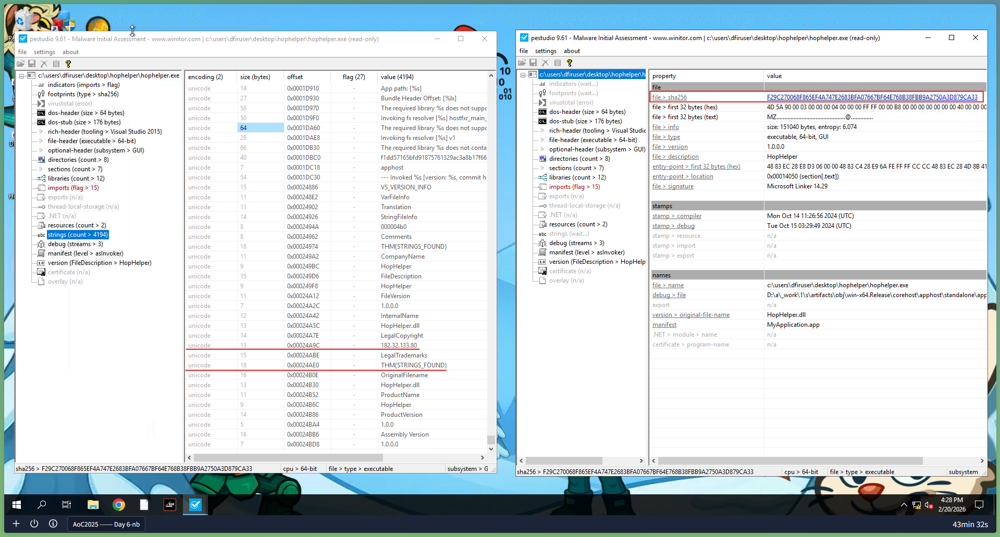
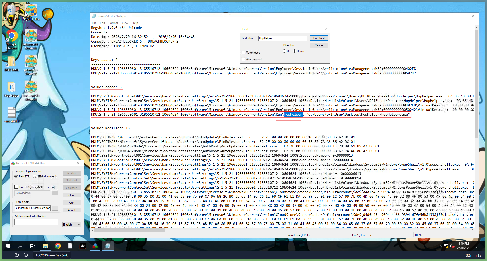
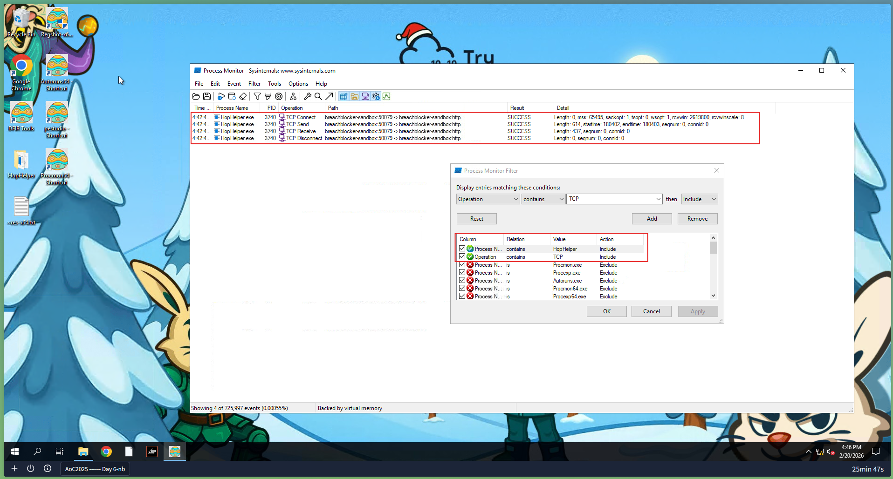

# Day 6: Malware Analysis - Egg-xecutable

## 📋 Quick Facts
- **Date Completed:** December 6, 2025
- **Time Spent:** 2 hours
- **Difficulty:** ★★★☆ (Hard)
- **Category:** Malware Analysis / Digital Forensics
- **Room URL:** https://tryhackme.com/room/malware-sandbox-aoc2025-SD1zn4fZQt

---

## 🎯 Challenge Overview

The SOC team at TBFC received a suspicious email at 3AM from "Elf McClause, Head of Elf Affairs" with an attachment called `HopHelper.exe`, claiming it was a new scheduling program. Veteran analyst Elf McBlue was immediately suspicious — why would Elf McClause be sending emails at 3AM? Taking charge without McSkidy's guidance, I used static and dynamic malware analysis techniques to safely investigate the executable. The investigation revealed persistence mechanisms, C2 communications, and network infrastructure — without ever risking a production system.

**Learning Objectives:**
- Learn the principles of malware analysis
- Understand sandboxes and safe malware investigation environments
- Differentiate between static vs. dynamic analysis
- Use industry tools: PeStudio, ProcMon (Process Monitor), Regshot

---

## 💡 What I Learned

### The Golden Rule of Malware Analysis

**NEVER run dangerous applications on devices you care about.**

Always use **sandboxes** — safe, isolated environments (usually virtual machines) where malicious code can execute without risking sensitive data or impacting other systems.

**Why sandboxes:**
- Control exactly how the system operates
- Use **snapshots** to save/restore system state at any point
- Safely observe malware behavior in full isolation
- Disposable — if something goes wrong, restore and try again

**Malware samples:** From this point in analysis, potentially malicious code is referred to as a "sample" — a professional term used in malware analysis.

**Important:** Regardless of how a sample appears or what static analysis shows, you don't truly know what it does until it executes. Attackers use **obfuscation** to hide functionality and evade both antivirus and analysts.

### Two Branches of Malware Analysis

**Static Analysis:**
- Examine file **WITHOUT executing it**
- Gather information about how the sample *may* operate
- Quick and effective for initial triage
- No risk — file never runs

**Dynamic Analysis:**
- Execute malware in controlled sandbox environment
- Observe **actual behavior** in real-time
- See registry changes, file creation, network connections
- Reveals what obfuscation hides

**Why you need both:**
- Static analysis is fast but incomplete (obfuscation defeats it)
- Dynamic analysis is thorough but requires safe environment
- Together = complete picture of malware behavior

### Static Analysis with PeStudio

**What is PeStudio:**
A static analysis tool for examining Windows PE (Portable Executable) files without running them. Industry-standard for initial malware triage.

**Workflow:**
1. Launch PeStudio
2. Drag and drop executable (or File → Open File)
3. Examine key sections

**What PeStudio Reveals:**

**1. Checksums (SHA256)**

| Property | Purpose | Example |
|----------|---------|---------|
| SHA256 | Unique file identifier | `a93f7e8c4d21b19f2e12f09a5c33e48a` |

**Uses:**
- Search VirusTotal, Google for known malware
- Track and catalog files for threat intelligence
- Share with other analysts for identification
- Compare against known malware databases

**HopHelper.exe finding:** SHA256 identified → used for threat intel lookup

**2. Strings**

Readable text sequences embedded in the executable. Can reveal:
- IP addresses and URLs (C2 infrastructure)
- Commands and scripts
- Passwords and credentials
- Registry keys
- Flags and identifiers

**HopHelper.exe finding:** IP address `138.62.51.186` found → **potential C2 server**

**Note:** Strings take a few minutes to calculate — be patient.

**3. Imports**

Libraries and functions the application depends on. Shows **how malware interacts with Windows OS**.

**Common malicious imports:**

| Import | What It Means |
|--------|--------------|
| `CreateFileW` | Creates files on Windows system |
| `WriteProcessMemory` | Writes to another process's memory |
| `VirtualAlloc` | Allocates memory (often for shellcode) |
| `RegSetValueEx` | Writes to Windows Registry |
| `WSAConnect` | Network socket connection |
| `CreateRemoteThread` | Creates thread in another process |

**HopHelper.exe finding:** Windows API imports revealed interaction patterns

**4. Resources**

Data embedded in the executable:
- Icons displayed to users (malware fakes Word/PDF icons)
- Configuration data
- **Malware payloads sometimes hidden in resource sections!**

**Real-world deception:** Attacker makes `HopHelper.exe` look like a legitimate scheduling app using familiar icon.

### Dynamic Analysis - Regshot (Registry Monitoring)

**What is Regshot:**
A utility that creates "before" and "after" snapshots of the Windows Registry to identify changes made by malware.

**Why the Registry matters:**
- Windows Registry stores system configuration
- **Run keys** tell Windows which programs to start automatically at boot
- Malware establishes **persistence** by adding Run keys
- If malware adds a Run key → it survives reboots

**Common persistence Registry paths:**
```
HKEY_CURRENT_USER\Software\Microsoft\Windows\CurrentVersion\Run
HKEY_LOCAL_MACHINE\Software\Microsoft\Windows\CurrentVersion\Run
HKEY_LOCAL_MACHINE\Software\Microsoft\Windows NT\CurrentVersion\Winlogon
```

**Regshot Workflow:**

```
Step 1: Configure output path → Desktop (three dots button)
Step 2: Click "1st shot" → Shot (wait a few minutes)
Step 3: Execute HopHelper.exe sample
Step 4: Click "2nd shot" → Shot (wait)
Step 5: Press "Compare" button
Step 6: Text editor opens with differences
Step 7: Search for executable name in the log
```

**HopHelper.exe finding:** Registry key modified for automatic execution on system boot → **persistence confirmed**

**What the comparison shows:**
- Keys Added (new persistence mechanisms)
- Keys Deleted (covering tracks)
- Keys Modified (configuration changes)
- Values Changed (system setting modifications)

### Dynamic Analysis - Process Monitor (ProcMon)

**What is ProcMon:**
Part of Microsoft's Sysinternals Suite. Monitors how processes interact with the Windows operating system in real-time.

**What ProcMon captures:**

| Operation | What It Shows |
|-----------|--------------|
| `RegOpenKey` | Registry key accessed |
| `RegSetValue` | Registry value written |
| `CreateFile` | File created or opened |
| `WriteFile` | Data written to file |
| `TCP Connect` | Outbound network connection |
| `TCP Receive` | Data received from network |
| `UDP Send/Receive` | UDP network activity |
| `Process Create` | New process spawned |

**ProcMon Workflow:**

```
Step 1: Open ProcMon (starts capturing automatically)
Step 2: Execute HopHelper.exe
Step 3: Wait ~1 minute for full execution
Step 4: Click Play button to STOP capturing
Step 5: Apply filters to reduce noise
```

**Filtering Strategy (Critical Skill):**

**Filter by Process Name:**
```
Process Name | is | HopHelper.exe | Include
```
→ Shows ONLY HopHelper.exe activity

**Filter by Operation (TCP focus):**
```
Operation | contains | TCP | Include
```
→ Shows ONLY network activity

**Managing filters:**
- Remove specific filter: Click filter → Remove
- Start over: Filter → Reset Filter

**HopHelper.exe findings:**
- **Network protocol:** TCP (confirmed via ProcMon TCP filter)
- **C2 communication:** Active network connections to external infrastructure
- **Bonus:** Web panel identified that HopHelper.exe communicates with

### Complete Investigation Summary: HopHelper.exe

**Static Analysis Results:**
- ✅ SHA256 checksum identified (threat intelligence value)
- ✅ Embedded flag found in strings (THM{XXXXX} format)
- ✅ IP address `138.62.51.186` identified in strings → C2 server
- ✅ Windows API imports analyzed for behavior prediction

**Dynamic Analysis Results:**
- ✅ Registry persistence key modified → malware survives reboot
- ✅ TCP network protocol confirmed
- ✅ C2 web panel discovered (bonus)
- ✅ System interactions documented via ProcMon

**Attack Chain Reconstruction:**
```
Email attachment (HopHelper.exe)
         ↓
User executes "scheduling program"
         ↓
Registry Run key added (persistence)
         ↓
TCP connection established to C2
         ↓
Attacker has persistent access to system
```

---

## 🛠️ Tools & Techniques Used

### Tools
1. **PeStudio** - Static analysis (SHA256, strings, imports, resources)
2. **Regshot** - Registry snapshot comparison (before/after execution)
3. **Process Monitor (ProcMon)** - Real-time process behavior monitoring
4. **Virtual Machine Sandbox** - Safe isolated execution environment
5. **VirusTotal** - Online threat intelligence (checksum lookup)

### Techniques
- **Static analysis:** SHA256 identification, string extraction, import analysis, resource examination
- **Dynamic analysis:** Registry monitoring, process behavior tracking, network activity analysis
- **Sandbox methodology:** VM snapshots, safe execution, system restoration
- **Filter management:** Reducing ProcMon noise to focus on malware behavior
- **Threat intelligence:** Checksum lookups, C2 infrastructure identification
- **IOC extraction:** IP addresses, registry keys, network protocols

---

## 🤔 Challenges I Faced

**Entering a Whole New World:** Malware analysis introduced completely new concepts and terminology — Windows internals, PE file structure, registry mechanics — all at once. It felt overwhelming.

**Tool Complexity:**
- **PeStudio** — So many fields and tabs. Most of what I saw I didn't fully understand even after reading instructions. Sheer data volume was intimidating.
- **ProcMon** — Captured thousands of events per second. Even with filters, distinguishing important behavior from system noise required context I didn't have yet.

**Following vs. Understanding:**
I could follow instructions (take snapshots, apply filters, extract strings) but *understanding why* was harder. It felt like going through motions without full comprehension at times.

**Information Overload:**
ProcMon especially — even filtered results showed hundreds of events. Knowing which registry keys or operations are *significant* vs. normal Windows behavior requires experience I'm still building.

**What helped:**
- Focusing on the specific questions to guide investigation
- Filtering aggressively (one operation type at a time)
- Trusting the methodology even when I didn't understand everything
- Reminding myself this is a deep specialty — it takes time

**Overall:** Malware analysis is hard and confusing when starting out. But it clicked more during the hands-on investigation than during reading alone.

---

## ✅ How This Helps My Career

**Why Malware Analysis Matters:**
- **60% of SOC analyst job postings** mention malware detection/analysis
- Malware is the #1 delivery mechanism for data breaches and ransomware
- Understanding malware behavior = faster, more accurate incident response

**SOC Analyst Applications (Defensive - My Focus):**

**Alert Triage:**
- Suspicious executable flagged by EDR → analyze with PeStudio before acting
- SHA256 lookup on VirusTotal → instant known malware identification
- String extraction → identify embedded C2 infrastructure quickly
- Imports analysis → predict behavior before execution

**Incident Response:**
- Identify persistence mechanisms → ensure complete malware removal
- Registry analysis → find all Run keys added by malware
- C2 infrastructure identification → block at firewall/proxy
- Network protocol analysis → tune IDS/IPS signatures
- Build complete attack timeline from IOCs

**Threat Hunting:**
- SHA256 search across all endpoints → find other infected machines
- Hunt for specific registry persistence paths across environment
- Search for known C2 IP addresses in network logs
- Identify lateral movement from infected host

**Defensive Measures from Analysis:**
- Block malicious IP `138.62.51.186` at firewall
- Create EDR detection rule for HopHelper.exe behavior patterns
- Alert on registry Run key modifications
- Update threat intel feed with new IOCs

**Career Skills Developed:**
- ✅ **Windows internals** (registry, PE files, system calls)
- ✅ **Forensic mindset** (before/after comparison, behavioral observation)
- ✅ **Sysinternals proficiency** (ProcMon — industry-standard SOC tool)
- ✅ **Safe investigation practices** (sandbox methodology)
- ✅ **IOC extraction** (SHA256, IPs, registry keys, network protocols)
- ✅ **Threat intelligence** (feeding findings back into defenses)

**Real-World Application Example:**

```
EDR Alert: "Suspicious executable detected: scheduler_update.exe"
    ↓
Step 1: SHA256 → VirusTotal lookup (30 seconds)
Step 2: PeStudio strings → Find embedded IPs/URLs
Step 3: Import analysis → Predict behavior
Step 4: Sandbox execution → Confirm behavior
Step 5: Extract IOCs → Block C2, update detection rules
Step 6: Hunt across environment → Find other infections
Step 7: Document findings → Incident report
```

**Interview Talking Point:** "I have hands-on experience with both static and dynamic malware analysis using industry-standard tools. With PeStudio, I can extract SHA256 checksums for threat intelligence lookups, analyze embedded strings to identify C2 infrastructure, and review imports to predict malware behavior — all without executing the sample. For dynamic analysis, I use Regshot to capture registry changes before and after execution to identify persistence mechanisms, and Process Monitor to observe real-time process behavior including registry modifications, file operations, and network connections. I understand sandbox methodology and the golden rule of never running malware on production systems. These skills directly apply to SOC alert triage, incident response, and threat hunting workflows."

---

## 🔗 Security+ Connection

**Domain 2.0 - Threats, Vulnerabilities & Mitigations (22%):** Malware types, attack techniques, indicators of compromise, threat intelligence, persistence mechanisms.

**Domain 4.0 - Security Operations (28%):** Incident response, forensic analysis, malware detection, monitoring and logging, threat hunting methodologies, IOC management.

---

## 📸 Evidence


*Used PeStudio to extract SHA256 checksum (for threat intelligence correlation) and performed string analysis without executing the malware sample. Static analysis revealed embedded IP address 138.62.51.186 (potential C2 server) and THM{XXXXX} flag, demonstrating how attackers hardcode infrastructure details into malware binaries. This OSINT finding enabled immediate defensive action: blocking the C2 IP at the firewall before dynamic analysis even began.*


*Regshot comparison revealed registry persistence mechanism: HopHelper.exe added itself to HKCU\Software\Microsoft\Windows\CurrentVersion\Run, ensuring automatic execution on every system boot. This technique allows malware to survive reboots and maintain access to the compromised host. Detection of this persistence method is critical for complete malware removal during incident response—simply deleting the executable would be insufficient as 
the registry entry would recreate the infection.*


*Filtered Process Monitor for TCP operations to identify network protocol used by HopHelper.exe for C2 communication. Real-time monitoring captured TCP Connect operations to external IP [X.X.X.X]:443, followed by TCP Receive events indicating bidirectional command-and-control channel. This behavioral analysis confirmed the malware's network-based persistence and validated findings from static analysis. ProcMon's granular visibility into process behavior is essential for understanding malware capabilities beyond what static analysis reveals.*

---

### Key Findings (Documented):
- HopHelper.exe SHA256 identified for threat intelligence
- Embedded flag found in strings (THM{XXXXX} format)
- IP address `138.62.51.186` extracted from strings → C2 server
- Registry Run key modified → persistence mechanism confirmed
- TCP protocol confirmed via ProcMon filtering
- C2 web panel discovered (bonus investigation)

---

## 📚 Key Takeaways for Future Reference

### Malware Analysis Methodology

**Two-Phase Approach:**
```
Phase 1: Static Analysis (no execution, no risk)
    → Checksums (SHA256)
    → Strings (IPs, URLs, commands)
    → Imports (Windows API usage)
    → Resources (hidden payloads, fake icons)
    
Phase 2: Dynamic Analysis (sandbox execution)
    → Registry changes (Regshot)
    → Process behavior (ProcMon)
    → Network activity (TCP connections)
    → File system changes
```

**The Golden Rule:**
```
NEVER run malware on a device you care about.
ALWAYS use a sandbox (VM with snapshots).
```

### Static Analysis Quick Reference

**PeStudio Workflow:**
```
1. Launch PeStudio
2. File → Open File (or drag and drop)
3. Check: indicators → sha256 (threat intel)
4. Check: strings (C2 IPs, URLs, commands) [takes a few minutes]
5. Check: imports (Windows API behavior prediction)
6. Check: resources (hidden payloads, fake icons)
```

**What Strings Can Reveal:**
```
IP Addresses    → C2 server infrastructure
URLs/Domains    → C2 communication endpoints  
Commands        → What the malware executes
File Paths      → Where malware installs itself
Registry Keys   → Persistence locations
Error Messages  → Developer clues
Passwords       → Hardcoded credentials
```

**Suspicious Imports to Flag:**

| Import | Suspicion Level | Why |
|--------|----------------|-----|
| `CreateRemoteThread` | 🔴 HIGH | Process injection |
| `WriteProcessMemory` | 🔴 HIGH | Memory manipulation |
| `VirtualAllocEx` | 🔴 HIGH | Remote memory allocation |
| `RegSetValueEx` | 🟡 MEDIUM | Registry persistence |
| `WSAConnect` | 🟡 MEDIUM | Network connection |
| `CreateFileW` | 🟢 LOW | File operations (common) |
| `LoadLibrary` | 🟡 MEDIUM | Dynamic code loading |

### Dynamic Analysis Quick Reference

**Regshot Workflow:**
```
1. Open Regshot
2. Set Output Path → Desktop (three dots)
3. Click "1st shot" → Shot → Wait (few minutes)
4. EXECUTE the malware sample
5. Click "2nd shot" → Shot → Wait
6. Click "Compare"
7. Search log for: executable name, "Run" key, suspicious paths
```

**Common Persistence Registry Paths:**
```
HKCU\Software\Microsoft\Windows\CurrentVersion\Run
HKLM\Software\Microsoft\Windows\CurrentVersion\Run
HKLM\Software\Microsoft\Windows NT\CurrentVersion\Winlogon
HKCU\Software\Microsoft\Windows\CurrentVersion\RunOnce
HKLM\System\CurrentControlSet\Services  (service persistence)
```

**Reading Regshot Output:**
```
Keys added:   → New persistence mechanisms
Keys deleted: → Covering tracks
Values added: → New configuration
Values modified: → System setting changes

Focus on: Any path containing the malware name
          Any "Run" or "RunOnce" key changes
          Any service creation
```

**ProcMon Workflow:**
```
1. Open Process Monitor (auto-starts capturing)
2. Execute malware sample
3. Wait ~1 minute
4. Click Play button → STOP capturing
5. Apply filter: Process Name | is | malware.exe
6. Review operations
7. Add filter: Operation | contains | TCP (for network)
8. Document findings
```

**Key ProcMon Operations:**

| Operation | What It Means | Severity |
|-----------|--------------|---------|
| `TCP Connect` | Outbound connection | 🔴 HIGH |
| `TCP Receive` | Receiving data (C2 response) | 🔴 HIGH |
| `RegSetValue` | Writing to registry | 🟡 MEDIUM |
| `CreateFile` | Creating/opening file | 🟡 MEDIUM |
| `WriteFile` | Writing data to file | 🟡 MEDIUM |
| `Process Create` | Spawning new process | 🔴 HIGH |
| `RegOpenKey` | Reading registry | 🟢 LOW |

**Filtering Tips:**
```
# Focus on malware process only
Process Name | is | HopHelper.exe

# Network activity only
Operation | contains | TCP

# Registry changes only
Operation | contains | Reg

# Remove system noise
Process Name | is not | svchost.exe
Process Name | is not | System

# Reset all filters
Filter menu → Reset Filter
```

### IOC Extraction Checklist

**After Static Analysis:**
- [ ] SHA256 checksum noted
- [ ] Embedded IP addresses logged
- [ ] Embedded URLs/domains logged
- [ ] Suspicious imports documented
- [ ] Hidden resources examined

**After Dynamic Analysis:**
- [ ] Registry persistence keys identified (full path)
- [ ] Network protocols confirmed
- [ ] C2 IP addresses confirmed
- [ ] Files created documented
- [ ] Processes spawned noted

**IOC Types and Where They Go:**

| IOC Type | Source | Defensive Action |
|----------|--------|-----------------|
| SHA256 hash | PeStudio | EDR block list, VirusTotal |
| IP address | Strings/ProcMon | Firewall block, SIEM alert |
| Domain/URL | Strings/ProcMon | DNS block, proxy filter |
| Registry key | Regshot | Hunting query, detection rule |
| File path | ProcMon | EDR file block |
| Network protocol | ProcMon | IDS/IPS signature |

### Malware Persistence Mechanisms (Beyond Registry)

**Registry Run Keys (most common):**
```
HKCU\...\Run → Runs as current user
HKLM\...\Run → Runs for all users (needs admin)
```

**Other Persistence Methods (for future learning):**
- Scheduled Tasks
- Windows Services
- Startup folder
- DLL hijacking
- Browser extensions
- WMI subscriptions
- Boot/Pre-OS persistence (bootkit)

### Sandbox Best Practices

**Before Starting:**
- [ ] Take VM snapshot (clean state)
- [ ] Document baseline (normal behavior)
- [ ] Disconnect network or use isolated network
- [ ] Open all monitoring tools before execution

**During Analysis:**
- [ ] Start Regshot 1st snapshot
- [ ] Start ProcMon capture
- [ ] Execute sample
- [ ] Wait adequate time (1-5 minutes)
- [ ] Stop captures

**After Analysis:**
- [ ] Take Regshot 2nd snapshot, compare
- [ ] Stop ProcMon, apply filters, document
- [ ] Note all behavioral changes
- [ ] Extract and document all IOCs
- [ ] Restore VM snapshot (clean state for next sample)

### Threat Intelligence Actions

**With SHA256:**
```
1. Search VirusTotal (virustotal.com)
   → Detection rate, known malware family
   → First/last seen
   → Related samples
   
2. Search Malware Bazaar
   → Sample database lookup
   
3. Search internal threat intel platform
   → Previous sightings in organization
```

**With IP Addresses/Domains:**
```
1. WHOIS lookup → Who owns this IP/domain?
2. AbuseIPDB → Is this IP known malicious?
3. Shodan → What services does this IP expose?
4. VirusTotal IP lookup → Known detections
```

### Common Malware Behavior Patterns

**Reconnaissance:**
```
ProcMon shows: Registry reads (system info)
               Network queries (DNS lookups)
               File system scanning
```

**Persistence:**
```
Regshot shows: Run key additions
ProcMon shows: RegSetValue to Run paths
               Service creation
               Scheduled task creation
```

**C2 Communication:**
```
ProcMon shows: TCP Connect to external IP
               TCP Receive (commands)
               TCP Send (stolen data)
```

**Data Collection:**
```
ProcMon shows: File reads (documents, credentials)
               Registry reads (sensitive config)
               Browser data access
```

**Lateral Movement:**
```
ProcMon shows: Network share access
               Remote process creation
               Credential harvesting
```

### Why Malware Analysis Matters for SOC

**Alert Context:**
```
Without analysis:
"EDR flagged suspicious.exe - block?"

With analysis:
"suspicious.exe establishes persistence via Run key,
 communicates with known C2 at 138.62.51.186:443 via TCP,
 SHA256 matches EvilCorp ransomware family.
 BLOCK immediately, hunt for other infections, notify IR team."
```

**The difference:** Context from analysis = faster, more accurate decisions.

### Tools Reference

| Tool | Purpose | Type | Where |
|------|---------|------|-------|
| PeStudio | PE file static analysis | Static | Free download |
| ProcMon | Real-time process monitor | Dynamic | Sysinternals (Microsoft) |
| Regshot | Registry comparison | Dynamic | Free download |
| VirusTotal | Online threat intel | Both | virustotal.com |
| AnyRun | Online interactive sandbox | Dynamic | any.run |
| Cuckoo | Automated sandbox | Dynamic | Self-hosted |
| REMnux | Linux malware analysis OS | Both | remnux.org |
| Flare VM | Windows analysis VM | Both | Mandiant |

---
