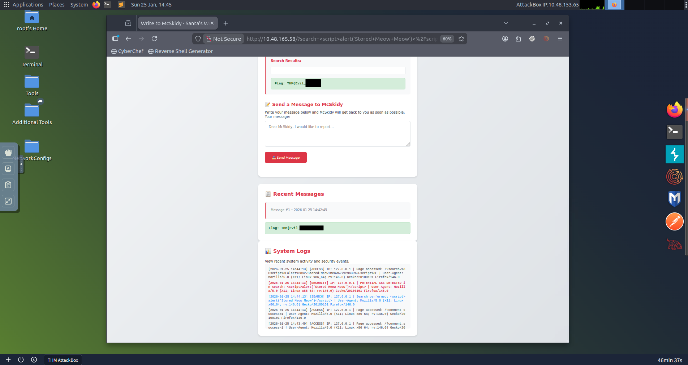

# Day 11: Cross-Site Scripting (XSS) - Merry XSSMas

## 📋 Quick Facts
- **Date Completed:** December 11, 2025
- **Time Spent:** 1 hour
- **Difficulty:** ★★☆☆ (Easy-Medium)
- **Category:** Web Application Security / OWASP Top 10
- **Room URL:** https://tryhackme.com/room/xss-aoc2025-c5j8b1m4t6

---

## 🎯 Challenge Overview

This challenge introduced Cross-Site Scripting (XSS) attacks against a secure message portal used by McSkidy. The portal had been experiencing unusual activity with suspicious search terms and script-like messages in the logs. I learned the difference between Reflected XSS and Stored XSS, practiced exploiting both vulnerabilities using JavaScript payloads, and understood prevention techniques to protect web applications from XSS attacks.

**Learning Objectives:**
- Understand how Cross-Site Scripting (XSS) works
- Differentiate between Reflected XSS and Stored XSS
- Practice exploiting XSS vulnerabilities with payload injection
- Learn to prevent XSS attacks through secure coding practices

---

## 💡 What I Learned

### What is Cross-Site Scripting (XSS)?

**XSS** is a web security vulnerability that allows attackers to inject malicious scripts (usually JavaScript) into web pages viewed by other users.

**How it works:**
1. Attacker injects malicious code into a vulnerable web application
2. The application doesn't properly sanitize or encode the input
3. The malicious code is executed in victims' browsers
4. Attacker can steal data, hijack sessions, or perform actions as the victim

**Key concept from Security+:** I learned the definition of XSS in Professor Messer's Security+ course, but this was my **first time seeing what XSS actually looks like in practice**.

### Reflected XSS (Non-Persistent)

**Definition:** XSS where the injected payload is immediately reflected back in the response, not stored on the server.

**How it works:**

**Normal URL:**
```
https://trygiftme.thm/search?term=gift
```

**Malicious URL (XSS payload):**
```
https://trygiftme.thm/search?term=<script>alert(atob("VEhNe0V2aWxfQnVubnl9"))</script>
```

**Attack Flow:**
1. Attacker crafts malicious URL with JavaScript payload
2. Attacker tricks victim into clicking the link (via phishing, social engineering)
3. Victim clicks link → browser loads page
4. Server reflects the payload back in the search results
5. Browser executes the malicious JavaScript code
6. Attacker's script runs in victim's browser context

**Why it's called "Reflected":** The payload is reflected immediately in the HTTP response, not stored anywhere.

**Attack Vector:** Usually exploited via **phishing** to trick users into clicking malicious links.

**What attackers can do:**
- Perform actions as the victim
- View information the victim can access
- Modify data the victim has permissions for
- Steal session cookies
- Redirect to malicious sites

### Stored XSS (Persistent)

**Definition:** XSS where the malicious script is **saved on the server** and executed every time a user views the affected page.

**How it works:**

**Normal Comment Submission:**
```http
POST /post/comment HTTP/1.1
Host: tgm.review-your-gifts.thm

postId=3
name=Tony Baritone
email=[email protected]
comment=This gift set my carpet on fire but my kid loved it!
```

**Malicious Comment Submission (Stored XSS):**
```http
POST /post/comment HTTP/1.1
Host: tgm.review-your-gifts.thm

postId=3
name=Tony Baritone
email=[email protected]
comment=<script>alert(atob("VEhNe0V2aWxfU3RvcmVkX0VnZ30="))</script> + "This gift set my carpet on fire but my kid loved it!"
```

**Attack Flow:**
1. Attacker submits malicious JavaScript in a comment/message form
2. Server stores the payload in the database
3. Every user who visits the page loads the stored payload
4. Browser executes the malicious script for EVERY visitor
5. Attacker's code runs automatically without further action

**Why it's called "Stored":** The payload is permanently stored on the server (database, file system).

**Why it's more dangerous than Reflected XSS:**
- **"Set-and-forget" attack** - No need to trick individual victims
- **Affects ALL users** who view the page, not just targeted victims
- **Persistent impact** - Runs every time the page is loaded
- **Higher success rate** - Doesn't require social engineering

**What attackers can do:**
- Steal session cookies from all users
- Trigger fake login popups (credential harvesting)
- Deface the website
- Create worms (self-propagating XSS)
- Mass account compromise

### Reflected vs. Stored XSS Comparison

| Feature | Reflected XSS | Stored XSS |
|---------|---------------|------------|
| **Persistence** | Non-persistent (one-time) | Persistent (stored on server) |
| **Attack Vector** | Malicious URL (phishing) | Malicious input in forms |
| **Victims** | Specific targeted users | All users who view the page |
| **Delivery** | Requires social engineering | Automatic execution |
| **Impact Scale** | Individual victims | Mass compromise |
| **Server Storage** | No (reflected immediately) | Yes (saved in database) |
| **Detection Difficulty** | Harder (no evidence on server) | Easier (payload stored in logs/DB) |

### Exploiting XSS - Hands-On Practice

**Basic XSS Payload:**
```javascript
<script>alert('Reflected Meow Meow')</script>
```

**What this does:**
- `<script>` tags tell the browser to execute JavaScript
- `alert()` function displays a popup message
- Used to confirm XSS vulnerability exists

**Exploiting Reflected XSS:**
1. Navigate to search functionality
2. Inject payload: `<script>alert('Reflected Meow Meow')</script>`
3. Click "Search Messages"
4. If alert box appears → Reflected XSS confirmed!

**What happened behind the scenes:**
- Search input was reflected directly in results **without encoding**
- Browser interpreted HTML/JavaScript as **executable code**
- Alert box demonstrated successful code execution

**Tracking Behavior:**
- Checked "System Logs" tab to see how the system interpreted the payload
- Logs showed the script execution activity

**Exploiting Stored XSS:**
1. Navigate to message form
2. Inject payload: `<script>alert('Stored Meow Meow')</script>`
3. Click "Send Message"
4. Payload is stored on the server
5. **Every time the page loads or reloads** → Alert displays
6. Affects all users, not just the attacker

**Key difference observed:**
- Reflected XSS: Alert only appears when visiting the malicious URL
- Stored XSS: Alert appears **every time the page is loaded** by anyone

### Preventing XSS Attacks

**Three key defensive strategies:**

**1. Disable Dangerous Rendering Paths**

**Vulnerable approach:**
```javascript
element.innerHTML = userInput; // DANGEROUS - allows HTML/JS injection
```

**Secure approach:**
```javascript
element.textContent = userInput; // SAFE - treats input as plain text
```

**Why this works:**
- `innerHTML` interprets input as HTML (executes scripts)
- `textContent` treats everything as plain text (displays literally, no execution)

**2. Make Cookies Inaccessible to JavaScript**

Set session cookies with security attributes:
- **HttpOnly** - Prevents JavaScript from accessing cookies
- **Secure** - Only sends cookies over HTTPS
- **SameSite** - Prevents cookies from being sent in cross-site requests

**Impact:** Reduces damage from XSS attacks by preventing cookie theft

**3. Sanitize Input/Output and Encode**

**When to use:**
Applications that need to accept limited HTML input (e.g., formatting, safe links)

**How it works:**
- **Sanitize:** Remove or escape elements that could be executable code
- **Encode:** Convert special characters to safe equivalents
  - `<` becomes `&lt;`
  - `>` becomes `&gt;`
  - `"` becomes `&quot;`

**What gets removed/escaped:**
- `<script>` tags
- Event handlers (`onclick`, `onerror`)
- JavaScript URLs (`javascript:`)

**What stays safe:**
- Basic formatting (bold, italic, links)
- Plain text content

---

## 🛠️ Tools & Techniques Used

### Tools
1. **Web Browser** - Firefox/Chrome for payload injection and testing
2. **System Logs** - Track XSS payload execution and behavior
3. **Developer Tools** - Inspect how browser interprets injected code
4. **XSS Payloads** - JavaScript alert() functions for proof-of-concept

### Techniques
- **Payload injection** - Inserting malicious JavaScript into input fields
- **XSS testing** - Using alert() to confirm vulnerability
- **Log analysis** - Reviewing system logs to understand payload execution
- **URL crafting** - Creating malicious URLs for Reflected XSS
- **Form exploitation** - Submitting stored payloads via message forms
- **Browser behavior analysis** - Observing how different XSS types execute

---

## 🤔 Challenges I Faced

**No Major Problems:** This room was pretty easy to follow and complete.

**Learning vs. Reviewing:**
- **From Professor Messer's Security+:** I learned the **definition** of XSS (what it is conceptually)
- **From This Room:** This was my **first time seeing what XSS actually looks like in practice**
  - First time crafting XSS payloads
  - First time seeing Reflected vs. Stored XSS in action
  - First time understanding the difference between `innerHTML` vs. `textContent`

**What Made It Easy:**
- Clear instructions on payload injection
- Immediate visual feedback (alert boxes)
- Simple payloads (`<script>alert()</script>`)
- System logs showed exactly what was happening

**Overall Experience:** This was a practical application of theoretical Security+ knowledge. Seeing XSS in action made the concept much clearer than just knowing the definition.

---

## ✅ How This Helps My Career

XSS is one of the most common web vulnerabilities and appears in almost every web security discussion:

**Why XSS Matters:**
- **#3 on OWASP Top 10** (Injection attacks, which includes XSS)
- **40% of web applications** have at least one XSS vulnerability
- **50% of SOC jobs** mention web application security awareness
- Found in real-world applications (social media, forums, e-commerce)

**SOC Analyst Applications (Defensive):**

**Alert Triage & Detection:**
- Recognize XSS payloads in web application logs
- Identify suspicious `<script>` tags or JavaScript in user input
- Detect Base64-encoded payloads (like `atob()` function in challenge)
- Monitor for unusual alert() or eval() executions

**Incident Response:**
- Investigate XSS incidents reported by Web Application Firewalls (WAF)
- Assess impact: Was it Reflected (limited) or Stored (widespread)?
- Determine scope: How many users were affected?
- Recommend remediation: Input sanitization, output encoding, CSP headers

**Security Awareness:**
- Educate developers on secure coding practices
- Demonstrate real XSS attacks to stakeholders
- Advocate for WAF deployment and input validation

**Penetration Testing / Red Team Applications (Offensive):**

**Web Application Testing:**
- Test all user input fields for XSS vulnerabilities
- Try both Reflected and Stored XSS vectors
- Use XSS to demonstrate risk during security assessments
- Chain XSS with other vulnerabilities (session hijacking, CSRF)

**Real-World Attack Scenarios:**
- Steal session cookies to hijack administrator accounts
- Create fake login pages to harvest credentials
- Deface websites or inject malicious content
- Conduct phishing campaigns via Reflected XSS URLs

**Career Skills Developed:**
- **OWASP Top 10 knowledge** - Industry-standard vulnerability framework
- **Web application security** - Understanding client-side attacks
- **Payload crafting** - Creating effective proof-of-concept exploits
- **Secure coding awareness** - Knowing how to prevent vulnerabilities
- **Defensive strategies** - Input validation, output encoding, CSP

**Interview Talking Point:** "I have hands-on experience identifying and exploiting Cross-Site Scripting (XSS) vulnerabilities, including both Reflected and Stored variants. I understand the difference between non-persistent attacks requiring social engineering and persistent attacks that affect all users. I can craft XSS payloads for security testing, recognize XSS patterns in logs and web application traffic, and recommend defensive measures including input sanitization, output encoding, and secure cookie configuration. I'm familiar with the OWASP Top 10 and understand how XSS fits into the broader web application threat landscape."

---

## 🔗 Security+ Connection

**Domain 1.0 - General Security Concepts (12%):** Secure coding practices, input validation, vulnerability types.

**Domain 2.0 - Threats, Vulnerabilities & Mitigations (22%):** Injection attacks, XSS, OWASP Top 10, web application vulnerabilities, attack techniques.

**Domain 4.0 - Security Operations (28%):** Vulnerability assessment, security monitoring, web application security, incident detection.

---

## 📸 Evidence


*Reviewed system logs showing XSS payload execution and browser interpretation of injected JavaScript code*

*Successfully injected Reflected XSS payload via search function, alert box confirmed code execution*

*Submitted Stored XSS payload through message form, script executes automatically on every page load affecting all users*

---

## 📝 Note on Learning Approach

**Important clarification:** When I say "reviewing and learning" in previous days, I mean I learned the **definition/concept** from Professor Messer's Security+ course, but TryHackMe rooms are my **first hands-on practical experience** with these topics.

**Examples:**
- **Day 5 (IDOR):** Knew the concept from Security+ → First time exploiting it
- **Day 9 (Password Cracking):** Knew dictionary attacks exist → First time using john/hashcat
- **Day 11 (XSS):** Knew XSS definition → First time crafting payloads and seeing it work

This combination of **theoretical foundation (Security+) + practical application (TryHackMe)** creates strong, well-rounded understanding.

---
