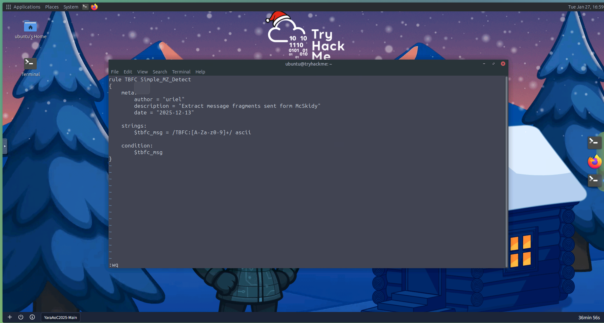
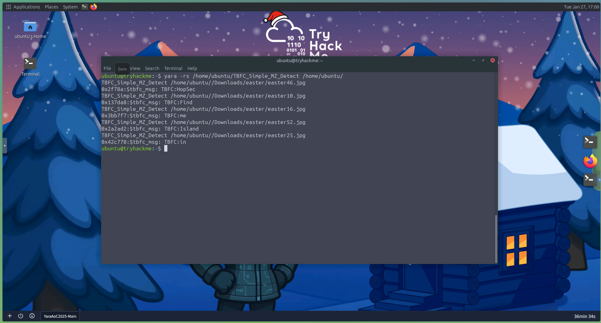

# Day 13: YARA Rules - YARA mean one!

## 📋 Quick Facts
- **Date Completed:** December 13, 2025
- **Time Spent:** 2 hours
- **Difficulty:** ★★★☆ (Medium-Hard)
- **Category:** Malware Detection / Threat Hunting / Digital Forensics
- **Room URL:** https://tryhackme.com/room/yara-aoc2025-q9w1e3y5u7

---

## 🎯 Challenge Overview

This challenge introduced YARA, a powerful pattern-matching tool used to identify and classify malware. McSkidy sent encrypted images containing hidden messages that could only be decoded using YARA rules. I learned to write YARA rules with metadata, strings (text, hexadecimal, regex), and conditions to scan files and directories for malicious indicators. The mission involved creating custom YARA rules to search for the keyword `TBFC:` followed by codewords hidden in image files to decode McSkidy's message.

**Learning Objectives:**
- Understand the basic concept of YARA and its role in malware detection
- Learn when and why defenders use YARA rules
- Explore different types of YARA rules (strings, conditions, modifiers)
- Practice writing YARA rules from scratch
- Detect malicious indicators using YARA in practical scenarios

---

## 💡 What I Learned

### What is YARA?

**YARA** is a tool designed to **identify and classify malware** by searching for unique patterns—the digital fingerprints left behind by attackers.

**Analogy:** Think of YARA as a detective's notebook for cyber defenders. Instead of dusting for fingerprints, YARA scans code, files, and memory for subtle traces that reveal a threat's identity.

**Key Concept:** YARA detects malware by its **behavior and patterns**, not just by name. This means:
- You're not waiting for antivirus signature updates
- You can detect new malware variants
- You define what constitutes "malicious" behavior

**YARA in SOC Operations:** At TBFC, YARA serves as a silent guardian, scanning through systems and uncovering faint traces of malicious activity that others might overlook.

### Why YARA Matters - Use Cases

**When Defenders Use YARA:**

**1. Post-Incident Analysis**
- Verify whether malware traces found on one compromised host exist elsewhere
- Example: "We found IcedID on Server A. Does it exist on Servers B, C, D?"

**2. Threat Hunting**
- Proactively search through systems and endpoints for signs of known malware families
- Hunt for indicators of compromise (IOCs) before they cause damage

**3. Intelligence-Based Scans**
- Apply shared YARA rules from security community or threat intelligence feeds
- Detect new attack patterns based on published research

**4. Memory Analysis**
- Examine active processes in memory dumps for malicious code fragments
- Find malware running only in RAM (fileless malware)

**5. Large-Scale File Scanning**
- Scan entire directories, drives, or network shares for suspicious patterns
- Quickly identify infected files among thousands or millions

### YARA Advantages for SOC Analysts

**Why YARA is Powerful:**

**Speed:** Quickly scans large sets of files or systems to identify suspicious ones

**Flexibility:** Detects everything from text strings to binary patterns and complex logic

**Control:** Lets analysts define exactly what they consider malicious (custom detection)

**Shareability:** Rules can be reused and improved by other defenders across organizations/communities

**Visibility:** Helps connect scattered clues into a clear picture of the attack

**Bottom Line:** YARA empowers defenders to move from **passive monitoring** to **active hunting**, turning intelligence into action before attackers strike.

### YARA Rule Structure - Three Key Elements

Every YARA rule consists of three main parts:

**1. Metadata (meta)**
- Information about the rule itself
- Who created it, when, and for what purpose
- Not required but highly recommended

**2. Strings**
- The clues YARA searches for
- Text, byte sequences, or regular expressions marking suspicious content
- The "signatures" of malicious activity

**3. Conditions**
- The logic deciding when the rule triggers
- Combines multiple strings or parameters into a single decision
- Determines true positive vs. false positive

**Basic YARA Rule Example:**

```yara
rule TBFC_KingMalhare_Trace
{
    meta:
        author = "Defender of SOC-mas"
        description = "Detects traces of King Malhare's malware"
        date = "2025-10-10"
    
    strings:
        $s1 = "rundll32.exe" fullword ascii
        $s2 = "msvcrt.dll" fullword wide
        $url1 = /http:\/\/.*malhare.*/ nocase
    
    condition:
        any of them
}
```

**What this does:**
- Searches for specific strings related to malware
- Triggers if ANY of the strings are found
- Provides metadata for rule management

### Metadata Section (meta)

**Purpose:** Helps you and other defenders understand the rule

**Common Fields:**
- `author` - Who created the rule
- `description` - What the rule detects
- `date` - When the rule was written
- `confidence` - How reliable the detection is (low/medium/high)
- `reference` - Link to threat intelligence or analysis

**Why Metadata Matters:**
When your YARA rule collection grows, clear metadata saves time. Without it, finding or updating the right rule becomes challenging.

**Best Practice:** Always include at least `description` and `date`.

### Strings Section - Types and Modifiers

**Strings are the clues YARA searches for.** There are three main types:

**1. Text Strings (Most Common)**

**Basic text string:**
```yara
strings:
    $TBFC_string = "Christmas"
```

**By default:** ASCII, case-sensitive

**Text String Modifiers (NEW CONCEPT - Like Programming):**

**a) nocase - Case-Insensitive Matching**
```yara
strings:
    $xmas = "Christmas" nocase
```
Matches: "Christmas", "CHRISTMAS", "christmas", "ChRiStMaS"

**Why useful:** Attackers often change casing to evade simple string searches

**b) wide / ascii - Character Encoding**
```yara
strings:
    $xmas = "Christmas" wide ascii
```
- `ascii` - Single-byte characters (standard text)
- `wide` - Two-byte Unicode characters (common in Windows executables)
- Both together - Search for either encoding

**Why useful:** Many Windows malware uses Unicode strings

**c) xor - XOR Encoding Detection**
```yara
strings:
    $hidden = "Malhare" xor
```
Automatically checks all possible single-byte XOR variations

**Why useful:** Attackers XOR-encode text to hide from scanners

**d) base64 / base64wide - Base64 Encoding**
```yara
strings:
    $b64 = "SOC-mas" base64
```
YARA decodes Base64 content and searches for original pattern

**Why useful:** Malware often encodes payloads or commands in Base64

**2. Hexadecimal Strings (Binary Patterns)**

Used when malware doesn't leave readable words—only raw bytes.

```yara
strings:
    $mz = { 4D 5A 90 00 }  // MZ header of Windows executable
    $hex_string = { E3 41 ?? C8 }  // ?? = wildcard byte
```

**Wildcards:**
- `??` - Any single byte
- `[2-4]` - 2 to 4 bytes of any value

**Why useful:** Detect file headers, shellcode, or binary signatures that can't be represented as text

**3. Regular Expression Strings (Flexible Patterns)**

Used when malware mutates and patterns vary slightly.

```yara
strings:
    $url = /http:\/\/.*malhare.*/ nocase
    $cmd = /powershell.*-enc\s+[A-Za-z0-9+/=]+/ nocase
```

**Why useful:** 
- Spot URLs with varying domains
- Detect encoded commands
- Match filenames sharing structure but differing slightly

**Caution:** Regex is powerful but can slow down scans if written too broadly.

### Conditions Section - Decision Logic

**The condition decides WHEN the rule triggers.**

**1. Match a Single String**
```yara
condition:
    $xmas
```
Triggers if `$xmas` string is found.

**2. Match Any String**
```yara
condition:
    any of them
```
Triggers if ANY defined string is found (early warning, fast detection).

**3. Match All Strings**
```yara
condition:
    all of them
```
Triggers only if ALL strings are found (reduces false positives, stricter detection).

**4. Logical Operators: and, or, not**
```yara
condition:
    ($s1 or $s2) and not $benign
```
- Detects if `$s1` OR `$s2` is found
- BUT ignores if `$benign` is present (whitelisting legitimate files)

**5. File Property Checks**

**File Size:**
```yara
condition:
    any of them and (filesize < 700KB)
```
Triggers only if strings match AND file is smaller than 700KB.

**Why useful:** Malware loaders are often small; legitimate software is usually larger.

**Other Properties:**
- `entrypoint` - Check file's entry point location
- `hash` - Match specific file hash values

### Practical YARA Rule Example - IcedID Malware

**Scenario:** Malhare's kingdom used IcedID trojan to steal credentials. Analysts discovered common signature (MZ header) in malicious executables.

**YARA Rule:**
```yara
rule TBFC_Simple_MZ_Detect
{
    meta:
        author = "TBFC SOC L2"
        description = "IcedID Rule"
        date = "2025-10-10"
        confidence = "low"
    
    strings:
        $mz = { 4D 5A }  // "MZ" header (PE file)
        $hex1 = { 48 8B ?? ?? 48 89 }  // malicious binary fragment
        $s1 = "malhare" nocase  // story / IOC string
    
    condition:
        all of them and filesize < 10485760  // < 10MB size
}
```

**What this detects:**
- Files with MZ header (Windows executables)
- Containing specific malicious hex pattern
- Containing "malhare" string (case-insensitive)
- Smaller than 10MB (typical loader size)

**Running YARA:**
```bash
yara -r icedid_starter.yar C:\
```

**Output:**
```
icedid_starter C:\Users\WarevilleElf\AppData\Roaming\TBFC_Presents\malhare_gift_loader.exe
```

**YARA Flags (First Time Learning):**
- `-r` - Recursively scan directories and follow symlinks
- `-s` - Print matching strings found in files (useful for analysis)

**Full Command:**
```bash
yara -r -s icedid_starter.yar C:\
```

### My Practical Task - Decoding McSkidy's Message

**Mission:** Create YARA rule to search for keyword `TBFC:` followed by alphanumeric codewords in `/home/ubuntu/Downloads/easter` directory.

**Challenge:**
- Multiple images contained hidden messages
- Had to extract codewords in ascending order
- Use regex to match pattern `TBFC:` + alphanumeric characters

**Regex Pattern I Learned:**
```
TBFC:[A-Za-z0-9]+
```
- `TBFC:` - Literal match
- `[A-Za-z0-9]+` - One or more alphanumeric ASCII characters

**What I Struggled With:**
- Understanding regex syntax (first time writing patterns)
- Knowing which modifiers to use (nocase? ascii? wide?)
- Structuring the condition correctly

**What Clicked:**
- YARA scans files looking for patterns (like Ctrl+F but powerful)
- Regex allows flexible matching (not exact strings)
- Conditions decide when to alert (logic gates)

---

## 🛠️ Tools & Techniques Used

### Tools
1. **YARA** - Pattern-matching engine for malware detection
2. **Text editor** - Writing YARA rule files (.yar)
3. **Command line** - Running YARA scans with flags
4. **Regex** - Creating flexible string matching patterns

### Techniques
- **YARA rule writing** - Creating custom detection signatures
- **String definition** - Using text, hex, and regex patterns
- **Condition logic** - Combining strings with logical operators
- **File property analysis** - Checking file size constraints
- **Recursive scanning** - Searching entire directory trees
- **Pattern extraction** - Finding hidden messages in files
- **Regex construction** - Building flexible matching expressions

---

## 🤔 Challenges I Faced

**Another New Concept:** YARA was completely new—never encountered it in Security+ or anywhere else.

**It's Like Learning a Programming Language:**
This was very challenging because YARA rules feel like writing code, and **I have no programming background**. The syntax, structure, and logic were unfamiliar.

**What I Got:**
- **Basic concept** - YARA searches for patterns in files
- **Why it's useful** - Detect malware by behavior, not just name
- **Three main parts** - Metadata, Strings, Conditions
- **Use cases** - Threat hunting, post-incident analysis

**What I Don't Fully Get:**
- **Regex syntax** - Understanding `[A-Za-z0-9]+` and other patterns is confusing
- **When to use modifiers** - Should I use `nocase`? `wide`? `ascii`? All of them?
- **Hex patterns** - How to know which bytes to look for (e.g., `{ 48 8B ?? ?? 48 89 }`)
- **Complex conditions** - Combining multiple logical operators gets complicated

**What Took Time:**
- Reading about all the string types and modifiers (lots to absorb)
- Understanding the difference between text/hex/regex strings
- Writing my first YARA rule for the practical task
- Debugging why my rule didn't trigger initially

**Overall Experience:**
Medium-hard difficulty. The room explained concepts well, but applying them felt like learning to code. Some parts clicked (basic structure), others didn't (regex details, hex patterns). It's a skill that will take practice to master.

---

## ✅ How This Helps My Career

YARA is an **industry-standard tool** for malware analysis and threat hunting:

**Why YARA Matters:**
- **70% of SOC/threat hunting jobs** mention YARA or similar pattern-matching tools
- Used by malware analysts, threat hunters, incident responders
- Essential for custom malware detection beyond antivirus signatures
- Highly valued skill in blue team operations

**SOC Analyst Applications:**

**Threat Hunting:**
- Proactively search endpoints for malware indicators
- Hunt for APT (Advanced Persistent Threat) patterns
- Scan systems for zero-day malware using custom rules
- Correlate YARA detections with SIEM alerts

**Incident Response:**
- After malware discovery on one host, scan all systems
- Verify malware removal during remediation
- Check for persistence mechanisms left behind
- Identify lateral movement across network

**Malware Analysis:**
- Classify unknown malware samples
- Identify malware families and variants
- Extract IOCs (Indicators of Compromise) from samples
- Build detection rules based on analysis findings

**Intelligence Integration:**
- Apply threat intelligence feeds as YARA rules
- Use community-shared rules (GitHub, VirusTotal)
- Contribute custom rules back to security community
- Stay updated on emerging threat patterns

**Forensics Investigation:**
- Scan forensic disk images for malware traces
- Analyze memory dumps for fileless malware
- Find deleted or hidden malicious files
- Reconstruct attacker activities through pattern matching

**Real-World Tools Using YARA:**
- **VirusTotal** - Scans samples against thousands of YARA rules
- **LOKI** - Free IOC scanner using YARA rules
- **osquery** - Queries endpoints with YARA integration
- **TheHive/Cortex** - SOAR platforms with YARA analysis
- **Cuckoo Sandbox** - Malware analysis with YARA signatures

**Career Skills Developed:**
- **Pattern recognition** - Identifying malware signatures
- **Rule writing** - Creating custom detection logic
- **Regex skills** - Building flexible matching patterns
- **Threat intelligence** - Translating IOCs into detections
- **Malware understanding** - Knowing what makes files suspicious
- **Automation** - Scaling detection across large environments

**Career Progression:**
- **Entry SOC Analyst** - Run existing YARA rules
- **Mid-Level Analyst** - Modify and improve rules
- **Senior Analyst/Threat Hunter** - Write custom rules from scratch
- **Malware Analyst** - Create advanced signatures for new threats

**Interview Talking Point:** "I have hands-on experience writing YARA rules for malware detection and threat hunting. I understand the three main components of YARA rules—metadata, strings, and conditions—and can create custom signatures using text strings with modifiers like nocase and xor, hexadecimal patterns for binary detection, and regular expressions for flexible matching. I've practiced scanning directories recursively with YARA, extracting matching strings, and applying logical conditions to reduce false positives. I understand YARA's role in post-incident analysis, intelligence-based scans, and proactive threat hunting, which are core responsibilities in SOC operations and incident response. While I'm still building proficiency in regex and complex hex patterns, I have the foundation to learn from community-shared rules and adapt them to organizational needs."

---

## 🔗 Security+ Connection

**Domain 2.0 - Threats, Vulnerabilities & Mitigations (22%):** Malware indicators, threat intelligence, IOC identification, signature-based detection.

**Domain 4.0 - Security Operations (28%):** Threat hunting, incident response, malware analysis, forensics, detection tools and techniques.

---

## 📸 Evidence


*Built regex pattern /TBFC:[A-Za-z0-9]+/ to extract alphanumeric codewords from hidden messages in image files*


*Successfully ran YARA rule recursively against directory, detected alphanumeric codewords from hidden messages in image files containing TBFC: codewords*

---

## 📚 Key Takeaways for Future Reference

**YARA Rule Quick Reference:**

**Basic Structure:**
```yara
rule RuleName
{
    meta:
        description = "What it detects"
        author = "Your name"
    
    strings:
        $text = "suspicious string" nocase
        $hex = { 4D 5A }
        $regex = /pattern.*here/ nocase
    
    condition:
        any of them
}
```

**Common String Modifiers:**
- `nocase` - Case-insensitive
- `wide` - Unicode (2-byte)
- `ascii` - ASCII (1-byte)
- `xor` - Check XOR-encoded variations
- `base64` - Decode Base64

**Common Conditions:**
- `$string` - Single string match
- `any of them` - At least one match
- `all of them` - All strings match
- `($s1 or $s2) and not $benign` - Complex logic
- `filesize < 10MB` - File property check

**Running YARA:**
```bash
yara rule.yar /path/to/scan           # Basic scan
yara -r rule.yar /path/to/scan        # Recursive
yara -r -s rule.yar /path/to/scan     # Show strings
```

---
