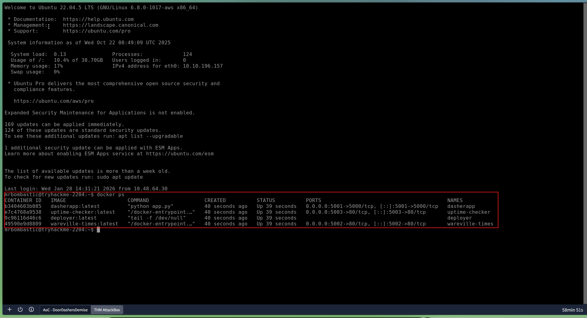
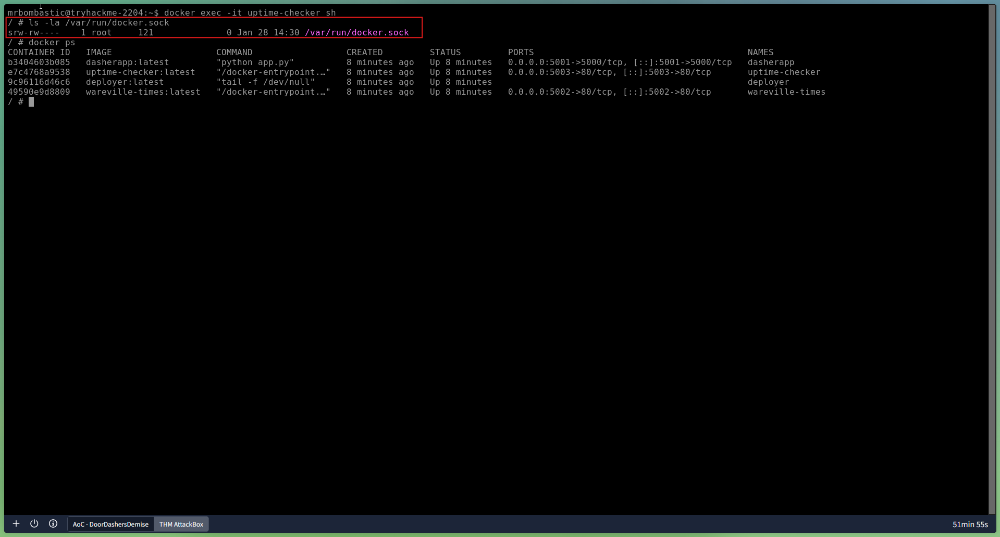
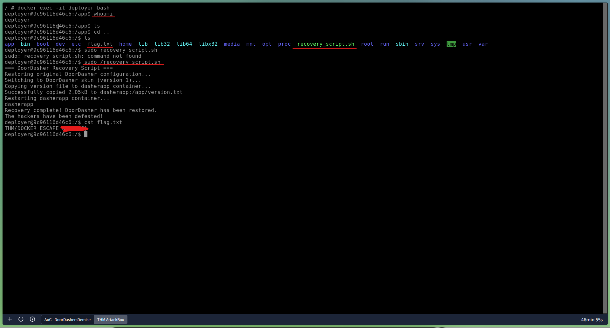

# Day 14: Container Security - DoorDasher's Demise

## 📋 Quick Facts
- **Date Completed:** December 14, 2025
- **Time Spent:** 2 hours
- **Difficulty:** ★★★☆ (Medium-Hard)
- **Category:** Container Security / Docker / Privilege Escalation
- **Room URL:** https://tryhackme.com/room/container-security-aoc2025-z0x3v6n9m2

---

## 🎯 Challenge Overview

This challenge focused on container security vulnerabilities after King Malhare seized control of DoorDasher (food delivery service) and rebranded it as "Hopperoo." A security engineer created a recovery script but was locked out by Sir CarrotBaine. I learned about Docker containers, container architecture, and performed a Docker escape attack to break out of a monitoring container, escalate privileges to a privileged deployer container, and run the recovery script to restore the original service.

**Learning Objectives:**
- Understand how containers and Docker work (images, layers, engine)
- Explore Docker runtime concepts (sockets, daemon, privileged containers)
- Learn common container escape and privilege escalation vectors
- Practice investigating Docker image layers
- Execute Docker escape attack to restore compromised service

---

## 💡 What I Learned

### What Are Containers? (Problem They Solve)

**From Security+:** Knew containers exist (basic definition)

**From This Room:** First deep-dive into how containers work and why they're used

**Problems Modern Applications Face:**

**1. Installation Issues**
- Configuration quirks in different environments
- Time-consuming and frustrating setup process
- "Works on my machine" syndrome

**2. Troubleshooting Difficulties**
- Hard to determine: Is it the application or the environment?
- Wasted time debugging environment-specific issues

**3. Conflicts**
- Multiple application versions needed simultaneously
- Different Python/library versions required by different apps
- Version conflicts break functionality

**Solution: Containerization**

Containers solve these problems by **packing applications along with their dependencies in one isolated environment**.

**Benefits:**
- ✅ **Isolation** - Each app runs in its own environment
- ✅ **Portability** - Runs consistently across different systems
- ✅ **Lightweight** - Shares host kernel (unlike VMs)
- ✅ **Fast startup** - Starts in seconds (vs. minutes for VMs)
- ✅ **Easy scaling** - Spin up multiple instances quickly

### Containers vs. Virtual Machines

**First Time Understanding the Difference:**

**Virtual Machines (VMs):**
- Run on **hypervisor** (software emulating multiple OS on one physical host)
- Include **full guest OS** (Windows, Linux, etc.)
- **Heavier** - Each VM has complete operating system
- **Fully isolated** - Separate kernel per VM
- **Slower to start** - Minutes to boot
- **Use case:** Running multiple different operating systems or legacy applications

**Containers:**
- Share the **host kernel**
- Isolate only **applications and dependencies**
- **Lightweight** - No full OS, just app layer
- **Fast to start** - Seconds to launch
- **Use case:** Deploying scalable, portable microservices

**Key Difference I Learned:**
- VM = Full OS + Application (heavy)
- Container = Application + Dependencies only (light)

**Architecture Comparison:**

```
Virtual Machines:
Hardware → Hypervisor → Guest OS → App

Containers:
Hardware → Host OS → Container Engine → App
```

### Microservices Architecture (Why Containers Became Popular)

**Monolithic Architecture (Old Way):**
- Application built as **single unit**
- Single codebase
- Single executable
- If one part gets high traffic, must scale entire application

**Microservices Architecture (Modern Way):**
- Application broken into **parts based on business function**
- Each service can scale independently
- If shopping cart gets high traffic, scale only cart service

**Why Containers Fit Microservices:**
- Lightweight nature makes scaling easy
- Deploy multiple instances quickly to meet demand
- Became go-to choice for microservices (last 10 years)

### Docker - Container Engine

**What is Docker?**

**Docker** is an open-source platform for developers to build, deploy, and manage containers.

**Container Engine:** Software that builds, runs, and manages containers by leveraging host system's kernel features like namespaces and cgroups.

**Docker Components:**

**1. Dockerfile**
- Simple text script
- Defines app environments and dependencies
- Instructions for building container image

**2. Docker Image**
- Built from Dockerfile
- Template for creating containers
- Contains application code + dependencies

**3. Docker Container**
- Running instance of an image
- Isolated environment where application runs

**4. Docker Daemon**
- Background service managing containers
- Handles actual execution and management

**5. Docker Client**
- Command-line tools (`docker` commands)
- Sends requests to daemon

### Docker Runtime Architecture

**Client-Server Setup:**

```
Docker Client (docker commands)
        ↓
Docker Socket (Unix socket)
        ↓
Docker Daemon (manages containers)
        ↓
Containers (running applications)
```

**Docker Socket (`/var/run/docker.sock`):**
- Unix socket providing API access
- Handles communication between client and daemon
- **Critical Security Component** - Access to socket = full Docker control

**What I Learned:** If attacker can communicate with Docker socket from inside container, they can **escape the container** and control the host.

### Container Escape Attack (NEW OFFENSIVE CONCEPT)

**What is Container Escape?**

Technique enabling code running inside container to obtain rights or execute on the **host kernel** (or other containers) beyond its isolated environment.

**Example Attack:**
- Start in test container (no internet access)
- Escape to host
- Create privileged container (with internet access)

**How It Works:**

**Step 1: Container Has Socket Access**
```bash
ls -la /var/run/docker.sock
```
If socket is accessible from inside container → **vulnerability!**

**Step 2: Run Docker Commands from Inside Container**
```bash
docker ps  # List all containers on host
```
If this works inside container → **we can escape!**

**Step 3: Access Other Containers**
```bash
docker exec -it deployer bash  # Access privileged container
```

**Why This is Dangerous:**
- **Breaking isolation** - Containers should NOT access host or other containers
- **Privilege escalation** - Move from unprivileged to privileged container
- **Full host control** - Docker socket access = root-level control

### Enhanced Container Isolation (Security Feature)

**Docker Documentation mentions:**
- Setting called **"Enhanced Container Isolation"**
- **Blocks** containers from mounting Docker socket
- Prevents malicious access to Docker Engine

**Why Disabled Sometimes:**
- Test containers need Docker socket access for development
- Monitoring containers need to check other containers' status
- **Trade-off:** Convenience vs. Security

**What I Learned:** In production, **NEVER** mount Docker socket into containers unless absolutely necessary. This is a common misconfiguration leading to container escape.

### Privileged Containers

**What is a Privileged Container?**

Container running with **elevated permissions**, having access to host system resources that normal containers don't.

**Created with:**
```bash
docker run --privileged
```

**Risks:**
- Can access all host devices
- Can modify kernel parameters
- Can mount file systems
- **Essentially has root-level access to host**

**Why Used:**
- Deployment tools (like `deployer` in challenge)
- System administration tasks
- Testing environments

**Security Implication:** If attacker escapes into privileged container, they have near-complete host control.

### Practical Attack Chain (What I Did)

**Scenario:** DoorDasher website defaced, recovery script exists but security engineer locked out.

**My Attack Path:**

**1. Reconnaissance - List Running Containers**
```bash
docker ps
```

**Output:**
- `uptime-checker` - Monitoring container
- `deployer` - Privileged deployment container
- Main service on port 5001 (defaced website)

**2. Initial Access - Enter Monitoring Container**
```bash
docker exec -it uptime-checker sh
```

**3. Check Socket Access**
```bash
ls -la /var/run/docker.sock
```
**Result:** Socket accessible! This means **container escape is possible**.

**4. Verify Escape Capability**
```bash
docker ps  # Run inside container
```
**Result:** Command works! We can control Docker from inside container = **successful escape**.

**5. Privilege Escalation - Access Deployer Container**
```bash
docker exec -it deployer bash
```
Moved from unprivileged monitoring container to **privileged deployer container**.

**6. Verify Privileges**
```bash
whoami
```
**Result:** Running as privileged user with sudo access.

**7. Execute Recovery Script**
```bash
sudo /recovery_script.sh
```
**Result:** Website restored from "Hopperoo" back to "DoorDasher"!

**8. Capture the Flag**
```bash
cat /flag.txt  # In deployer container root directory
```

**Attack Summary:**
```
uptime-checker (monitoring) 
    → Docker socket access
    → Container escape
    → deployer (privileged)
    → sudo access
    → Recovery script execution
    → Flag captured
```

### Docker Commands I Learned

**List Running Containers:**
```bash
docker ps
```

**Execute Command in Container:**
```bash
docker exec -it <container_name> <shell>
```
- `-i` - Interactive mode
- `-t` - Allocate pseudo-TTY (terminal)

**Access Container Shell:**
```bash
docker exec -it uptime-checker sh     # Alpine Linux (sh shell)
docker exec -it deployer bash         # Ubuntu/Debian (bash shell)
```

**Check Docker Socket:**
```bash
ls -la /var/run/docker.sock
```

**Check Current User:**
```bash
whoami
```

**Run Script with Sudo:**
```bash
sudo /recovery_script.sh
```

**Read File:**
```bash
cat /flag.txt
```

### Dockerfile (Building Images)

**What is Dockerfile?**

Text file containing **instructions for building a Docker image**.

**Example Dockerfile:**
```dockerfile
FROM ubuntu:20.04              # Base image
RUN apt-get update             # Run commands
COPY app.py /app/              # Copy files
CMD ["python", "/app/app.py"]  # Default command
```

**Common Instructions:**
- `FROM` - Base image to build on
- `RUN` - Execute commands during build
- `COPY` / `ADD` - Copy files into image
- `CMD` - Default command when container starts
- `EXPOSE` - Document which ports app uses

**What I Learned:** Dockerfile defines the **recipe** for creating container images.

---

## 🛠️ Tools & Techniques Used

### Tools
1. **Docker** - Container engine and runtime
2. **Docker CLI** - Command-line interface for Docker operations
3. **Unix Sockets** - `/var/run/docker.sock` for Docker API access
4. **Shell (sh/bash)** - Command execution inside containers

### Techniques
- **Container enumeration** - Listing running containers with `docker ps`
- **Container escape** - Exploiting Docker socket access
- **Privilege escalation** - Moving from unprivileged to privileged container
- **Interactive shell access** - Using `docker exec -it`
- **Socket reconnaissance** - Checking Docker socket permissions
- **Service restoration** - Executing recovery scripts with elevated privileges

---

## 🤔 Challenges I Faced

**Another New Concept:** Container security was completely new. Never worked with Docker before (only heard about it in Security+, I think?).

**Not My Favorite - Prefer Blue Team:**
This was **offensive** (Red Team) focused—escaping containers, privilege escalation. I prefer **Blue Team** defensive stuff, but understanding offensive techniques helps me defend better, so it's good to know.

**What Made It Hard:**
- **Docker commands** - New command syntax (`docker exec`, `-it` flags, etc.)
- **Container concepts** - Understanding isolation, escape, privileged containers
- **Architecture** - Containers vs VMs, sockets, daemons (all new)
- **Hard to remember** - Lots of new commands and concepts to memorize

**What I Reviewed:**
- **Docker basics** - What containers are, how they work
- **VMs vs Containers** - Architectural differences
- **Commands** - `docker ps`, `docker exec`, socket checks

**Overall Experience:**
Medium-hard difficulty. The offensive nature (Red Team focus) made it less enjoyable for me personally, but I recognize it's important knowledge. Containers are everywhere in modern infrastructure, so understanding how they can be exploited helps me protect them as a Blue Team analyst.

---

## ✅ How This Helps My Career

Container security is **critical in modern infrastructure** since most companies use Docker/Kubernetes:

**Why Container Security Matters:**
- **80%+ of companies** use containers in production (Docker, Kubernetes)
- **60% of SOC jobs** mention cloud/container security awareness
- Containers are common attack surface in cloud environments
- Container escape = full host compromise

**SOC Analyst Applications (Blue Team - My Preference):**

**Threat Detection:**
- Monitor for container escape attempts
- Detect unauthorized Docker socket access
- Alert on privileged container creation
- Identify suspicious `docker exec` commands from unexpected sources

**Incident Response:**
- Investigate container compromise incidents
- Determine if escape occurred (check socket access logs)
- Assess lateral movement between containers
- Recommend isolation and remediation

**Security Monitoring:**
- Watch for Docker daemon API abuse
- Monitor container runtime security events
- Track privileged container deployments
- Alert on misconfigurations (socket mounting)

**Vulnerability Assessment:**
- Audit container configurations for socket exposure
- Identify containers running as privileged
- Review Dockerfiles for security issues
- Recommend Enhanced Container Isolation enforcement

**Security Hardening (Defensive Recommendations):**
- **Never** mount Docker socket into containers unless absolutely necessary
- Enable Enhanced Container Isolation by default
- Avoid running containers as privileged
- Use least-privilege principle for container permissions
- Implement runtime security monitoring (Falco, Aqua Security)
- Regularly scan container images for vulnerabilities

**Cloud Security:**
- Containers are core to AWS ECS, Azure Container Instances, Google GKE
- Understanding Docker security = understanding cloud workload security
- Kubernetes security builds on Docker concepts

**Real-World Tools:**
- **Falco** - Runtime container security monitoring
- **Aqua Security / Prisma Cloud** - Container security platforms
- **Docker Bench Security** - Security configuration checker
- **Trivy / Clair** - Container image vulnerability scanners

**Career Skills Developed:**
- **Container fundamentals** - Understanding isolation, images, runtime
- **Docker operations** - Command-line proficiency
- **Security mindset** - Recognizing misconfigurations and attack vectors
- **Privilege escalation** - Understanding attacker techniques to defend against them
- **Cloud infrastructure** - Containers are foundation of modern cloud

**Interview Talking Point:** "I have hands-on experience with container security, including understanding Docker architecture, container isolation mechanisms, and common attack vectors like Docker socket exploitation and container escape techniques. I can identify security misconfigurations such as unnecessary Docker socket mounting and privileged container usage. While my practical experience involved offensive techniques like privilege escalation through container escape, I understand how to apply this knowledge defensively as a SOC analyst by monitoring for container escape attempts, detecting unauthorized Docker API access, and recommending security hardening measures like Enhanced Container Isolation. I recognize that containers are critical infrastructure in modern cloud environments, and understanding their security implications is essential for protecting organizational assets."

---

## 🔗 Security+ Connection

**Domain 2.0 - Threats, Vulnerabilities & Mitigations (22%):** Container vulnerabilities, privilege escalation, escape techniques, misconfigurations.

**Domain 3.0 - Security Architecture (18%):** Virtualization security, container isolation, microservices architecture, cloud infrastructure.

**Domain 4.0 - Security Operations (28%):** Security monitoring, incident response, vulnerability assessment, hardening procedures.

---

## 📸 Evidence


*Listed running containers with docker ps, identified uptime-checker monitoring container and privileged deployer container*


*Verified Docker socket accessibility from inside uptime-checker container, confirming container escape vulnerability*


*Successfully escaped to privileged deployer container, executed recovery script with sudo, restored DoorDasher service and captured flag*

---

## 📚 Key Takeaways for Future Reference

**Container Security Checklist (Blue Team Defense):**

**✅ What to Monitor:**
- Containers with Docker socket access (`/var/run/docker.sock` mounted)
- Privileged containers (`--privileged` flag)
- Unusual `docker exec` commands
- Docker API calls from unexpected sources
- Container escape indicators (accessing host resources)

**✅ Security Best Practices:**
- Enable Enhanced Container Isolation
- Never mount Docker socket unless absolutely necessary
- Avoid privileged containers in production
- Run containers as non-root users
- Implement runtime security monitoring (Falco)
- Regularly scan images for vulnerabilities

**✅ Docker Commands Reference:**
```bash
docker ps                           # List running containers
docker exec -it <name> <shell>      # Access container shell
ls -la /var/run/docker.sock         # Check socket access
whoami                              # Check current user
```

**✅ Attack Chain Recognition:**
```
Monitoring Container → Socket Access → Container Escape → 
Privileged Container → Sudo Access → Host Compromise
```

**✅ Defensive Indicators:**
- Socket mounted: **High Risk**
- Privileged container: **High Risk**
- Both together: **Critical Risk**

---