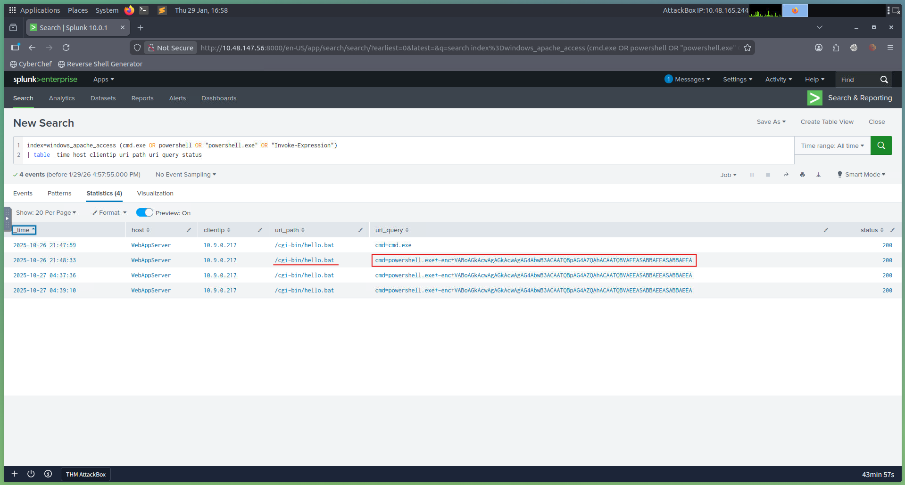
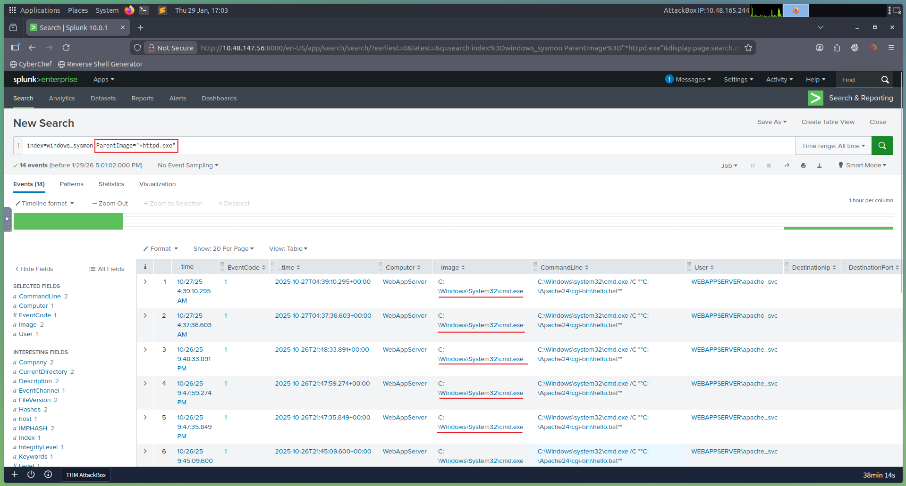
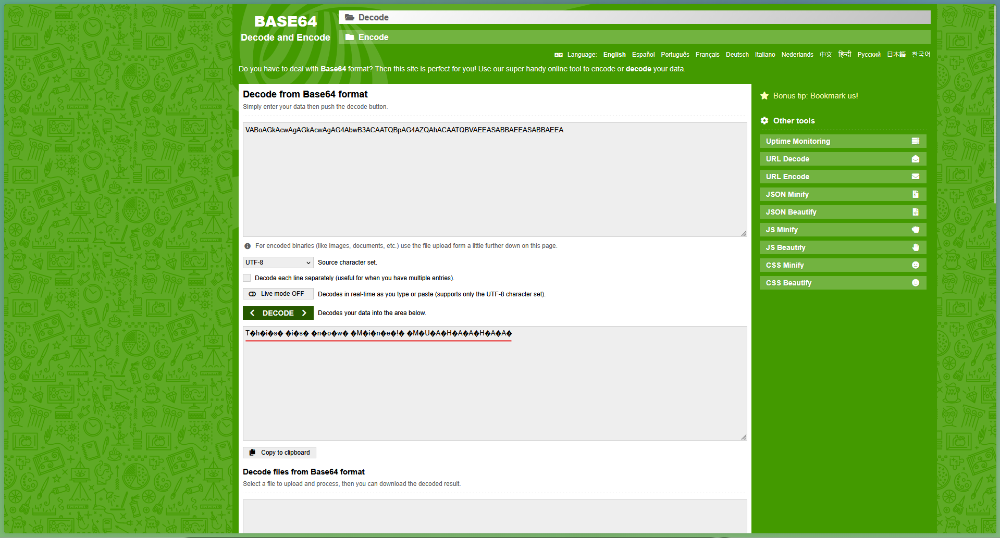

# Day 15: Web Attack Forensics - Drone Alone

## 📋 Quick Facts
- **Date Completed:** December 15, 2025
- **Time Spent:** 1.5 hours
- **Difficulty:** ★★★★ (Hard)
- **Category:** SIEM / Incident Response / Web Attack Forensics / Blue Team
- **Room URL:** https://tryhackme.com/room/webattackforensics-aoc2025-b4t7c1d5f8

---

## 🎯 Challenge Overview

This challenge focused on investigating a web attack against TBFC's drone scheduler web UI. The SOC detected strange, long HTTP requests containing Base64-encoded chunks, and Sysmon raised alerts about Apache spawning unusual processes. As a Blue Team analyst, I triaged the incident using Splunk to correlate web access logs, Apache error logs, and Sysmon telemetry. I identified command injection attacks, decoded obfuscated PowerShell payloads, traced process execution chains, confirmed attacker reconnaissance activities, and reconstructed the full attack timeline.

**Learning Objectives:**
- Detect and analyze malicious web activity through access and error logs
- Investigate host-level attacker actions using Sysmon data
- Identify and decode suspicious or obfuscated attacker payloads (Base64)
- Reconstruct the full attack chain using Splunk for investigation
- Practice real SOC analyst incident response workflow

---

## 💡 What I Learned

### Web Attack Forensics Investigation Workflow

**This is MY FAVORITE type of room!** SIEM/SOC/Forensic work is what I enjoy most - pure Blue Team defensive operations.

**Investigation Scenario:**
- **Alert:** Apache web server (`httpd.exe`) spawned unusual processes
- **Indicators:** Long HTTP requests with Base64-encoded payloads
- **Attack Type:** Command Injection via vulnerable CGI script (`hello.bat`)
- **Goal:** Triage incident, identify compromised hosts, decode payloads, determine scope

**Investigation Strategy:**
1. Start with web access logs (detect initial attack vector)
2. Check error logs (confirm exploitation attempts)
3. Examine process creation (verify command execution)
4. Track reconnaissance activity (understand attacker actions)
5. Decode obfuscated payloads (reveal true intent)

**This mirrors REAL SOC analyst workflow!**

### Step 1: Detect Suspicious Web Commands (Access Logs)

**Objective:** Search web access logs for command execution attempts

**Splunk Query:**
```spl
index=windows_apache_access (cmd.exe OR powershell OR "powershell.exe" OR "Invoke-Expression") 
| table _time host clientip uri_path uri_query status
```

**What This Query Does:**
- Searches Apache access logs (`windows_apache_access`)
- Looks for indicators of command execution:
  - `cmd.exe` - Windows command prompt
  - `powershell` / `powershell.exe` - PowerShell execution
  - `Invoke-Expression` - PowerShell cmdlet for running commands
- Displays key fields in table format:
  - `_time` - When request occurred
  - `host` - Target server
  - `clientip` - Attacker's IP address
  - `uri_path` - URL path requested
  - `uri_query` - Query parameters (where payload hides)
  - `status` - HTTP response code

**What I Found:**
- HTTP requests to `/cgi-bin/hello.bat?cmd=powershell`
- Query parameters containing **Base64-encoded strings**
- Example encoded payload: `VABoAGkAcwAgAGkAcwAgAG4AbwB3ACAATQBpAG4AZQAhACAATQBVAEEASABBAEEASABBAEEA`

**Attack Vector Identified:** Command Injection through vulnerable CGI script

**Base64 Decoding (First Time Practicing This in Incident Response):**

**Encoded String:**
```
VABoAGkAcwAgAGkAcwAgAG4AbwB3ACAATQBpAG4AZQAhACAATQBVAEEASABBAEEASABBAEEA
```

**Decoded Result:**
```
This is now Mine! MUAHAHAA
```

**Tools Used:** https://www.base64decode.org/

**What I Learned:**
- Attackers encode payloads to **evade signature-based detection**
- Base64 encoding makes malicious commands look like random strings
- Blue Team must **decode suspicious strings** during investigation
- Encoded payloads are common in web attacks and post-exploitation

### Step 2: Looking for Server-Side Errors (Error Logs)

**Objective:** Inspect Apache error logs to confirm malicious activity reached backend

**Splunk Query:**
```spl
index=windows_apache_error ("cmd.exe" OR "powershell" OR "Internal Server Error")
```

**What This Query Does:**
- Searches Apache error logs (`windows_apache_error`)
- Looks for:
  - `cmd.exe` - Command execution attempts
  - `powershell` - PowerShell execution attempts
  - `Internal Server Error` - HTTP 500 errors (backend failures)

**Important Setting:** Select `View: Raw` from dropdown above Event display field

**Why Error Logs Matter:**

**HTTP 500 "Internal Server Error" Significance:**
- Request like `/cgi-bin/hello.bat?cmd=powershell` triggers 500 error
- Means: Attacker's input was **processed by server** but **failed during execution**
- **Key indicator:** Attack penetrated beyond web layer, reached backend

**What This Confirms:**
- ✅ Attack **reached the backend** (not blocked at web layer)
- ✅ Server **attempted to execute** malicious command
- ✅ Exploitation was **partially successful**

**Blue Team Value:**
- Differentiates between **blocked attacks** (web layer) and **successful exploitation** (backend)
- Helps determine incident severity and scope
- Guides response priorities

### Step 3: Trace Suspicious Process Creation (Sysmon Logs)

**Objective:** Identify malicious processes spawned by Apache web server

**Splunk Query:**
```spl
index=windows_sysmon ParentImage="*httpd.exe"
```

**What This Query Does:**
- Searches Sysmon logs for process creation events
- Filters for processes where **parent is Apache** (`httpd.exe`)
- Reveals what Apache spawned (should only be worker threads!)

**Important Setting:** Select `View: Table` from dropdown

**Normal Behavior:**
Apache (`httpd.exe`) should **ONLY** spawn worker threads, NOT system processes.

**Malicious Behavior Found:**
```
ParentImage: C:\Apache24\bin\httpd.exe
Image: C:\Windows\System32\cmd.exe
```

**What This Means:**
- ✅ **Command injection was SUCCESSFUL**
- ✅ Apache executed system command (`cmd.exe`)
- ✅ Attack **penetrated the operating system**
- ✅ **Strongest indicator** of successful exploitation

**Why This is Critical:**

**Process Relationships Matter:**
- Normal: `httpd.exe` → worker threads
- Malicious: `httpd.exe` → `cmd.exe` / `powershell.exe`

**This proves:**
1. Attack bypassed web layer defenses
2. Malicious code executed on host operating system
3. Attacker gained **code execution** capability
4. Incident severity = **HIGH/CRITICAL**

**Sysmon Value for Blue Team:**
- Tracks **parent-child process relationships**
- Detects **anomalous process creation**
- Provides **proof of exploitation** (not just attempts)
- Essential for incident response and forensics

### Step 4: Confirm Attacker Enumeration Activity (Reconnaissance)

**Objective:** Discover what specific commands attacker executed post-exploitation

**Splunk Query:**
```spl
index=windows_sysmon *cmd.exe* *whoami*
```

**What This Query Does:**
- Searches Sysmon logs for command execution
- Looks for `cmd.exe` running `whoami` command

**Why Attackers Use `whoami`:**

**Post-Exploitation Reconnaissance:**
- **First command** attackers run after gaining code execution
- Determines **which user account** malicious process is running as
- Helps attacker understand **privilege level**:
  - `NT AUTHORITY\SYSTEM` = Highest privilege (jackpot!)
  - `IIS APPPOOL\DefaultAppPool` = Web server service account
  - Regular user = Limited privileges

**What Finding `whoami` Confirms:**
- ✅ Attacker achieved **code execution**
- ✅ Attacker performed **post-exploitation reconnaissance**
- ✅ Injected command was **successfully executed** on host
- ✅ Attack progressed beyond initial exploitation

**Attack Chain Progression:**
```
1. Command Injection (web layer)
   ↓
2. Code Execution (OS level)
   ↓
3. Reconnaissance (whoami)
   ↓
4. Next steps: Privilege escalation, lateral movement, persistence
```

**Blue Team Significance:**
- Confirms attack **fully successful** (not just attempted)
- Indicates attacker is **actively exploring** environment
- Suggests more malicious activity likely occurred
- Requires immediate incident response escalation

### Step 5: Identify Base64-Encoded PowerShell Payloads

**Objective:** Search for all successfully encoded PowerShell commands

**Splunk Query:**
```spl
index=windows_sysmon Image="*powershell.exe" (CommandLine="*enc*" OR CommandLine="*-EncodedCommand*" OR CommandLine="*Base64*")
```

**What This Query Does:**
- Searches Sysmon for PowerShell execution events
- Filters for **Base64-encoded commands**
- Looks for common encoding flags:
  - `-enc` - Short form of `-EncodedCommand`
  - `-EncodedCommand` - PowerShell parameter for Base64 payloads
  - `Base64` - Literal string in command line

**Why Attackers Encode PowerShell Commands:**

**Obfuscation Techniques:**
- **Evade signature-based detection** - Encoded commands don't match known malicious patterns
- **Hide malicious intent** - Analysts can't read payload at first glance
- **Bypass security controls** - Some tools only scan plaintext
- **Fileless malware** - Execute entirely in memory without touching disk

**Expected Results:**

**If Defenses Work (Good):**
- Query returns **NO results**
- Encoded payload never executed
- Attack was **blocked** before execution

**If Defenses Failed (Bad):**
- Query returns PowerShell events
- Encoded commands were executed
- Must **decode Base64** to reveal true intent

**Example Encoded Command Analysis:**

**Command Line:**
```powershell
powershell.exe -enc VABoAGkAcwAgAGkAcwAgAG4AbwB3ACAATQBpAG4AZQAhACAATQBVAEEASABBAEEASABBAEEA
```

**Decoded:**
```
This is now Mine! MUAHAHAA
```

**In Real Attacks, Could Be:**
- Reverse shell payload
- Credential dumping command
- Persistence mechanism
- Lateral movement script
- Ransomware dropper

**Blue Team Actions:**
1. Extract all encoded strings from Splunk results
2. Decode using Base64 decoder
3. Analyze decoded commands for malicious intent
4. Document findings in incident report
5. Update detection rules to catch similar attacks

### Command Injection Attack Explained

**What is Command Injection?**

Vulnerability where attacker can execute arbitrary system commands on the server through vulnerable application input.

**How It Works:**

**Vulnerable CGI Script:**
```
/cgi-bin/hello.bat?name=user
```

**Normal Use:**
```
hello.bat processes "name=user"
Outputs: "Hello, user!"
```

**Malicious Use:**
```
/cgi-bin/hello.bat?cmd=powershell -enc <BASE64>
```

**What Happens:**
1. Application passes `cmd` parameter to system shell
2. Server executes: `powershell -enc <BASE64>`
3. Attacker gains code execution on server
4. Can run any command (whoami, download malware, etc.)

**Why Vulnerable:**
- Application doesn't **validate/sanitize** user input
- Directly passes input to system shell
- No input filtering or command whitelisting

### Splunk Investigation Skills Developed

**What I Practiced:**

**Query Construction:**
- Searching multiple indexes (`windows_apache_access`, `windows_apache_error`, `windows_sysmon`)
- Using boolean operators (`OR`, `AND`)
- Wildcard searching (`*httpd.exe`, `*cmd.exe*`)
- Field filtering (`Image="*powershell.exe"`, `CommandLine="*enc*"`)

**Data Correlation:**
- Linking web logs → error logs → process logs
- Building timeline of attack progression
- Connecting different log sources to tell complete story

**Incident Response Workflow:**
1. Detect (access logs show suspicious requests)
2. Confirm (error logs show backend execution)
3. Validate (Sysmon shows process creation)
4. Investigate (track reconnaissance commands)
5. Analyze (decode obfuscated payloads)

**What Made This Hard:**

**Query Crafting Challenge:**
- Room **provided queries** to use (guided investigation)
- But in **real-world**, I'd need to craft these myself
- Don't know if I could create these queries independently yet
- **Takes time to get used to** - need more practice
- Need to **remember field names**, index names, search syntax

**What I Need to Improve:**
- Memorizing common Splunk field names (Image, ParentImage, CommandLine, etc.)
- Understanding which indexes contain which log types
- Building queries from scratch without templates
- Faster Base64 decoding workflow
- Connecting dots between different log sources independently

---

## 🛠️ Tools & Techniques Used

### Tools
1. **Splunk** - SIEM platform for log analysis and correlation
2. **Base64 Decoder** - https://www.base64decode.org/
3. **Sysmon Logs** - Process creation and execution tracking
4. **Apache Access Logs** - HTTP request monitoring
5. **Apache Error Logs** - Server-side error tracking

### Techniques
- **Web attack forensics** - Analyzing HTTP logs for injection attempts
- **Log correlation** - Linking access logs → error logs → process logs
- **Base64 decoding** - Revealing obfuscated attacker payloads
- **Process tree analysis** - Tracking parent-child relationships (httpd.exe → cmd.exe)
- **Reconnaissance detection** - Identifying post-exploitation enumeration (whoami)
- **Timeline reconstruction** - Building complete attack narrative
- **Splunk query writing** - SPL syntax for multi-index searches
- **Incident triage** - Determining attack scope and severity

---

## 🤔 Challenges I Faced

**ANOTHER FAVORITE ROOM!** This is exactly the type of work I love - SIEM/SOC/Forensic investigations. Pure Blue Team defensive operations!

**Connection to Day 3:**
I tried Splunk on **Day 3** (first SIEM experience), but this room was **much more advanced**.

**What Made This Hard (★★★★):**

**Query Crafting is the Main Challenge:**
- Room **provided queries** for me to run (guided investigation)
- I could follow instructions and understand results
- BUT in **real-world SOC work**, I'd need to craft queries myself
- **Don't know if I can do this independently yet**

**Specific Concerns:**
- Remembering field names (`Image`, `ParentImage`, `CommandLine`, `uri_query`)
- Knowing which index contains which logs (`windows_sysmon` vs. `windows_apache_access`)
- Understanding SPL syntax nuances (wildcards, boolean operators, field filters)
- Building complex queries from scratch without templates

**What Takes Time:**
- **"These things take time to get used to"** - need repeated practice
- Memorizing common patterns and search techniques
- Developing intuition for where to look in logs
- Building muscle memory for query syntax

**What I'm Good At:**
- ✅ Understanding the investigation **workflow**
- ✅ Following logical progression (access → error → process → recon)
- ✅ Interpreting query results (what findings mean)
- ✅ Connecting evidence across log sources
- ✅ Decoding Base64 payloads
- ✅ Understanding **WHY** we search for specific indicators

**What I Need to Improve:**
- ❌ Creating queries independently (without templates)
- ❌ Remembering all field names and index names
- ❌ Faster query iteration during investigations
- ❌ Advanced SPL techniques (subsearches, statistics, regex)

**Overall Experience:**
Hard difficulty but **extremely valuable**. This is the job I want to do - investigating web attacks, correlating logs, decoding payloads, reconstructing attack chains. Even though query crafting is challenging, the investigation methodology and Blue Team mindset clicked perfectly for me. I just need more practice to build independent query-writing skills.

---

## ✅ How This Helps My Career

This room directly simulates **actual SOC analyst daily work**:

**Why Web Attack Forensics Matters:**
- **75% of SOC analyst jobs** require log analysis and SIEM skills
- Web attacks are **#1 entry point** for breaches (OWASP Top 10)
- Command injection is common vulnerability in web applications
- Splunk is industry-standard SIEM platform

**Direct SOC Analyst Applications:**

**Incident Response (My Future Job):**
- Triage web attack alerts from SIEM
- Investigate suspicious HTTP requests
- Correlate web logs with host-level telemetry (Sysmon)
- Decode obfuscated payloads (Base64, PowerShell encoding)
- Reconstruct attack timelines
- Document findings in incident reports

**Alert Investigation Workflow:**
1. **Detect** - SIEM alert on suspicious web request
2. **Validate** - Check error logs for backend execution
3. **Confirm** - Verify process creation via Sysmon
4. **Investigate** - Track post-exploitation activity
5. **Analyze** - Decode payloads to understand intent
6. **Report** - Document scope and recommend remediation

**Threat Hunting:**
- Proactively search for command injection indicators
- Hunt for Base64-encoded PowerShell payloads
- Identify anomalous parent-child process relationships
- Discover undetected web shells or backdoors

**Security Monitoring:**
- Monitor Apache/IIS/Nginx access logs for injection attempts
- Alert on suspicious process creation (web server spawning cmd.exe)
- Detect reconnaissance commands (whoami, ipconfig, net user)
- Track encoded command execution

**Forensic Analysis:**
- Investigate compromise after breach detected
- Determine initial access vector (command injection)
- Map attacker progression (injection → execution → recon)
- Extract IOCs (attacker IPs, payloads, commands)

**Real-World Skills Practiced:**

**Technical Skills:**
- ✅ Splunk SPL query writing
- ✅ Multi-index log correlation
- ✅ Base64 decoding
- ✅ Sysmon event analysis
- ✅ Web server log interpretation
- ✅ Process tree investigation

**Analytical Skills:**
- ✅ Attack chain reconstruction
- ✅ Evidence correlation across log sources
- ✅ Determining attack success vs. attempt
- ✅ Prioritizing investigation based on severity
- ✅ Payload deobfuscation and analysis

**Career Progression:**

**Entry SOC Analyst:**
- Run provided Splunk queries (like this room)
- Interpret results and escalate
- Follow investigation playbooks

**Mid-Level SOC Analyst:**
- Create custom Splunk queries independently
- Lead investigations without templates
- Develop detection rules

**Senior SOC Analyst / Threat Hunter:**
- Design investigation workflows
- Mentor junior analysts on query techniques
- Proactive threat hunting using advanced SPL

**Interview Talking Point:** "I have hands-on experience investigating web attacks using Splunk SIEM by correlating Apache access logs, error logs, and Sysmon telemetry. I can detect command injection attacks through suspicious HTTP requests, confirm exploitation by analyzing server-side errors and process creation events, track post-exploitation reconnaissance activity like whoami commands, and decode Base64-encoded PowerShell payloads to reveal attacker intent. I understand the complete incident response workflow from initial detection through timeline reconstruction and evidence documentation. While I'm still building proficiency in independent Splunk query creation, I have strong investigation methodology skills and understand how to correlate multiple log sources to reconstruct attack chains. This directly applies to SOC analyst responsibilities in alert triage, incident investigation, and threat hunting."

---

## 🔗 Security+ Connection

**Domain 2.0 - Threats, Vulnerabilities & Mitigations (22%):** Command injection, web application attacks, obfuscation techniques, reconnaissance activities.

**Domain 4.0 - Security Operations (28%):** SIEM operations, log analysis, incident response, forensic investigation, threat hunting, security monitoring, alert triage.

---

## 📸 Evidence


*Detected command injection attempts in Apache access logs using Splunk query, identified Base64-encoded payloads in uri_query parameters*


*Traced suspicious process creation showing httpd.exe spawning cmd.exe, confirming successful command injection exploitation*


*Decoded Base64-encoded PowerShell payload revealing attacker message "This is now Mine! MUAHAHAA", demonstrating payload analysis technique*

---

## 📚 Key Takeaways for Future Reference

**Web Attack Investigation Workflow:**

**Step-by-Step Process:**
1. **Web Access Logs** → Detect injection attempts
2. **Error Logs** → Confirm backend execution
3. **Process Logs (Sysmon)** → Verify code execution
4. **Command History** → Track post-exploitation activity
5. **Payload Decoding** → Reveal true intent

**Splunk Query Templates (For Review):**

**Detect Web Command Injection:**
```spl
index=windows_apache_access (cmd.exe OR powershell OR "Invoke-Expression")
| table _time host clientip uri_path uri_query status
```

**Check Error Logs:**
```spl
index=windows_apache_error ("cmd.exe" OR "powershell" OR "Internal Server Error")
```

**Trace Process Creation:**
```spl
index=windows_sysmon ParentImage="*httpd.exe"
```

**Find Reconnaissance:**
```spl
index=windows_sysmon *cmd.exe* *whoami*
```

**Detect Encoded PowerShell:**
```spl
index=windows_sysmon Image="*powershell.exe" (CommandLine="*enc*" OR CommandLine="*-EncodedCommand*")
```

**Key Indicators of Compromise (IOCs):**

✅ **Web Layer:**
- Long HTTP requests with Base64 strings
- `/cgi-bin/` requests with `cmd=` parameters
- HTTP 500 errors on CGI endpoints

✅ **Process Layer:**
- Web server spawning system processes
- `httpd.exe` → `cmd.exe` parent-child relationship
- `httpd.exe` → `powershell.exe` execution

✅ **Post-Exploitation:**
- `whoami` command execution
- `ipconfig`, `net user`, system enumeration
- Base64-encoded PowerShell commands

**Blue Team Recommendations:**
- Input validation on all CGI scripts
- Disable unnecessary CGI handlers
- Monitor web server process creation
- Alert on Base64-encoded HTTP parameters
- Implement WAF (Web Application Firewall)
- Regular vulnerability scanning

---