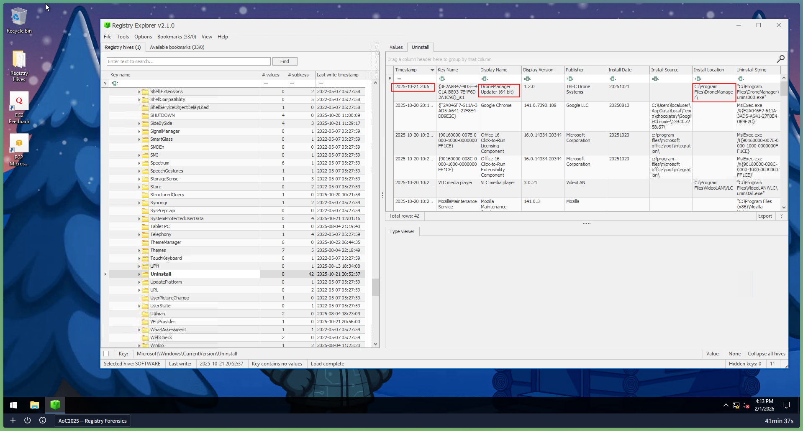
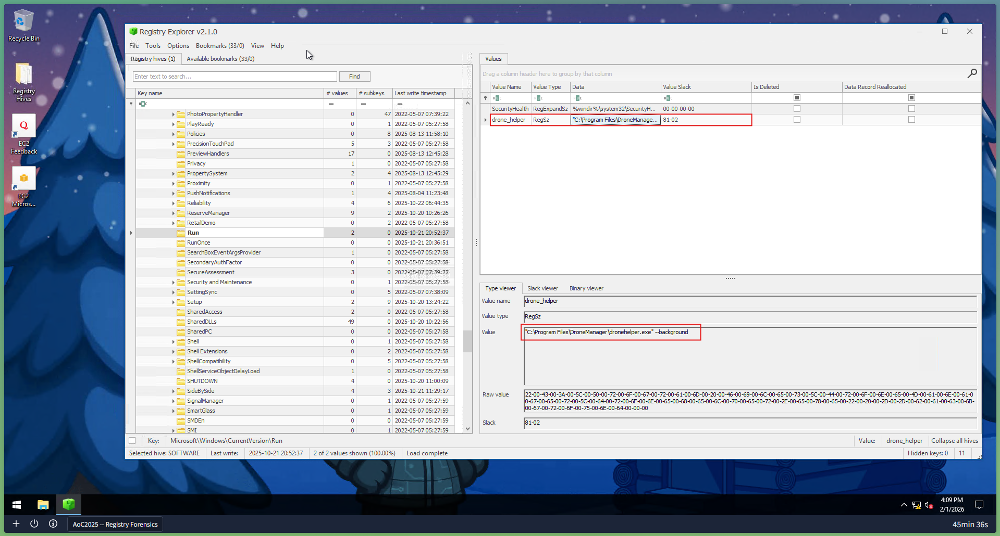

# Day 16: Registry Forensics - Registry Forensics

## 📋 Quick Facts
- **Date Completed:** December 16, 2025
- **Time Spent:** 2 hours
- **Difficulty:** ★★★☆ (Medium-Hard)
- **Category:** Digital Forensics / Windows Registry / Incident Investigation
- **Room URL:** https://tryhackme.com/room/registry-forensics-aoc2025-h6k9j2l5p8

---

## 🎯 Challenge Overview

This challenge focused on Windows Registry forensics as part of incident response investigation on the compromised `dispatch-srv01` system (TBFC's drone delivery coordinator). King Malhare's bandits had compromised the system, and the SOC team needed to investigate registry artifacts to uncover the attack. I learned about Registry Hives, Root Keys, Registry Editor, and used the Registry Explorer forensic tool to analyze offline registry files, extract evidence, identify installed applications, track user activity, and determine persistence mechanisms used by attackers.

**Learning Objectives:**
- Understand what the Windows Registry is and its role in system configuration
- Learn Registry Hives and Root Keys (HKLM, HKCU, HKU, etc.)
- Analyze Registry through built-in Registry Editor tool
- Use Registry Explorer tool for offline forensic analysis
- Extract forensic evidence from registry keys
- Investigate persistence mechanisms and suspicious applications

---

## 💡 What I Learned

### What is the Windows Registry?

**Analogy:** Think of the Windows Registry as the **"brain" of Windows**.

Just like your brain stores:
- How you behave
- Your habits
- Your recent activities
- Important memories

The Windows Registry stores:
- **System configuration** - How Windows is set up and functions
- **User settings** - Desktop preferences, application settings
- **Hardware information** - Connected devices, drivers
- **Application data** - Installed programs, file associations
- **User activity** - Recently accessed files, typed commands
- **Startup programs** - Programs that run automatically
- **Persistence mechanisms** - How malware maintains access

**Key Concept:** Registry = Database of Windows configuration and activity

### Registry Hives - Where Data is Stored

**What are Registry Hives?**

Unlike human brain (one physical location in head), Registry is **distributed across multiple files** called **Hives**.

**Main Registry Hives and Their Locations:**

| Hive Name | Contains | File Location |
|-----------|----------|---------------|
| SYSTEM | Hardware info, boot settings, system configuration | `C:\Windows\System32\config\SYSTEM` |
| SECURITY | User access policies, security information | `C:\Windows\System32\config\SECURITY` |
| SOFTWARE | Installed programs, application settings | `C:\Windows\System32\config\SOFTWARE` |
| SAM | User account information, password hashes | `C:\Windows\System32\config\SAM` |
| NTUSER.DAT | User-specific settings, activity history | `C:\Users\[username]\NTUSER.DAT` |
| USRCLASS.DAT | User-specific COM and shell settings | `C:\Users\[username]\AppData\Local\Microsoft\Windows\USRCLASS.DAT` |

**Important Note:** Each hive stores **many more settings** than listed above - these are just examples.

### Root Keys - How Registry is Organized

**Problem:** Registry Hives contain **binary data** (unreadable without proper tools)

**Solution:** Windows organizes hives into **Root Keys** (like folders)

**Main Root Keys in Registry Editor:**

**HKEY_LOCAL_MACHINE (HKLM):**
- Contains system-wide settings
- Not specific to any user
- Contains: SYSTEM, SECURITY, SOFTWARE, SAM hives
- Example path: `HKEY_LOCAL_MACHINE\SYSTEM`

**HKEY_CURRENT_USER (HKCU):**
- Contains settings for currently logged-in user
- Contains data from NTUSER.DAT hive
- Example path: `HKEY_CURRENT_USER\Software\Microsoft\Windows`

**HKEY_USERS (HKU):**
- Contains all user profiles (not just current)
- Contains NTUSER.DAT and USRCLASS.DAT data
- Example path: `HKEY_USERS\S-1-5-21-123456789-123456789-123456789-1001`

**HKEY_CLASSES_ROOT (HKCR):**
- File associations, COM objects
- **Not stored in separate hive file** - dynamically populated

**HKEY_CURRENT_CONFIG (HKCC):**
- Hardware profile information
- **Not stored in separate hive file** - dynamically populated

**Mapping Hives to Root Keys:**

| Hive on Disk | Visible In Registry Editor |
|--------------|---------------------------|
| SYSTEM | `HKEY_LOCAL_MACHINE\SYSTEM` |
| SECURITY | `HKEY_LOCAL_MACHINE\SECURITY` |
| SOFTWARE | `HKEY_LOCAL_MACHINE\SOFTWARE` |
| SAM | `HKEY_LOCAL_MACHINE\SAM` |
| NTUSER.DAT | `HKEY_USERS\<SID>` and `HKEY_CURRENT_USER` |
| USRCLASS.DAT | `HKEY_USERS\<SID>\Software\Classes` |

**What I Learned:** Different hives = different data sources; different root keys = different organization scheme

### Registry Editor - Built-in Tool

**What is Registry Editor?**

Windows built-in tool for viewing and editing Registry data.

**How to Open:**
- Type "Registry Editor" in Windows search bar
- Or press `Win + R`, type `regedit`, press Enter

**Limitations of Registry Editor:**
- ❌ Cannot open offline hive files (forensic analysis requires offline files)
- ❌ Displays some values in binary format (unreadable)
- ❌ Risk of modification if used on live system (forensic contamination)
- ❌ Limited search capabilities

**When Used:**
- Live system troubleshooting
- Viewing current system registry
- Making configuration changes

**Not suitable for:** Forensic investigations

### Registry Forensics - Extracting Evidence

**What is Registry Forensics?**

Process of extracting and analyzing evidence from Registry during incident investigations.

**Why Registry is Important for Forensics:**

Registry contains **everything about system and user activity**:
- What applications were installed
- When they were installed
- What commands were executed
- What files were accessed
- What USB devices connected
- What websites visited
- Malware persistence mechanisms
- Attacker lateral movement
- Timeline of events

**Complete Incident Timeline:**
Investigators analyze:
- Registry data
- Event logs
- File system data
- Memory data
- Network logs

All sources together tell complete story.

### Key Registry Paths for Forensic Investigation

**These are the "treasure maps" for forensics:**

**Recently Accessed Applications:**
```
HKCU\Software\Microsoft\Windows\CurrentVersion\Explorer\UserAssist
```
- Applications launched via GUI
- Execution counts and timestamps
- User activity tracking

**User-Typed Paths:**
```
HKCU\Software\Microsoft\Windows\CurrentVersion\Explorer\TypedPaths
```
- All paths typed in Explorer address bar
- Reveals where user navigated

**Application Paths:**
```
HKLM\Software\Microsoft\Windows\CurrentVersion\App Paths
```
- Where installed applications are located
- Helps identify legitimate vs. malicious applications

**Search Terms:**
```
HKCU\Software\Microsoft\Windows\CurrentVersion\Explorer\WordWheelQuery
```
- All search terms typed in Explorer search bar
- What user was looking for on system

**Startup Programs (PERSISTENCE!):**
```
HKLM\Software\Microsoft\Windows\CurrentVersion\Run
HKCU\Software\Microsoft\Windows\CurrentVersion\Run
```
- **CRITICAL FOR FORENSICS**
- Programs run automatically at startup
- **Common malware persistence vector**
- Attacker modifies these to maintain access

**Recently Accessed Files:**
```
HKCU\Software\Microsoft\Windows\CurrentVersion\Explorer\RecentDocs
```
- Files user recently opened
- Timeline of user activity

**Computer Name:**
```
HKLM\SYSTEM\CurrentControlSet\Control\ComputerName\ComputerName
```
- System's hostname
- Useful for system identification

**Installed Programs:**
```
HKLM\SOFTWARE\Microsoft\Windows\CurrentVersion\Uninstall
```
- All installed applications
- Installation information
- **Identifies suspicious software**

**Connected USB Devices:**
```
HKLM\SYSTEM\CurrentControlSet\Enum\USBSTOR
```
- USB devices connected to system
- Device ID, make, model
- Timeline of connections

**I Learned:** Each registry path tells different part of attack story

### Registry Explorer - Forensic Tool

**Why Not Registry Editor for Forensics?**

Registry Editor is **NOT suitable** for offline forensic analysis because:
- Cannot open offline hive files
- Displays binary data unreadably
- Risk of modification (forensic contamination)
- Limited analysis capabilities

**Solution: Registry Explorer**

**What is Registry Explorer?**
- Open-source forensic tool
- Specifically designed for registry forensics
- Can parse binary registry data
- Allows offline analysis without modification risk
- Better search and navigation
- Readable output format

**Key Features:**
- ✅ Load offline hive files
- ✅ Parse binary data automatically
- ✅ Search registry keys
- ✅ Navigate hierarchical structure
- ✅ Export findings
- ✅ No risk of modification

### Hands-On: Loading Registry Hives in Registry Explorer

**Step 1: Launch Registry Explorer**
- Click Registry Explorer icon on taskbar

**Step 2: Load Registry Hives**
- File → Load hive
- Navigate to hive location: `C:\Users\Administrator\Desktop\Registry Hives`
- Select hive file (e.g., SYSTEM, SOFTWARE, NTUSER.DAT)

**Step 3: Handle "Dirty" Hives (IMPORTANT!)**

**What is a "Dirty" Hive?**
- Hives collected from **live systems**
- May have **incomplete transactions** (unfinished writes)
- Data could be inconsistent or corrupted

**How to Load Clean Hives:**
1. Open Load hives dialog
2. Navigate to hive location
3. **Hold SHIFT** and click **Open**
4. System replays transaction logs automatically
5. Prompts confirm successful replay
6. Repeat for all hives

**Why This Matters:** Ensures forensic analysis on **complete, consistent data**

### Step 4: Investigating Registry Keys

**Example: Find Computer Name**

Navigate to:
```
ROOT\ControlSet001\Control\ComputerName\ComputerName
```

Or **Quick Search:** Type "ComputerName" in search bar

**Result:** Under "Data" value, shows: `DISPATCH-SRV01`

**Alternative:** Use Available Bookmarks tab for quick navigation

### Real Attack Investigation - dispatch-srv01

**Scenario:**
- System: `dispatch-srv01` (drone delivery coordinator)
- Compromise date: October 21, 2025
- Task: Find what was installed, where, and how attacker maintained persistence

**Investigation Questions:**

**Question 1: What Application Was Installed?**
- Look in: `HKLM\SOFTWARE\Microsoft\Windows\CurrentVersion\Uninstall`
- Find applications installed before October 21, 2025
- Identify suspicious software

**Question 2: Full Path Where Application Was Launched?**
- Look in: `HKCU\Software\Microsoft\Windows\CurrentVersion\Explorer\RunMRU`
- Find commands run via Run dialog
- Shows where application executable is located

**Question 3: Persistence Mechanism?**
- Look in: `HKLM\Software\Microsoft\Windows\CurrentVersion\Run`
- Find malicious entries added to startup
- How attacker maintains access after reboot
- **Strongest indicator of compromise**

**Investigation Workflow:**
```
Uninstall → Find suspicious app
RunMRU → Find where it was run from
Run key → Find how it persists
```

### Binary Data and Registry Forensics

**What I Struggled With:**

Registry contains **lots of binary data** that's unreadable in text form. This is why:
- Cannot use Notepad to open hive files
- Registry Editor displays some values as `REG_BINARY`
- Need forensic tools like Registry Explorer

**What Registry Explorer Does:**
- Automatically **parses binary data**
- Converts to **readable format**
- Shows meaningful values (timestamps, data)

**First-Hand Experience:**
- Opening registry hives manually = gibberish
- Using Registry Explorer = readable, analyzable data

---

## 🛠️ Tools & Techniques Used

### Tools
1. **Registry Editor** (regedit) - Built-in tool for viewing registry
2. **Registry Explorer** - Forensic tool for offline analysis
3. **File Explorer** - Navigating to hive locations
4. **Available Bookmarks** - Quick navigation in Registry Explorer

### Techniques
- **Registry hive identification** - Locating physical hive files
- **Offline analysis** - Loading hives into forensic tool
- **Binary data parsing** - Using Registry Explorer to read binary format
- **Key navigation** - Finding specific registry paths
- **Timeline construction** - Using registry data to build attack timeline
- **Persistence detection** - Finding malware startup entries
- **Application enumeration** - Identifying installed software
- **User activity tracking** - Finding recently accessed files and commands

---

## 🤔 Challenges I Faced

**Interesting Topic, Also Hard**

**Personal Experience with Registry:**
- Past experience: PC optimization (tweaking registry for performance)
- **Now:** Deep forensic analysis (completely different application)
- Gap between casual user knowledge and forensic expertise

**What Made It Hard:**

**New Terminology (Lots of Fancy Words!):**
- Hives, Root Keys, HKLM, HKCU, HKU, HKCR, HKCC
- SIDs (Security Identifiers), binary data
- Dirty hives, transaction logs
- Persistence mechanisms
- **Confusing at first, but started to make sense**

**Conceptual Difficulty:**
- Understanding relationship between hive files and root keys
- How binary data translates to readable values
- Why you need special tools (Registry Explorer) vs. built-in tool
- Lots of new registry paths to memorize

**Overall Assessment:**
- **Pretty confusing** at first
- **"One of the importance of forensic stuff that I like"** - Recognition that this matters
- Medium-hard difficulty ★★★☆ accurate
- **Similar to Day 15 (web forensics)** - Both investigate evidence

### What Clicked:

**Registry as Evidence:**
- Registry = activity log of system and users
- Each path = different piece of evidence
- Together = complete attack story

**Forensic Workflow:**
- Collect hive files offline
- Load into Registry Explorer
- Navigate to key paths
- Extract evidence
- Build timeline

**Persistence Detection:**
- Malware modifies startup keys
- Can be detected in registry
- **Critical for incident response**

### What's Still Confusing:

- All the different hives and which contains what
- Binary data format (why it looks like garbage)
- Registry path syntax (lots of backslashes and abbreviations)
- Memorizing all forensic key paths
- Determining significance of findings

**Overall:** Medium-hard but important - forensics fundamentals building!

---

## ✅ How This Helps My Career

Registry forensics is **critical blue team skill**:

**Why Registry Matters:**
- **90% of incident investigations** require registry analysis
- Registry contains **definitive proof** of compromise
- Malware almost always modifies registry for persistence
- Attackers leave registry "footprints" everywhere

**SOC Analyst / Incident Response Applications:**

**Compromise Detection:**
- Unexpected entries in startup keys (`HKLM\...\Run`)
- Recently installed suspicious applications
- Unusual application execution paths
- Changed system settings

**Incident Investigation:**
- Timeline reconstruction using timestamps
- Identifying attacker's tools and techniques
- Finding persistence mechanisms
- Determining lateral movement
- Collecting forensic evidence

**Threat Hunting:**
- Proactively search for suspicious registry modifications
- Identify common malware persistence patterns
- Look for signs of post-exploitation activity
- Hunt for attacker artifacts

**Post-Incident Actions:**
- Remove malware registry entries (persistence)
- Detect if malware re-establishes persistence
- Verify complete remediation
- Document findings for legal/compliance

**Real-World Examples:**

**Malware Persistence Detection:**
- Find unexpected entry in: `HKLM\SOFTWARE\Microsoft\Windows\CurrentVersion\Run`
- Value like: `"UpdateService" = "C:\temp\malware.exe"`
- **Proof of compromise and persistence mechanism**

**Application Timeline:**
- Find suspicious app in Uninstall registry
- Installation date: October 20, 2025
- User ran it from: `C:\temp\malware.exe`
- Startup entry added: October 21, 2025
- **Construct complete attack timeline**

**Reconnaissance Activity:**
- Find recently accessed files in RecentDocs
- Search terms in WordWheelQuery
- Typed paths in TypedPaths
- **Understand what attacker was looking for**

**Career Skills Developed:**

✅ **Technical Skills:**
- Registry hive identification and loading
- Offline forensic analysis
- Binary data interpretation
- Registry path navigation
- Evidence extraction

✅ **Analytical Skills:**
- Timeline construction from registry timestamps
- Pattern recognition (unusual registry entries)
- Threat assessment (persistence mechanisms)
- Evidence correlation with other artifacts

✅ **Investigative Skills:**
- Post-incident analysis
- Compromise verification
- Persistence detection
- Forensic evidence documentation

**Career Progression:**

**Entry SOC Analyst:**
- Analyze registry when instructed
- Follow investigation playbooks
- Identify obvious suspicious entries

**Mid-Level SOC Analyst:**
- Independently investigate registry findings
- Build timelines from registry data
- Detect sophisticated persistence mechanisms
- Lead registry forensics investigations

**Senior SOC Analyst / Forensic Specialist:**
- Design registry analysis procedures
- Develop detection rules based on registry artifacts
- Mentor junior analysts
- Publish research on registry forensics

**Interview Talking Point:** "I have hands-on experience with Windows Registry forensics, understanding how Registry Hives are organized into Root Keys and how to analyze them using tools like Registry Explorer. I can extract forensic evidence from critical registry paths such as startup programs, recently accessed files, installed applications, and user activity artifacts. I understand how malware uses registry modifications for persistence, and I can identify suspicious registry entries during incident investigations. While I'm still building proficiency in memorizing all registry paths and advanced timeline reconstruction, I understand the importance of registry analysis in incident response and can correlate registry findings with other forensic artifacts to build comprehensive attack timelines."

---

## 🔗 Security+ Connection

**Domain 2.0 - Threats, Vulnerabilities & Mitigations (22%):** Malware persistence, infection vectors, post-exploitation activity.

**Domain 4.0 - Security Operations (28%):** Incident response, digital forensics, evidence collection and preservation, timeline construction, system analysis.

---

## 📸 Evidence


*Extracted installation date and path information from SOFTWARE hive to reconstruct attack timeline, identified suspicious application installed before compromise date*


*Identified malicious entry in HKLM\Software\Microsoft\Windows\CurrentVersion\Run showing attacker's persistence mechanism, application name and launch path*

---

## 📚 Key Takeaways for Future Reference

**Registry Hives Quick Reference:**

| Hive | Location | Contains |
|------|----------|----------|
| SYSTEM | `C:\Windows\System32\config\SYSTEM` | Hardware, boot, system config |
| SOFTWARE | `C:\Windows\System32\config\SOFTWARE` | Installed apps, settings |
| SAM | `C:\Windows\System32\config\SAM` | User accounts, password hashes |
| NTUSER.DAT | `C:\Users\[user]\NTUSER.DAT` | User activity, recent files |
| USRCLASS.DAT | `C:\Users\[user]\AppData\Local\Microsoft\Windows\USRCLASS.DAT` | User COM, shell settings |

**Root Keys Quick Reference:**

- `HKEY_LOCAL_MACHINE` - System-wide settings
- `HKEY_CURRENT_USER` - Current user settings
- `HKEY_USERS` - All user profiles
- `HKEY_CLASSES_ROOT` - File associations
- `HKEY_CURRENT_CONFIG` - Hardware profiles

**Forensic Paths to Remember:**

**For Finding Suspicious Apps:**
```
HKLM\SOFTWARE\Microsoft\Windows\CurrentVersion\Uninstall
```

**For Finding Startup Persistence:**
```
HKLM\Software\Microsoft\Windows\CurrentVersion\Run
HKCU\Software\Microsoft\Windows\CurrentVersion\Run
```

**For Finding User Activity:**
```
HKCU\Software\Microsoft\Windows\CurrentVersion\Explorer\RecentDocs
HKCU\Software\Microsoft\Windows\CurrentVersion\Explorer\RunMRU
HKCU\Software\Microsoft\Windows\CurrentVersion\Explorer\TypedPaths
```

**For Finding Searches:**
```
HKCU\Software\Microsoft\Windows\CurrentVersion\Explorer\WordWheelQuery
```

**For System Information:**
```
HKLM\SYSTEM\CurrentControlSet\Control\ComputerName\ComputerName
```

**Registry Forensics Checklist:**

✅ **Before Analysis:**
- Collect registry hives from live or offline system
- Use Registry Explorer (not Registry Editor)
- Load with transaction logs (Hold SHIFT when opening)
- Verify clean load

✅ **During Analysis:**
- Check Uninstall key for suspicious apps
- Search Run keys for persistence entries
- Review RecentDocs for user activity
- Check RunMRU for executed commands
- Look for unusual entries with timestamps

✅ **Evidence Documentation:**
- Note exact registry path
- Document value name and data
- Record timestamps
- Correlate with other artifacts
- Build timeline

✅ **Red Flags:**
- Unexpected entries in Run keys
- System32 applications modified
- Temporary folder entries
- Double file extensions
- Services with unusual paths

---