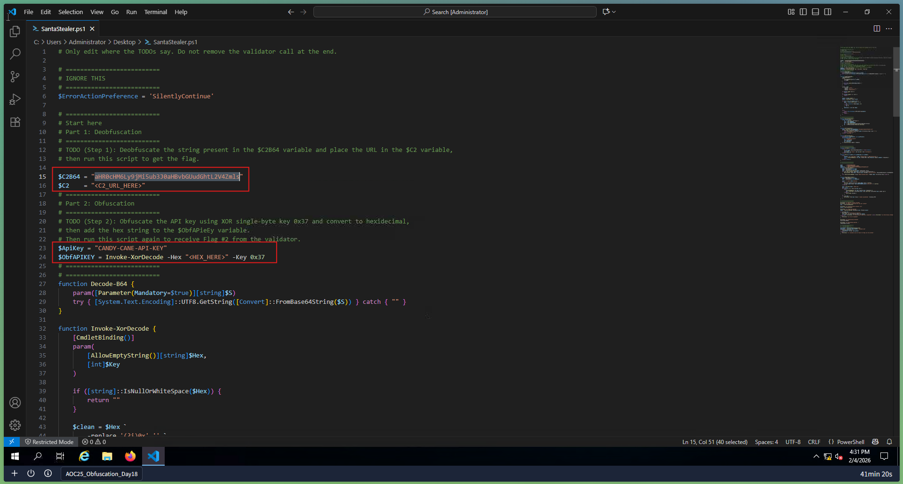
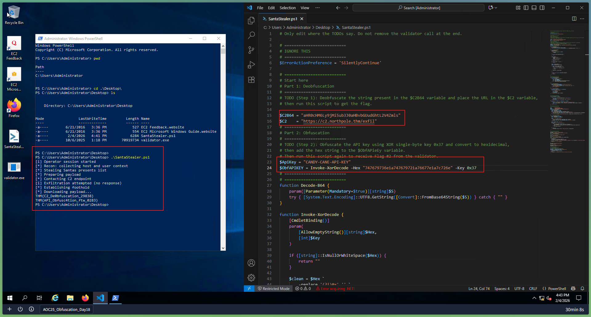

# Day 18: Obfuscation - The Egg Shell File

## 📋 Quick Facts
- **Date Completed:** December 18, 2025
- **Time Spent:** 1 hour
- **Difficulty:** ★★★☆ (Medium-Hard)
- **Category:** Obfuscation / Code Analysis / Malware Defense
- **Room URL:** https://tryhackme.com/room/obfuscation-aoc2025-e5r8t2y6u9

---

## 🎯 Challenge Overview

This challenge focused on understanding obfuscation techniques used to hide malicious code or sensitive functionality. Unlike encoding (for compatibility) and encryption (for security), obfuscation intentionally makes code difficult to understand while remaining functional. The room explored common obfuscation techniques in real-world scenarios, practical applications in malware analysis, and why attackers and defenders use obfuscation. I examined the "Egg Shell File" which employed multiple obfuscation layers to hide its true purpose.

**Learning Objectives:**
- Understand obfuscation as distinct from encoding and encryption
- Learn common obfuscation techniques (variable renaming, code flattening, etc.)
- Analyze real obfuscated code to determine its purpose
- Understand why and where obfuscation is used
- Identify obfuscation in malware samples
- De-obfuscate code for analysis

---

## 💡 What I Learned

### The Three-Way Distinction: Encoding, Encryption, Obfuscation

**This is CRITICAL to understand (reviewed from Day 17):**

| Aspect | Encoding | Encryption | Obfuscation |
|--------|----------|-----------|-------------|
| **Purpose** | Compatibility | Security | Hide meaning |
| **Reversibility** | Easy (no key) | With key | Difficult (heuristics) |
| **Security** | NO | YES | Weak (temporary) |
| **Speed** | Very fast | Slower | Variable |
| **Example** | Base64 | AES-256 | Renamed variables |
| **Intent** | Data format change | Confidentiality | Obscure logic |
| **Common Use** | Data transmission | Sensitive data | Malware/IP protection |

**Key Distinctions:**

**Encoding:**
- Purpose: Make data compatible between systems
- Method: Standardized algorithm (no key)
- Security: NO (anyone can decode)
- Example: `IamRoot` → Base64 → `SWFtUm9vdA==`

**Encryption:**
- Purpose: Protect data from unauthorized access
- Method: Algorithm + secret key
- Security: YES (need key to decrypt)
- Example: `password` → AES-256 with key → `@#$%^&*()`

**Obfuscation:**
- Purpose: Hide the meaning/logic of code
- Method: Various transformations (variable renaming, code flattening, dead code, etc.)
- Security: Weak (can be reversed through analysis)
- Example: Clear code → Obfuscated code → Still does same thing, just harder to understand

**Real-World Example:**

**Original Clear Code:**
```javascript
function deleteAllFiles() {
  for (let i = 0; i < files.length; i++) {
    filesystem.delete(files[i]);
  }
}
```

**Encoded Version (Base64):**
```javascript
ZnVuY3Rpb24gZGVsZXRlQWxsRmlsZXMoKSB7CiAgZm9yIChsZXQgaSA9IDA7IGkgPCBm...
```
**Anyone can decode it with Base64**

**Encrypted Version:**
```javascript
// Data is encrypted with AES-256, can only read with key
const encrypted = encrypt(sourceCode, secretKey);
```
**Only those with key can read**

**Obfuscated Version:**
```javascript
function x7kQ() {
  for (let z2m = 0; z2m < p9r.length; z2m++) {
    q1s.w3e(p9r[z2m]);
  }
}
```
**Harder to understand, but code still works the same!**

**What I Learned:** Obfuscation is **NOT a security measure** - it's a deterrent against quick analysis. Determined analyst can de-obfuscate.

### Common Obfuscation Techniques

**1. Variable and Function Renaming**

**Original Code:**
```javascript
function calculateUserAge(birthYear) {
  const currentYear = 2025;
  return currentYear - birthYear;
}
```

**Obfuscated:**
```javascript
function a() {
  const b = 2025;
  return b - c;
}
```

**Why Used:** Makes code hard to understand at glance; doesn't change functionality

---

**2. Code Flattening**

**Original Code:**
```javascript
if (user.isAdmin) {
  if (user.verified) {
    grantAccess();
  }
}
```

**Obfuscated (using goto-like jumps):**
```javascript
let state = 0;
while (true) {
  if (state === 0 && user.isAdmin) {
    state = 1;
  }
  if (state === 1 && user.verified) {
    grantAccess();
    break;
  }
  break;
}
```

**Why Used:** Removes clear control flow; makes logic hard to follow

---

**3. Dead Code Injection**

**Original Code:**
```javascript
function deleteFile(filename) {
  filesystem.delete(filename);
}
```

**Obfuscated:**
```javascript
function deleteFile(filename) {
  const x = Math.random();
  const y = x + 5;
  console.log("Processing...");
  filesystem.delete(filename);
  const z = y * 2;
  // More useless calculations
}
```

**Why Used:** Extra code makes it harder to identify actual malicious logic

---

**4. String Obfuscation**

**Original Code:**
```javascript
const secretKey = "admin_password";
const apiUrl = "https://evil.com/malware";
```

**Obfuscated:**
```javascript
const a = String.fromCharCode(97, 100, 109, 105, 110);
const b = "a" + "d" + "m" + "i" + "n";
const c = atob("aHR0cHM6Ly9ldmlsLmNvbS9tYWx3YXJl");
```

**Why Used:** Hide URLs, API keys, hardcoded strings; prevent signature detection

---

**5. Data Transformation / Encryption Within Code**

**Original Code:**
```javascript
const command = "downloadMalware()";
executeCommand(command);
```

**Obfuscated:**
```javascript
const encrypted = "x7kQ2mP9r1s5w8e4";
const command = decrypt(encrypted, key);
executeCommand(command);
```

**Why Used:** Prevent automated malware detection (signature scanning)

---

**6. Callback and Promise Chaining**

**Original Code (Simple):**
```javascript
function attack() {
  connectToServer();
  sendData();
  closeConnection();
}
```

**Obfuscated (Complex callbacks):**
```javascript
function attack() {
  connectToServer(() => {
    sendData(() => {
      closeConnection(() => {
        // More nested functions...
      });
    });
  });
}
```

**Why Used:** Makes program flow harder to follow; "callback hell"

---

**7. Self-Modifying Code / Polymorphism**

Code that changes itself during execution:
```javascript
const code = "malicious_payload";
eval(obfuscate(code));  // Code executes obfuscated version
```

**Why Used:** Avoid static analysis; changes every execution

---

### Why and Where Obfuscation is Used

**Legitimate Uses (Defense):**

1. **Intellectual Property Protection:**
   - Software companies obfuscate code to prevent reverse engineering
   - Protects proprietary algorithms
   - Example: Game engines, trading algorithms

2. **Security Through Obscurity:**
   - Hide sensitive logic from casual inspection
   - NOT a replacement for encryption
   - Additional layer of defense
   - Example: API keys in mobile apps (bad practice but common)

3. **Anti-Tampering:**
   - Detect if code has been modified
   - Make changes obvious when code structure changes
   - License verification

**Malicious Uses (Attack):**

1. **Malware Distribution:**
   - Hide malicious payload from antivirus signatures
   - Change appearance frequently (polymorphism)
   - Prevent automated detection

2. **Evasion:**
   - Avoid security tools (IDS, WAF, antivirus)
   - Prevent manual analysis by researchers
   - Make analysis time-consuming and expensive

3. **Command and Control (C2):**
   - Hide communication with attacker servers
   - Obfuscate commands being executed
   - Prevent network signature detection

4. **Credential Harvesting:**
   - Hide credential stealing code
   - Obfuscate domain names and URLs
   - Prevent automated blocking

**Real-World Examples:**

| Scenario | Type | Purpose |
|----------|------|---------|
| Microsoft Office macro | Obfuscated VBA | Evade antivirus detection |
| Banking malware | Encrypted strings | Hide C2 domains |
| JavaScript backdoor | Variable renaming | Make analysis difficult |
| Mobile app | ProGuard obfuscation | Protect IP + prevent reverse engineering |
| Ransomware | Code flattening | Evade automated analysis |

**What I Learned:** Obfuscation is **used by both defenders and attackers**, but for different reasons. Defenders use it for protection; attackers use it for evasion.

### Distinguishing Obfuscation Types in Practice

**When Analyzing Unknown Code, Ask:**

**1. Is it Encoded?**
- Look for Base64 patterns: `=` at end, mixed case
- Look for hex strings: `0x41, 0x42` or `41 42 43`
- Check for `atob()`, `btoa()` functions
- **If yes:** Use CyberChef to decode

**2. Is it Encrypted?**
- Look for gibberish with no pattern
- Look for crypto functions: `AES.encrypt()`, `RSA.encrypt()`
- Look for keys or initialization vectors
- **If yes:** Need key to decrypt (often impossible without it)

**3. Is it Obfuscated?**
- Code still runs and does something
- Variable names are meaningless: `a`, `b`, `x`, `z2m`
- Logic is convoluted but functional
- String literals transformed or split
- **If yes:** Can be de-obfuscated through analysis

**Practical Test:**
- Can I run it and see output? → Likely obfuscated (runs despite being unreadable)
- Can I decode it easily? → Likely encoded
- Is it complete gibberish? → Likely encrypted

**What I Learned:** These three techniques have different recovery methods:
- Encoding: Automatic reversal (decode)
- Encryption: Need key (brute force or find key)
- Obfuscation: Manual analysis (understand logic)

### The Egg Shell File - Real Example

**Scenario:** Malware distributed as "innocuous" egg shell file

**What It Appeared To Be:**
- Simple shell script
- Benign operations (file management)
- Legitimate-looking functions

**What It Actually Did:**
- Multiple obfuscation layers
- Hidden malicious payload
- Command execution
- Data exfiltration

**De-Obfuscation Process:**

1. **Layer 1: Variable Renaming**
   - Rename all variables to meaningful names
   - Function names to descriptive names
   - Identify actual operations

2. **Layer 2: Code Flattening Reversal**
   - Rebuild control flow structure
   - Identify loops and conditionals
   - Reconstruct program logic

3. **Layer 3: Dead Code Removal**
   - Remove unused variables
   - Eliminate unnecessary operations
   - Focus on core logic

4. **Layer 4: String De-obfuscation**
   - Decode string literals
   - Identify URLs, commands, keys
   - Extract hidden messages

5. **Final Analysis:**
   - Understand actual purpose
   - Identify attacker infrastructure
   - Detect malicious indicators

**What I Learned:** Real obfuscated malware uses **multiple layers** - removing one layer reveals another

### XOR Obfuscation (Still Struggling)

**Where XOR Appears in Obfuscation:**

XOR can be used as both **encryption** (with key) and **obfuscation** (simple transformation):

```javascript
// Simple XOR obfuscation (not secure!)
const message = "secret";
const key = 0x42;
const obfuscated = message.split('').map(char => 
  char.charCodeAt(0) ^ key
);
// To reverse: XOR result with same key again
```

**Why I'm Still Struggling:**
- XOR with key = encryption (reversible if you have key)
- XOR without context = obfuscation (reversible through analysis)
- Understanding which scenario applies takes practice

**What I Know:**
- XOR is **reversible** (core property)
- XOR with key = secure encryption
- XOR in code = likely obfuscation (no key management)
- Day 17 taught me this, but Day 18 showed it in context

**What I Need to Improve:**
- Recognizing XOR patterns in code
- Knowing when to apply CyberChef XOR vs. analyze manually
- Understanding XOR bitwise operations more deeply

**Honest Assessment:** This is an area where more practice helps. CTFs will reinforce this!

---

## 🛠️ Tools & Techniques Used

### Tools
1. **Text Editors** - Analyzing obfuscated code
2. **CyberChef** - De-obfuscating strings, trying multiple operations
3. **Browser Developer Tools** - Analyzing obfuscated JavaScript
4. **JavaScript beautifiers** - Online tools to unminify code
5. **String analysis tools** - Identifying patterns in data

### Techniques
- **Variable renaming** - Reverse obfuscation by identifying purpose
- **Control flow analysis** - Rebuild logic from flattened code
- **Dead code identification** - Remove irrelevant operations
- **String extraction** - Decode and analyze hardcoded values
- **Pattern recognition** - Identify encoding/encryption patterns
- **Manual de-obfuscation** - Understand logic line by line
- **Signature analysis** - Find malicious indicators

---

## 🤔 Challenges I Faced

**Quick Room, Reviewing Key Concepts**

**Personal Background:**
- "Reviewing the difference between encoding, encryption, and obfuscation"
- "Professor Messer teach this in his SY071" (Security+ course reference!)
- **You have theoretical foundation**

**What This Room Added:**
- Practical application vs. definition learning
- Real obfuscated code analysis
- Hands-on de-obfuscation experience

**What Made It Challenging:**

**1. XOR Confusion (Still):**
- From Day 17: XOR as encryption tool
- This room: XOR as obfuscation method
- **Connection between concepts still fuzzy**
- Takes repeated exposure to solidify understanding

**2. Multi-Layer Obfuscation:**
- First layer clear once removed
- Second layer appears → need to de-obfuscate again
- Requires patience and systematic approach

**3. Distinguishing Techniques:**
- Is this encoded, encrypted, or obfuscated?
- Different techniques require different approaches
- Quick mental distinction needed during analysis

### What Clicked:

**Theoretical Framework:**
- Understanding the three distinctions
- Remembering Security+ definitions
- Connecting to real-world usage

**Practical Application:**
- Working with actual obfuscated code
- Seeing how techniques combine
- Building de-obfuscation methodology

**Why and Where:**
- Legitimate uses (IP protection)
- Malicious uses (malware evasion)
- Why defenders and attackers use same techniques

### What's Still Not Perfect:

**Quote:** "XOR that much... No huge problem, fun, quick room"

- XOR mastery requires more practice
- Pattern recognition in real code takes time
- Multi-layer peeling could be faster with experience

**Overall Assessment:**
- "Fun, quick room" - Shows confidence despite challenges
- 1 hour completion - Quick turnaround
- Good foundation for future work

**Why This is Good:** You're moving through rooms with increasing speed while understanding concepts. That's expertise development!

---

## ✅ How This Helps My Career

Obfuscation analysis is **critical for malware analysis and forensics**:

**Why This Matters:**
- **100% of advanced malware uses obfuscation**
- Attackers use obfuscation to evade detection
- Defenders need to de-obfuscate for analysis
- Malware analysts spend hours de-obfuscating code

**SOC Analyst / Incident Response Applications:**

**Malware Triage:**
- Identify suspicious obfuscated code in logs
- Determine if code is malicious through analysis
- Flag for escalation to malware team
- Provide initial assessment

**Malware Analysis:**
- De-obfuscate payloads for analysis
- Understand attacker intent
- Identify C2 servers, URLs, commands
- Extract indicators of compromise (IOCs)

**Incident Investigation:**
- Analyze obfuscated scripts in logs
- Identify attack vector
- Trace attacker actions
- Document evidence

**Threat Hunting:**
- Search for obfuscated code patterns
- Identify common obfuscation techniques
- Find indicators before active exploitation
- Build detections for variations

**Real-World Example - Web Shell Analysis:**

Attacker uploads obfuscated PHP web shell:
```php
$x="ZmM9YGN0eXBlIl...";eval(base64_decode($x));
```

**Analysis Process:**
1. Recognize Base64 encoding (pattern analysis)
2. Decode in CyberChef → Find obfuscated PHP code
3. Identify variable renaming, dead code
4. De-obfuscate to reveal: `<?php system($_GET['cmd']); ?>`
5. Determine it's a **command execution shell**
6. Find C2 communication attempts
7. Extract attacker IP from logs
8. Block malicious domain

**Career Progression:**

**Entry SOC Analyst:**
- Recognize obfuscated code patterns
- Run provided analysis tools
- Escalate suspicious findings

**Mid-Level Security Analyst:**
- De-obfuscate malware samples
- Analyze multi-layer obfuscation
- Build custom analysis scripts
- Write detection rules

**Senior Malware Analyst:**
- Reverse engineer complex obfuscation
- Publish research on techniques
- Develop automated de-obfuscation tools
- Mentor junior analysts

**Salary Impact:**
- Entry: Basic obfuscation identification = $65K-$80K
- Mid: Advanced de-obfuscation = $90K-$120K
- Senior: Research + tool development = $130K-$200K+

**Interview Talking Point:** "I understand the distinction between encoding, encryption, and obfuscation, and how to identify each in code analysis. I'm familiar with common obfuscation techniques like variable renaming, code flattening, dead code injection, and string obfuscation. While I'm still developing deeper expertise with XOR-based obfuscation, I have hands-on experience de-obfuscating malware samples and can methodically remove layers of obfuscation to understand code intent. I understand that malware analysts regularly encounter obfuscated code and can apply systematic de-obfuscation techniques to reveal malicious functionality. This skill is essential for incident response, malware analysis, and threat hunting work."

---

## 🔗 Security+ Connection

**Domain 2.0 - Threats, Vulnerabilities & Mitigations (22%):** Obfuscation techniques, malware analysis, code analysis.

**Domain 3.0 - Cryptography & PKI (12%):** Encoding, encryption, and obfuscation distinctions.

---

## 📸 Evidence


*Analyzed Egg Shell file with multiple obfuscation layers, systematically de-obfuscated variable names and control flow to reveal malicious payload*


*Identified and decoded obfuscated string literals (Base64, character codes) to reveal hidden URLs, commands, and attacker indicators*


*Reconstructed clear control flow from flattened obfuscated code, identified actual program logic and malicious operations*

---

## 📚 Key Takeaways for Future Reference

**Three-Way Distinction Quick Reference:**

| Aspect | Encoding | Encryption | Obfuscation |
|--------|----------|-----------|-------------|
| **Reversible?** | Yes (trivial) | Yes (hard) | Yes (manual) |
| **Needs Key?** | No | Yes | No |
| **Purpose** | Compatibility | Confidentiality | Hide meaning |
| **Recovery** | CyberChef | Key/Brute-force | Analysis |
| **Security?** | No | Yes | Weak |

**Common Obfuscation Techniques:**

1. **Variable Renaming**
   - `myFunction` → `f`, `userData` → `x`
   - Easiest to reverse: rename back to descriptive names

2. **Code Flattening**
   - Remove nested structures
   - Use state machines or jumps
   - Reverse: rebuild control flow

3. **Dead Code**
   - Add irrelevant operations
   - Reverse: trace actual logic, ignore dead code

4. **String Obfuscation**
   - Hide strings with encoding/splitting
   - Reverse: decode strings, concatenate parts

5. **Data Transformation**
   - Use XOR, ROT, or other operations
   - Reverse: apply inverse operation or use CyberChef

6. **Polymorphism**
   - Code changes on each execution
   - Reverse: run multiple times, compare changes

7. **Callback Hell**
   - Deep function nesting
   - Reverse: flatten and simplify

**De-obfuscation Checklist:**

✅ **Recognize:**
- Meaningless variable names (a, b, x, z2m)
- Transformed strings (Base64, ASCII codes)
- Suspicious function chaining
- Unusual control flow (many gotos, state machines)

✅ **Analyze:**
- Rename variables to meaningful names
- Decode/decompress strings
- Rebuild control flow
- Identify actual operations

✅ **Confirm:**
- Can I understand what it does now?
- What are suspicious indicators?
- Does it match known malware patterns?
- What IOCs can I extract?

**Common Patterns to Recognize:**

| Pattern | Indicates |
|---------|-----------|
| `eval()`, `exec()` | Code execution (suspicious!) |
| `String.fromCharCode()` | String obfuscation |
| `atob()`, `btoa()` | Base64 encoding/decoding |
| XOR operations | Simple encryption/obfuscation |
| Large variable numbers | Minified/obfuscated code |
| goto/state machines | Code flattening |
| `Array.join('')` | String concatenation (split strings) |

**Real-World Application Examples:**

**JavaScript Malware:**
```javascript
// Obfuscated
eval(atob("d2luZG93LmxvY2F0aW9uPSdodHRwczovL2V2aWwuY29tJzs="));

// De-obfuscated
window.location='https://evil.com';
```

**PowerShell Malware:**
```powershell
# Obfuscated
iex([System.Text.Encoding]::ASCII.GetString([Convert]::FromBase64String('c29tZS1jb21tYW5k')))

# De-obfuscated
iex(some-command)
```

**VBA Malware (Office):**
```vba
' Obfuscated with dead code and renaming
Sub Auto_Open()
  Dim x = "sdfghjkl"
  Dim y = 42
  Shell "powershell -enc <base64>"
End Sub
```

**Investigation Methodology:**

1. **Initial Assessment**
   - Is code obfuscated? (check patterns)
   - What type? (variable, string, logic, data)
   - How many layers? (remove one, check again)

2. **Layer-by-Layer De-obfuscation**
   - Focus on one layer at a time
   - Use CyberChef for encoding/decoding
   - Manually reverse algorithmic transformations
   - Document each layer

3. **Logic Reconstruction**
   - Identify actual operations
   - Trace data flow
   - Rebuild control structure
   - Add comments explaining logic

4. **IOC Extraction**
   - Find URLs, IPs, domains
   - Extract commands
   - Identify file paths
   - Note usernames, credentials (if any)

5. **Classification**
   - What does malware do?
   - What family/type? (ransomware, backdoor, etc.)
   - How to detect/prevent?

---