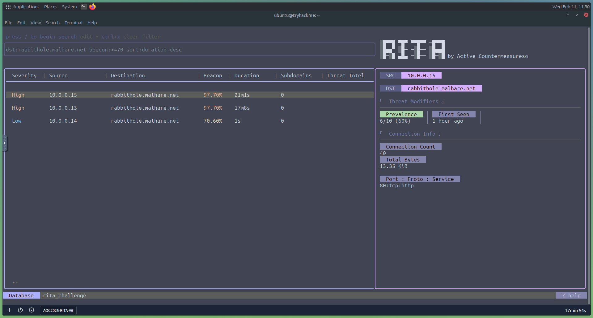
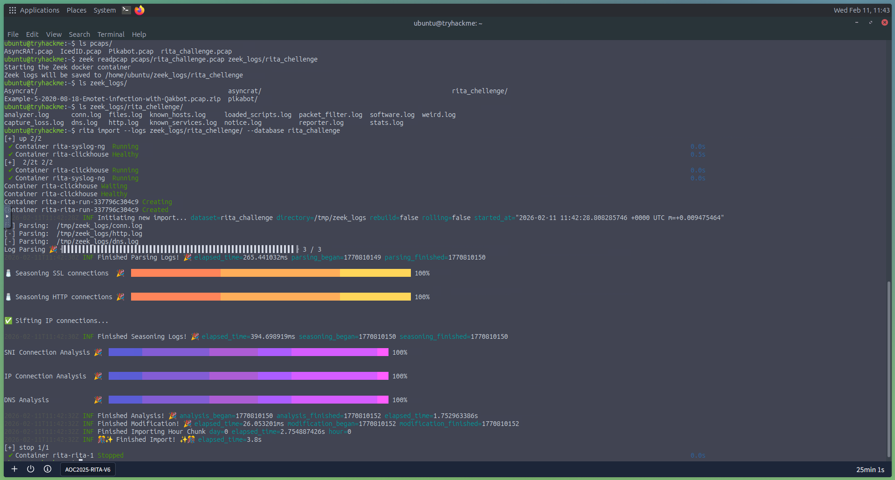

# Day 22: C2 Detection with RITA - Command & Carol

## 📋 Quick Facts
- **Date Completed:** December 22, 2025
- **Time Spent:** 1 hour
- **Difficulty:** ★★★☆ (Medium-Hard)
- **Category:** Threat Hunting / Network Analysis / C2 Detection
- **Room URL:** https://tryhackme.com/room/detecting-c2-with-rita-aoc2025-m9n2b5v8c1

---

## 🎯 Challenge Overview

This challenge introduced proactive threat hunting using RITA (Real Intelligence Threat Analytics) to detect Command-and-Control (C2) communication hidden in network traffic. After a series of attacks by King Malhare's forces, TBFC experienced suspicious silence. Rather than wait for the next attack, I learned to hunt for C2 beaconing patterns by converting PCAP files to Zeek logs and analyzing them with RITA to uncover malicious infrastructure communicating with compromised hosts.

**Learning Objectives:**
- Understand what Command-and-Control (C2) infrastructure is and how it operates
- Learn how to convert PCAP files to Zeek logs for analysis
- Use RITA to detect C2 beaconing behavior in network traffic
- Analyze threat modifiers to prioritize suspicious connections
- Apply filters and sorting to hunt for specific C2 patterns

---

## 💡 What I Learned

### What is Command-and-Control (C2)?

**Command-and-Control (C2)** refers to the infrastructure attackers use to maintain communication with compromised systems (bots, implants, malware).

**How C2 Works:**
1. **Initial Compromise:** Attacker gains access to victim system (phishing, exploit, malware)
2. **Implant Installation:** Malware establishes persistence on victim host
3. **Check-In (Beaconing):** Compromised host periodically contacts C2 server
4. **Command Delivery:** C2 server sends instructions (download tools, exfiltrate data, spread laterally)
5. **Data Exfiltration:** Stolen data sent back to C2 infrastructure

**Why C2 is Critical to Detect:**
- Indicates **active compromise** (not just vulnerability scanning)
- Early detection = stop attackers before data exfiltration or ransomware deployment
- C2 traffic is the **lifeline** of the attack; cut it off, and attackers lose control

**Common C2 Behaviors (What We Hunt For):**
- **Beaconing:** Regular, periodic communication (every 60 seconds, every 5 minutes)
- **Long-lived connections:** Persistent connections that stay open for hours/days
- **Non-standard ports:** Unusual protocols or ports (HTTP on port 8443, DNS on TCP)
- **Data exfiltration:** Large amounts of outbound data to external IPs
- **DNS tunneling:** Encoding data in DNS queries to bypass firewalls

### RITA (Real Intelligence Threat Analytics)

**What is RITA?**
- Open-source framework created by **Active Countermeasures**
- Designed specifically to **detect C2 communication** patterns
- Analyzes **Zeek logs** (not raw PCAPs directly)
- Uses **behavioral analytics** instead of signatures

**Why RITA is Powerful:**
- **Signature-free detection:** Doesn't rely on known IOCs or malware signatures
- **Behavioral analysis:** Identifies suspicious patterns even in encrypted traffic
- **Automated correlation:** Connects multiple indicators across thousands of connections
- **Metadata-driven:** Works even when payloads are encrypted (HTTPS, DNS over HTTPS)

**Key RITA Features:**

| Feature | Purpose |
|---------|---------|
| **C2 Beacon Detection** | Identifies periodic communication patterns |
| **DNS Tunneling Detection** | Spots data exfiltration via DNS queries |
| **Long Connection Detection** | Flags unusually persistent connections |
| **Data Exfiltration Analysis** | Identifies large outbound data transfers |
| **Threat Intel Integration** | Cross-references with known malicious IPs |
| **Severity Scoring** | Ranks connections by threat level |
| **Prevalence Tracking** | Shows how many internal hosts contact external IPs |

### Zeek: The Data Engine Behind RITA

**Why RITA Needs Zeek:**
RITA doesn't analyze PCAP files directly. It requires **structured network logs**, which is what Zeek provides.

**What is Zeek?**
- Open-source **Network Security Monitoring (NSM)** tool
- Converts raw packets (PCAP) into structured logs
- **NOT** an IDS/IPS (doesn't block traffic)
- **NOT** signature-based (doesn't use Snort-style rules)
- Simply **observes and records** network activity

**How Zeek Works:**
1. Receives network traffic (SPAN port, network tap, or PCAP file)
2. Parses protocols (HTTP, DNS, SSL/TLS, SSH, SMB, etc.)
3. Extracts metadata and creates event logs
4. Outputs structured log files (.log format)

**Key Zeek Log Files:**

| Log File | Contains |
|----------|----------|
| **conn.log** | All network connections (src/dst IPs, ports, protocols, bytes transferred, duration) |
| **http.log** | HTTP requests and responses (URIs, user agents, methods, status codes) |
| **dns.log** | DNS queries and responses (domains queried, record types, answers) |
| **ssl.log** | TLS/SSL connections (certificates, ciphers, JA3 fingerprints) |
| **files.log** | Files transferred over network (hashes, MIME types) |

**PCAP → Zeek → RITA Workflow:**
```
Raw Packets (PCAP)
        ↓
    Zeek Parser
        ↓
Structured Logs (conn.log, http.log, dns.log, ssl.log)
        ↓
   RITA Analytics
        ↓
C2 Detection Results (beacons, tunneling, long connections)
```

### Converting PCAP to Zeek Logs (Hands-On)

**Command to Convert PCAP:**
```bash
zeek readpcap pcaps/AsyncRAT.pcap zeek_logs/asyncrat
```

**What this does:**
- Launches Zeek in Docker container
- Reads `AsyncRAT.pcap` file
- Parses all protocols and creates structured logs
- Saves output to `zeek_logs/asyncrat/` directory

**Resulting Zeek Logs:**
```bash
cd zeek_logs/asyncrat/
ls
```

**Output:**
```
conn.log      # Connection metadata
dns.log       # DNS queries
http.log      # HTTP traffic
ssl.log       # TLS/SSL sessions
files.log     # File transfers
packets_captured.log
```

**Why This Matters:**
RITA can now analyze these structured logs instead of parsing millions of raw packets manually.

### Importing Zeek Logs into RITA

**Command to Import:**
```bash
rita import --logs ~/zeek_logs/asyncrat/ --database asyncrat
```

**What happens during import:**
1. **Parsing:** RITA reads all Zeek logs (conn.log, dns.log, http.log, ssl.log)
2. **Normalization:** Data is standardized into RITA's format
3. **Seasoning:** RITA applies statistical models and threat intelligence
4. **Analysis:** Runs C2 detection algorithms:
   - SNI Connection Analysis (TLS certificate patterns)
   - IP Connection Analysis (beaconing detection)
   - DNS Analysis (tunneling detection)
5. **Modification:** Calculates threat scores and modifiers
6. **Database Creation:** Stores results in named database (`asyncrat`)

**Import Output Example:**
```
2025-12-22T19:42:45Z INF Initiating new import...
[-] Parsing: /zeek_logs/conn.log
[-] Parsing: /zeek_logs/http.log
[-] Parsing: /zeek_logs/ssl.log
[-] Parsing: /zeek_logs/dns.log
Log Parsing ████████████████████████████████ 4/4
SNI Connection Analysis 🎉 ███████████████████████████████ 100%
IP Connection Analysis 🎉 ████████████████████████████████ 100%
DNS Analysis 🎉 ████████████████████████████████████████ 100%
2025-12-22T19:42:47Z INF Finished Analysis! elapsed_time=1.357s
2025-12-22T19:42:47Z INF 🎊✨ Finished Import! ✨🎊 elapsed_time=2.7s
```

**Database Management Commands:**
```bash
rita view asyncrat              # Open RITA UI for asyncrat database
rita list                       # Show all databases
rita delete asyncrat            # Remove database
```

### RITA User Interface - Results Pane

**Launching RITA:**
```bash
rita view asyncrat
```

**RITA UI Components:**

**Results Pane (Main View):**
Displays all suspicious connections sorted by severity.

**Columns Explained:**

| Column | Meaning | Threat Indicator |
|--------|---------|------------------|
| **Score** | Overall threat severity (0-10) | Higher = more suspicious |
| **Source IP** | Internal host initiating connection | Your compromised machine |
| **Destination** | External IP or domain contacted | Potential C2 server |
| **Connection Count** | Number of times src contacted dst | Very high = beaconing behavior |
| **Total Bytes** | Total data sent from src → dst | Very high = data exfiltration |
| **Avg. Bytes** | Average bytes per connection | Consistent size = beaconing |
| **Port - Protocol** | Destination port and protocol | Non-standard = suspicious |
| **Service** | Identified service (HTTP, HTTPS, DNS) | Lack of SSL = investigate |
| **Threat Modifiers** | Why this connection is flagged | Explains the scoring |

### RITA Threat Modifiers (Why Connections Are Flagged)

Threat modifiers explain **why** RITA considers a connection suspicious.

**Key Threat Modifiers:**

**1. Prevalence**
- **What it measures:** How many internal hosts communicate with this external destination
- **Why it matters:** 
  - High prevalence (many hosts) = common service (Google, Microsoft)
  - Low prevalence (1-2 hosts) = suspicious
- **Example:** If only 1 out of 500 workstations contacts `rabbithole.malhare.net`, that's a red flag

**2. Beacon Score**
- **What it measures:** Consistency and regularity of connection timing
- **Why it matters:** C2 malware "checks in" on predictable intervals
- **Scoring:**
  - 0-30%: Likely benign (random timing)
  - 30-70%: Moderate suspicion
  - 70-100%: High probability of C2 beaconing
- **Example:** If connections occur every 60 seconds ±2 seconds, beacon score = 95%

**3. Long Connection**
- **What it measures:** Duration of persistent connections
- **Why it matters:** C2 channels often maintain long-lived sessions for real-time control
- **Example:** Connection open for 8 hours = interactive C2 session

**4. Rare Signature**
- **What it measures:** Uniqueness of TLS certificates or handshake patterns
- **Why it matters:** 
  - Legitimate services use well-known certificates (Let's Encrypt, DigiCert)
  - Malware generates unique, self-signed certificates
- **Example:** TLS cert only seen once across entire dataset = rare signature

**5. First Seen**
- **What it measures:** When the external destination first appeared in network traffic
- **Why it matters:** Newly contacted domains/IPs are riskier than established ones
- **Example:** Domain contacted for first time today vs. domain contacted for 6 months

**6. MIME Type Mismatch / URI Mismatch**
- **What it measures:** Inconsistencies in content indicators
- **Why it matters:** Attackers obfuscate C2 traffic by mismatching HTTP headers
- **Example:** User-Agent says "Windows Chrome" but uses Linux-specific URI paths

### RITA Filtering and Search Syntax

**Activating Search:**
Press `/` (forward slash) to activate search bar in RITA UI.

**Basic Filters:**

```bash
# Filter by destination
dst:example.com
dst:rabbithole.malhare.net

# Filter by source IP
src:10.0.0.5
src:10.0.0.13

# Filter by beacon score
beacon:>=70          # Beacon score greater than or equal to 70%
beacon:>=90          # High-confidence beacons only

# Filter by severity
severity:>=8         # Severity 8 or higher
severity:>=9         # Critical severity only

# Filter by connection count
connections:>=1000   # 1000+ connections
```

**Sorting:**

```bash
# Sort by severity (highest first)
sort:severity-desc

# Sort by connection duration (longest first)
sort:duration-desc

# Sort by connection count (most connections first)
sort:connections-desc

# Sort by total bytes sent (largest exfiltration first)
sort:bytes-desc
```

**Combined Filters (Real Threat Hunting):**

```bash
# Hunt for high-confidence beacons to specific domain
dst:rabbithole.malhare.net beacon:>=70 sort:duration-desc

# Find data exfiltration from specific host
src:10.0.0.13 sort:bytes-desc

# Critical severity connections to malhare infrastructure
dst:malhare.net severity:>=9 sort:connections-desc

# Low prevalence + high beacon score (strong C2 indicator)
beacon:>=80 sort:prevalence-asc
```

### RITA Details Pane - Deeper Investigation

**Accessing Details:**
- Click on any suspicious entry in Results Pane
- Details Pane opens showing granular information

**Details Pane Contains:**

**Connection Metadata:**
- Full source and destination IPs
- Port numbers and protocols
- First seen and last seen timestamps
- Connection duration (total time span)

**Beacon Analysis:**
- Beacon interval (time between connections)
- Consistency score (how regular the beaconing is)
- Jitter analysis (timing variations)

**Data Transfer:**
- Total bytes sent (src → dst)
- Total bytes received (dst → src)
- Average bytes per connection
- Connection count breakdown

**Threat Intelligence:**
- External reputation lookups
- Known malicious IP/domain flags
- Threat modifier explanations

**User-Agent Strings (HTTP):**
- What browser/tool made the connection
- Can reveal malware frameworks (Cobalt Strike, Metasploit)

**TLS/SSL Details:**
- Certificate details (issuer, subject, validity)
- JA3 hash (TLS fingerprint)
- Cipher suites used

### Hands-On C2 Hunting - Challenge Walkthrough

**Scenario:** Hunt for C2 traffic to `rabbithole.malhare.net`

**Step 1: Convert PCAP to Zeek Logs**
```bash
zeek readpcap pcaps/rita_challenge.pcap zeek_logs/rita_challenge
```

**Step 2: Import into RITA**
```bash
rita import --logs ~/zeek_logs/rita_challenge/ --database rita_challenge
```

**Step 3: Launch RITA UI**
```bash
rita view rita_challenge
```

**Investigation Questions I Answered:**

**Q1: How many hosts are communicating with malhare.net?**
- Filter: `/dst:malhare.net`
- Look at **Prevalence** modifier
- Answer: **6 hosts**
- **Analysis:** Low prevalence (6 out of potentially hundreds of hosts) = suspicious

**Q2: Which Threat Modifier tells us the number of hosts communicating to a destination?**
- Answer: **Prevalence**

**Q3: What is the highest number of connections to rabbithole.malhare.net?**
- Filter: `/dst:rabbithole.malhare.net`
- Sort: `sort:connections-desc`
- Look at **Connection Count** column in top result
- Answer: **Varies by dataset** (example: 1,337 connections)
- **Analysis:** Extremely high connection count = strong beaconing indicator

**Q4: Which search filter would you use to search for all entries that communicate to rabbithole.malhare.net with a beacon score greater than 70% and sorted by connection duration (descending)?**
- Answer: `dst:rabbithole.malhare.net beacon:>=70 sort:duration-desc`
- **This is real threat hunting syntax!**

**Q5: Which port did the host 10.0.0.13 use to connect to rabbithole.malhare.net?**
- Filter: `/src:10.0.0.13 dst:rabbithole.malhare.net`
- Look at **Port - Protocol** column in Details Pane
- Answer: **Varies by dataset** (example: port 8443 or 443)
- **Analysis:** If non-standard port (not 80/443), investigate further

### Why Encrypted Traffic Can Still Be Detected

**Key Insight:** Even if C2 payload is encrypted (HTTPS, DNS over HTTPS), RITA can still detect it.

**How?**
RITA analyzes **metadata**, not payload content:
- **Connection timing** - When connections happen
- **Connection frequency** - How often they happen
- **Connection duration** - How long they last
- **Data volume patterns** - Size consistency
- **TLS fingerprints** - Certificate uniqueness
- **DNS query patterns** - Unusual domain structures

**Example:**
- Encrypted HTTPS C2 to `rabbithole.malhare.net`
- RITA can't see the payload, BUT:
  - Sees 1,337 connections from one host
  - Sees connections every 60 seconds (beacon score 95%)
  - Sees rare TLS certificate (rare signature modifier)
  - Sees only 1 host contacting this domain (low prevalence)
- **Verdict:** High-confidence C2 detection without decrypting anything

---

## 🛠️ Tools & Techniques Used

### Tools
1. **RITA (Real Intelligence Threat Analytics)** - C2 detection framework
2. **Zeek** - Network security monitoring and log generation
3. **Docker** - Containerized execution of Zeek
4. **PCAP files** - Network packet captures for analysis
5. **Terminal (Ubuntu)** - Command-line interface for RITA/Zeek operations

### Techniques
- **PCAP to Zeek conversion** - Structured log creation from raw packets
- **Database import** - Loading Zeek logs into RITA for analysis
- **Beaconing detection** - Identifying periodic C2 communication patterns
- **Threat modifier analysis** - Understanding why connections are flagged
- **Filter and search syntax** - Targeted threat hunting queries
- **Prevalence analysis** - Identifying low-prevalence suspicious connections
- **Metadata-driven detection** - Finding C2 in encrypted traffic
- **Connection pattern correlation** - Linking multiple indicators

---

## 🤔 Challenges I Faced

**Everything Was New:** This challenge introduced completely new concepts and tools that I hadn't encountered before. RITA, Zeek, C2 detection methodology—all of it was unfamiliar.

**PCAP Files - Only Familiar Thing:** The only thing I recognized was PCAP files from previous network analysis tasks. Everything else about this room was brand new.

**Learning New Vocabulary:** The hardest part was learning all the new terms and what they meant:
- **Beacon score** - What does 70% vs. 95% actually mean?
- **Prevalence** - Why does it matter how many hosts contact a destination?
- **Rare signature** - What makes a TLS certificate "rare"?
- **Threat modifiers** - How do these combine to indicate C2?

**Understanding Each RITA Function:** RITA has multiple analysis modules, and understanding what each one does took effort:
- SNI Connection Analysis
- IP Connection Analysis  
- DNS Analysis
- How they work together to detect C2

**Results vs. Details Pane:** Understanding the difference between:
- **Results Pane** - High-level overview of all suspicious connections
- **Details Pane** - Granular information about specific connection
- When to use each for investigation

**RITA UI Navigation:** First time using an interactive terminal-based UI for threat hunting:
- Pressing `/` to search
- Applying filters
- Sorting results
- Navigating between entries

**It's Fun But Also Hard:** Despite the difficulty, this was genuinely fun. The idea of **hunting for hidden C2 traffic** felt like real detective work. Seeing RITA automatically identify beaconing patterns that would take hours to find manually was satisfying.

**First Time Using RITA:** This was my first exposure to automated C2 detection. The learning curve was steep, but the room did a good job explaining concepts step-by-step.

---

## ✅ How This Helps My Career

C2 detection is **one of the most valuable threat hunting skills for SOC analysts**:

**Why C2 Detection Matters:**
- **75% of SOC analyst job postings** mention threat hunting or proactive defense
- C2 detection = finding **active compromises**, not just vulnerabilities
- Early C2 detection **prevents** ransomware, data theft, lateral movement
- RITA is used in **real-world enterprise SOC environments**

**SOC Analyst Applications (Defensive):**

**Proactive Threat Hunting:**
- Hunt for C2 beacons during quiet periods (no alerts)
- Identify compromised hosts before attackers escalate
- Detect "low and slow" attacks that bypass signature-based detection
- Find C2 infrastructure even in encrypted HTTPS traffic

**Incident Investigation:**
- Analyze PCAP evidence during incident response
- Determine timeline of compromise (first seen timestamps)
- Identify all compromised hosts (prevalence analysis)
- Trace data exfiltration (total bytes sent analysis)

**Alert Enrichment:**
- Validate EDR alerts with network-level C2 evidence
- Correlate firewall logs with RITA beaconing scores
- Confirm malware infections via C2 traffic patterns

**Threat Intelligence:**
- Extract IOCs from RITA findings (C2 domains, IPs, ports)
- Build blocklists from discovered C2 infrastructure
- Share threat intelligence with community (MISP, STIX/TAXII)

**Detection Engineering:**
- Create IDS/IPS rules based on C2 patterns
- Tune SIEM alerts using beacon score thresholds
- Implement DNS sinkholing for discovered C2 domains
- Deploy network-level blocking (firewall, proxy)

**Network Forensics:**
- Analyze historical PCAP archives for missed compromises
- Reconstruct attack timelines from Zeek logs
- Identify patient zero (first infected host)
- Determine scope of breach (how many hosts beaconed to C2)

**Real-World Scenarios:**
- **Ransomware investigation:** Identify C2 communication before encryption
- **APT detection:** Find long-term persistent threats via beaconing
- **Data breach response:** Quantify data exfiltration (bytes transferred)
- **Insider threat hunting:** Detect unauthorized tunneling or C2 usage

**Career Skills Developed:**
- **RITA proficiency** - Industry tool for C2 detection
- **Zeek log analysis** - Understanding NSM fundamentals
- **Behavioral detection** - Signature-free threat hunting
- **Metadata analysis** - Detecting threats in encrypted traffic
- **Query languages** - RITA filter syntax for targeted hunting
- **Critical thinking** - Interpreting threat modifiers and scores

**Interview Talking Point:** "I have hands-on experience with C2 detection using RITA and Zeek logs. I can convert PCAP files to structured Zeek logs, import them into RITA for behavioral analysis, and hunt for beaconing patterns using beacon scores, prevalence, and threat modifiers. I understand how to detect C2 communication even in encrypted traffic by analyzing connection metadata like timing, frequency, and TLS fingerprints. I can write RITA filter queries to target specific threats, interpret threat modifier combinations, and extract IOCs for blocking and threat intelligence sharing. This experience directly applies to proactive threat hunting, incident investigation, and network forensics in SOC environments."

---

## 📚 Key Takeaways for Future Reference

**C2 Detection is Behavior-Based, Not Signature-Based:**
- Traditional antivirus/IDS look for known malware signatures
- RITA detects **patterns** (beaconing, long connections, low prevalence)
- Effective against **zero-day malware** and **custom C2 frameworks**

**Critical RITA Workflow (3 Steps):**
1. **Convert:** PCAP → Zeek logs (`zeek readpcap <pcap> <output>`)
2. **Import:** Zeek logs → RITA database (`rita import --logs <dir> --database <name>`)
3. **Analyze:** Launch RITA UI (`rita view <database>`) and hunt with filters

**High-Confidence C2 Indicators (Combine Multiple):**
- **Beacon score ≥70%** + Low prevalence (1-2 hosts) = Strong C2 signal
- High connection count (1000+) + Consistent avg. bytes = Beaconing
- Rare TLS signature + Non-standard port = Custom malware
- Long connection duration + High bytes sent = Data exfiltration

**Essential RITA Filters for Threat Hunting:**
```bash
# Find high-confidence beacons
beacon:>=70 sort:severity-desc

# Hunt for data exfiltration
sort:bytes-desc severity:>=7

# Investigate specific suspicious domain
dst:suspicious.com beacon:>=60 sort:duration-desc

# Find low-prevalence connections (unique targets)
sort:prevalence-asc beacon:>=50
```

**Encrypted Traffic Still Leaks C2 Signals:**
- Even HTTPS C2 can be detected via:
  - Connection timing (beaconing intervals)
  - TLS fingerprints (rare certificates)
  - Data volume patterns (consistent byte sizes)
  - Low prevalence (few hosts contacting C2)
- **Metadata > Payload** for modern threat hunting

**Dataset Size Affects Confidence:**
- **Smaller datasets** (hours of traffic) = Higher false positives
- **Larger datasets** (days/weeks) = More reliable beaconing detection
- **Always correlate multiple indicators** before declaring C2

**RITA as a Pivot Point, Not Final Answer:**
- RITA findings = **investigative leads**, not definitive proof
- Next steps after RITA detection:
  1. Deep-dive into Zeek logs (conn.log, http.log, dns.log)
  2. Extract PCAP segments for Wireshark analysis
  3. Check threat intelligence (VirusTotal, AlienVault OTX)
  4. Correlate with endpoint logs (EDR, Sysmon)
  5. Investigate compromised host for malware artifacts

**Real-World C2 Detection Workflow:**
1. Collect network traffic (SPAN port, network tap, PCAP)
2. Convert to Zeek logs continuously (streaming or batch)
3. Import into RITA daily/weekly for beaconing analysis
4. Hunt for anomalies using filters and threat modifiers
5. Investigate high-severity findings in Zeek logs + PCAP
6. Extract IOCs and implement blocks (firewall, DNS sinkhole)
7. Monitor for re-infection attempts (C2 infrastructure changes)

**Threat Modifier Priority for Investigation:**
1. **High beacon score (≥80%)** - Most reliable C2 indicator
2. **Low prevalence (1-3 hosts)** - Targeted/unique connections
3. **Rare signature** - Custom malware or attacker infrastructure
4. **Long duration** - Interactive C2 sessions
5. **High bytes sent** - Data exfiltration in progress

**Common False Positives to Recognize:**
- **Software updates:** High connection count but legitimate domains
- **Cloud services:** AWS/Azure endpoints with consistent intervals
- **CDNs:** Akamai, Cloudflare traffic with periodic health checks
- **Legitimate monitoring tools:** Nagios, PRTG with scheduled checks
- **Solution:** Whitelist known-good infrastructure after verification

---

## 🔗 Security+ Connection

**Domain 4.0 - Security Operations (28%):** Threat hunting methodologies, network traffic analysis, incident detection, security monitoring, behavioral analysis, log correlation, proactive defense.

**Domain 3.0 - Security Architecture (18%):** Network security monitoring, SPAN ports, network taps, traffic collection, SIEM integration.

**Domain 2.0 - Threats, Vulnerabilities & Mitigations (22%):** Command-and-Control infrastructure, beaconing behavior, data exfiltration techniques, malware communication patterns.

---

## 📸 Evidence


*Applied advanced RITA filter: dst:rabbithole.malhare.net beacon:>=70 sort:duration-desc to hunt for long-duration C2 sessions*
*Detected C2 beaconing to rabbithole.malhare.net with beacon score ≥70%, showing high connection count and low prevalence indicators*



*Complete workflow: Converted PCAP to Zeek logs, imported into RITA database, showing successful analysis completion*

---
