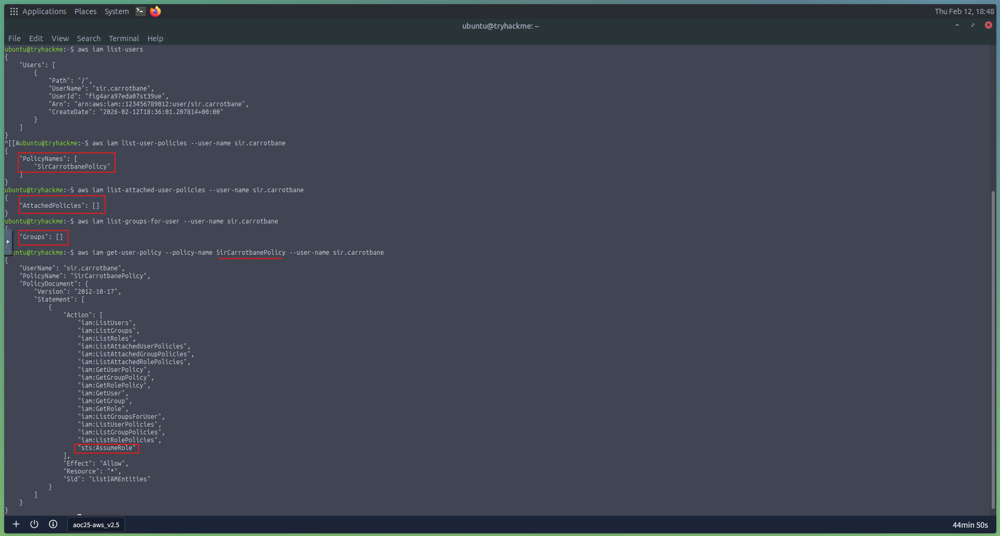
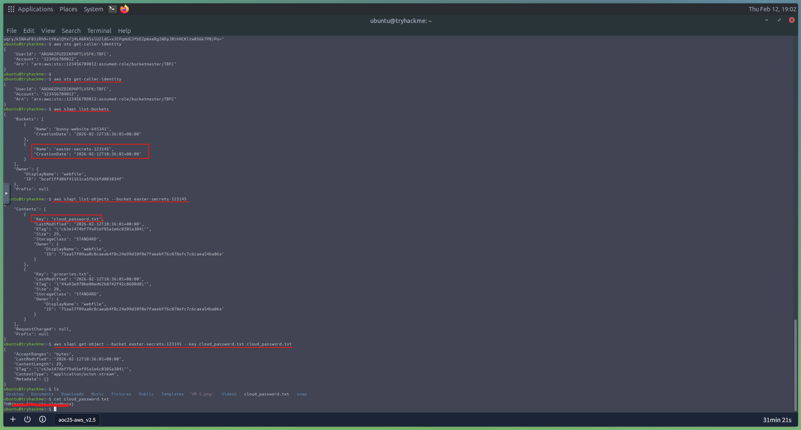

# Day 23: AWS Security - S3cret Santa

## 📋 Quick Facts
- **Date Completed:** December 23, 2025
- **Time Spent:** 1 hour
- **Difficulty:** ★★★☆ (Medium)
- **Category:** Cloud Security / AWS IAM / Privilege Escalation
- **Room URL:** https://tryhackme.com/room/cloudenum-aoc2025-y4u7i0o3p6

---

## 🎯 Challenge Overview

This challenge introduced AWS cloud security through investigating Sir Carrotbane's compromised credentials. I learned how AWS IAM (Identity and Access Management) works, how attackers enumerate cloud permissions, and how a single misconfiguration can lead to privilege escalation and data exfiltration from S3 buckets. While the room focused on offensive techniques (Red Team), understanding these attack paths is essential for defending cloud infrastructure.

**Learning Objectives:**
- Understand AWS IAM fundamentals (Users, Roles, Groups, Policies)
- Learn AWS CLI basics for cloud enumeration
- Recognize privilege escalation through role assumption
- Identify common cloud security misconfigurations
- Apply defensive thinking to cloud security

---

## 💡 What I Learned

### AWS Cloud Fundamentals

**What is "The Cloud"?**

Instead of running servers in your own data center, the cloud lets you rent computing resources (servers, storage, databases) from providers like AWS, Microsoft Azure, or Google Cloud Platform.

**Why Companies Use Cloud:**
- Scalability - Easily add/remove resources
- Cost-effective - Pay only for what you use
- Global reach - Deploy applications worldwide
- Reliability - Providers handle infrastructure maintenance

**Key Point:** 95%+ of organizations use cloud services, making cloud security skills essential.

### AWS IAM - Identity and Access Management

**The Four Key Components:**

**1. Users**
- Represents a person or application
- Has unique credentials (access keys)
- Example: `sir.carrotbane`

**2. Groups**
- Collection of users with similar permissions
- Example: `Developers`, `Admins`

**3. Roles**
- Temporary identity that can be "assumed"
- Provides temporary credentials
- Example: `bucketmaster` role for S3 access

**4. Policies**
- JSON documents defining what actions are allowed/denied
- Attached to users, groups, or roles

**Example Policy:**
```json
{
  "Effect": "Allow",
  "Action": "s3:GetObject",
  "Resource": "arn:aws:s3:::my-bucket/*"
}
```

**What this means:** User can download files from `my-bucket`.

### AWS Services Encountered

**AWS CLI (Command Line Interface):**
- Tool for interacting with AWS services programmatically
- Used for enumeration, administration, and investigation

**AWS STS (Security Token Service):**
- Creates temporary credentials for IAM roles
- Key action: `sts:AssumeRole` (switch to another role)

**AWS S3 (Simple Storage Service):**
- Object storage (like cloud folders)
- Companies store files, backups, documents
- Example: `easter-secrets-123145` bucket

### The Attack Path (What I Observed)

**Privilege Escalation Chain:**

```
1. Compromised Credentials (sir.carrotbane)
        ↓
2. Enumerate IAM Permissions
        ↓
3. Discover sts:AssumeRole Capability
        ↓
4. Find bucketmaster Role (can be assumed)
        ↓
5. Assume Role (get temporary credentials)
        ↓
6. Access S3 Buckets
        ↓
7. Download Sensitive Files
```

**Key Discovery:** Sir Carrotbane couldn't directly access S3, but he could **assume a role** that had S3 access. This is privilege escalation.

### Common Cloud Security Misconfigurations

**1. Overly Permissive sts:AssumeRole**

**Vulnerable:**
```json
{
  "Action": "sts:AssumeRole",
  "Resource": "*"
}
```
Allows user to assume **any role** in the account.

**Secure:**
```json
{
  "Action": "sts:AssumeRole",
  "Resource": "arn:aws:iam::123456789012:role/SpecificRole"
}
```
Only specific roles can be assumed.

---

**2. Wildcard Permissions**

**Vulnerable:**
```json
{
  "Action": "s3:*",
  "Resource": "*"
}
```
Full S3 access to all buckets.

**Secure:**
```json
{
  "Action": ["s3:GetObject"],
  "Resource": "arn:aws:s3:::specific-bucket/*"
}
```
Limited actions on specific bucket only.

---

**3. Exposed Credentials**

AWS access keys left in:
- Desktop files (like Sir Carrotbane)
- GitHub repositories
- Application configuration files
- Unencrypted logs

**Real-World Examples:**
- **Toyota (2023):** AWS keys in GitHub → customer data leaked
- **Capital One (2019):** IAM misconfiguration → 100M+ records stolen

---

**4. Public S3 Buckets**

S3 buckets accidentally set to public access.

**Impact:**
- Anyone can list/download files
- Data breaches, compliance violations

**Prevention:**
- Enable S3 Block Public Access
- Audit bucket policies regularly

### Key AWS CLI Commands (What I Used)

**Identity & Enumeration:**
```bash
aws sts get-caller-identity           # Who am I?
aws iam list-users                    # List all users
aws iam list-roles                    # List all roles
```

**Role Assumption (Privilege Escalation):**
```bash
aws sts assume-role --role-arn <arn> --role-session-name <name>
```

**S3 Operations:**
```bash
aws s3api list-buckets                # List all buckets
aws s3api list-objects --bucket <n>   # List bucket contents
aws s3api get-object --bucket <n> --key <file> <output>  # Download
```

---

## 🛠️ Tools & Techniques Used

### Tools
1. **AWS CLI** - Command-line interface for AWS
2. **AWS IAM** - Identity and Access Management
3. **AWS STS** - Security Token Service
4. **AWS S3** - Object storage service

### Techniques
- Cloud enumeration (listing IAM entities)
- Permission analysis (reading JSON policies)
- Privilege escalation (role assumption)
- Data exfiltration (downloading from S3)

---

## 🤔 Challenges I Faced

**New Topic - Easier Than Expected:** This was my first deep dive into AWS security, and while completely new, it was surprisingly easier than previous rooms.

**What Made It Easier:**

**Real-World Relevance:**
- "I like it, I think it's pretty useful and align with real world application with IAM"
- IAM is something I've heard HR and people talk about all the time
- Seeing how it works in practice made concepts click
- Clear connection to actual job requirements

**Clear Output Fields:**
- AWS CLI output is well-structured JSON
- Fields are clearly labeled: `"RoleName": "bucketmaster"`
- Easy to understand what each field means
- Logical progression through enumeration steps

**What Was Challenging:**

**New Commands and Options:**
- "The problem is just like the same where there are new commands and options which I don't remember them yet"
- AWS CLI syntax: `aws iam list-users` vs. `aws s3api get-object`
- Flags and parameters: `--user-name`, `--role-arn`, `--bucket`
- Can follow during challenge, but can't recall from memory

**Overall Experience:**
- "Fun, useful, quick room" ✅
- 1 hour completion (relatively fast) ✅
- High practical value (real-world skills) ✅
- Will need more practice to memorize commands ✅

---

## ✅ How This Helps My Career

AWS cloud security is **one of the highest-demand skills in cybersecurity**:

**Why AWS Security Matters:**
- **80% of companies** use AWS cloud infrastructure
- **60% of SOC analyst jobs** require cloud security knowledge
- **90% of data breaches** involve cloud misconfigurations
- AWS is the **#1 cloud provider** worldwide

**SOC Analyst Applications (Blue Team - My Focus):**

**Cloud Security Monitoring:**
- Monitor AWS CloudTrail logs for suspicious API calls
- Detect unauthorized `sts:AssumeRole` attempts
- Alert on unusual S3 bucket access patterns
- Track IAM policy changes

**Incident Response:**
- Investigate compromised AWS credentials
- Determine scope of cloud account breach
- Identify which resources were accessed
- Trace data exfiltration from S3 buckets

**Threat Hunting:**
- Hunt for overly permissive IAM policies
- Find users with dangerous `sts:AssumeRole` permissions
- Identify public S3 buckets
- Discover exposed AWS credentials in repositories

**Vulnerability Assessment:**
- Audit IAM policies for least privilege violations
- Review role trust relationships
- Check S3 bucket permissions
- Identify wildcard permissions (`Resource: "*"`)

**Career Skills Developed:**
- Cloud security fundamentals (IAM, roles, policies)
- AWS CLI basics (essential for cloud investigations)
- Permission policy analysis (reading JSON)
- Understanding privilege escalation in cloud
- Cloud incident response methodology

**Salary Impact:**
- Entry SOC (no cloud): $60K-$75K
- SOC with AWS knowledge: $75K-$95K
- Cloud Security Analyst: $100K-$140K

**Interview Talking Point:** "I have hands-on experience with AWS cloud security, including IAM enumeration, understanding privilege escalation through role assumption, and investigating S3 bucket access. I can use AWS CLI to enumerate users, roles, and policies, analyze permission documents to identify misconfigurations, and understand common cloud security issues like overly permissive role assumptions and wildcard permissions. While I'm still building command memorization, I have strong conceptual understanding of cloud security principles and can apply them to SOC monitoring, incident investigation, and vulnerability assessment in cloud environments."

---

## 🔗 Security+ Connection

**Domain 2.0 - Threats, Vulnerabilities & Mitigations (22%):** Cloud vulnerabilities, privilege escalation, credential compromise, data exfiltration, misconfigurations.

**Domain 3.0 - Security Architecture (18%):** Cloud security architecture, IAM, identity management, access control models, least privilege principle.

**Domain 4.0 - Security Operations (28%):** Cloud security monitoring, incident response, threat hunting, vulnerability assessment.

---

## 📸 Evidence


*Enumerated IAM users, roles, and policies using AWS CLI; discovered sir.carrotbane has sts:AssumeRole capability leading to privilege escalation via bucketmaster role*


*After assuming bucketmaster role, successfully accessed S3 buckets and downloaded sensitive files from easter-secrets-123145 bucket*

---

## 📚 Key Takeaways for Future Reference

**AWS IAM Core Concepts:**

| Component | Purpose | Example |
|-----------|---------|---------|
| **User** | Single identity | sir.carrotbane |
| **Role** | Temporary identity | bucketmaster |
| **Group** | Collection of users | Developers, Admins |
| **Policy** | Permission rules | JSON document |

**Dangerous IAM Actions:**

| Action | Risk Level | Why |
|--------|------------|-----|
| `sts:AssumeRole` | **High** | Privilege escalation |
| `s3:GetObject` | **High** | Data exfiltration |
| `iam:Get*` / `iam:List*` | Medium | Reconnaissance |

**Common Cloud Misconfigurations (Red Flags):**

❌ Wildcard Resource: `"Resource": "*"`  
❌ Wildcard Action: `"Action": "s3:*"`  
❌ Unrestricted AssumeRole on sensitive roles  
❌ Public S3 buckets  
❌ Exposed credentials in code/files  

**Security Best Practices (Blue Team Defense):**

✅ Least Privilege - Grant minimum permissions  
✅ Specific Resources - Avoid wildcards  
✅ Role Trust Restrictions - Limit who can assume roles  
✅ S3 Block Public Access - Prevent exposure  
✅ Credential Rotation - Regularly rotate keys  
✅ CloudTrail Logging - Monitor all API calls  
✅ MFA for Sensitive Operations - Require second factor  

**Detection Strategies (SOC Monitoring):**

**Monitor CloudTrail for:**
- Unusual `sts:AssumeRole` calls (geography, IP, timing)
- Multiple `iam:List*` calls (enumeration)
- High-volume `s3:GetObject` (data exfiltration)
- Failed authorization attempts (reconnaissance)
- Policy modifications (privilege escalation prep)

**Real-World Breach Examples:**

| Company | Year | Issue | Impact |
|---------|------|-------|--------|
| Toyota | 2023 | AWS keys in GitHub | Customer data leaked |
| Capital One | 2019 | IAM misconfiguration | 100M+ records stolen |
| Verizon | 2020 | Public S3 bucket | 14M customer records |

**Key Lesson:** One IAM misconfiguration = complete cloud compromise

---
