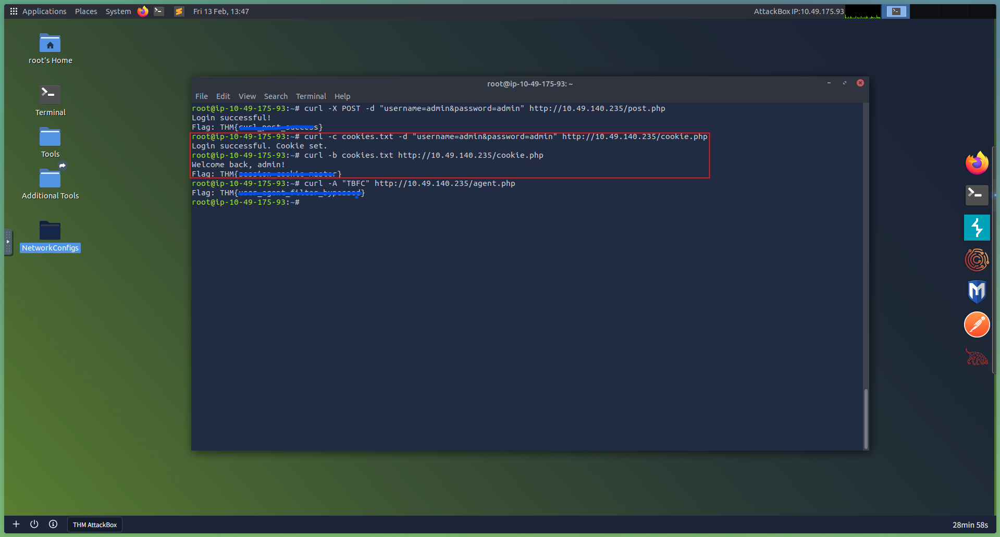

# Day 24: cURL Exploitation - Hoperation Eggsploit

## 📋 Quick Facts
- **Date Completed:** December 24, 2025
- **Time Spent:** 1 hour
- **Difficulty:** ★★★☆ (Medium)
- **Category:** Web Exploitation / Command Line / HTTP Manipulation
- **Room URL:** https://tryhackme.com/room/webhackingusingcurl-aoc2025-w8q1a4s7d0

---

## 🎯 Challenge Overview

The final Advent of Cyber 2025 challenge focused on web exploitation using cURL from the command line. The scenario involved shutting down a wormhole control panel operated by the Evil Easter Bunnies, but without browser access or Burp Suite—only a terminal and cURL. I learned to craft HTTP requests manually, send POST data to login forms, manage session cookies, automate brute-force attacks with bash scripts, and spoof User-Agent headers to bypass weak security controls.

**Learning Objectives:**
- Understand HTTP requests and responses at a fundamental level
- Use cURL to make GET and POST requests from the terminal
- Work with cookies and sessions in cURL for authentication
- Automate web exploitation with bash scripting
- Bypass basic security controls (User-Agent filtering)

---

## 💡 What I Learned

### What is cURL?

**cURL** is a command-line tool for crafting HTTP requests and viewing raw responses.

**Why cURL Matters:**
- Works when browsers aren't available (headless environments, SSH sessions)
- Provides precise control over HTTP requests
- Essential for understanding what tools like Burp Suite do under the hood
- Used in automation scripts and penetration testing

**Basic Usage:**
```bash
curl http://example.com
```

This sends an HTTP GET request and prints the raw HTML response in the terminal.

### HTTP Basics (Review)

**HTTP (Hypertext Transfer Protocol)** is how browsers and servers communicate.

**Two Main Request Types:**

**1. GET Request**
- Retrieves a webpage or resource
- Example: Loading a homepage

**2. POST Request**
- Submits data to the server
- Example: Logging in with username/password

**What I Learned:** Login forms are just POST endpoints with parameters. Understanding this makes tools like Burp Suite, cURL, or Python scripts interchangeable.

### cURL Techniques Practiced

**1. Basic GET Request**

```bash
curl http://MACHINE_IP/
```

**What this does:** Fetches the homepage HTML (raw text, not rendered).

---

**2. POST Request (Login Form)**

```bash
curl -X POST -d "username=admin&password=admin" http://MACHINE_IP/post.php
```

**Flags explained:**
- `-X POST` - Use POST method (not GET)
- `-d "data"` - Send data in request body
- Format: `key=value&key2=value2`

**What this does:** Simulates clicking "Login" button with credentials.

---

**3. Viewing Full Response (Headers + Body)**

```bash
curl -i -X POST -d "username=admin&password=admin" http://MACHINE_IP/post.php
```

**New flag:**
- `-i` - Include response headers in output

**Why useful:** Headers contain `Set-Cookie` values and status codes.

---

**4. Cookie Management (Session Handling)**

**Saving cookies:**
```bash
curl -c cookies.txt -d "username=admin&password=admin" http://MACHINE_IP/session.php
```

**Flag:**
- `-c cookies.txt` - Save cookies received from server to file

**Reusing cookies:**
```bash
curl -b cookies.txt http://MACHINE_IP/session.php
```

**Flag:**
- `-b cookies.txt` - Send cookies from file with request

**What I Learned:** Web applications use cookies to maintain sessions. Browsers do this automatically, but with cURL you handle it manually.

---

**5. User-Agent Spoofing**

Some applications block cURL by checking the User-Agent header.

**Blocked (default cURL):**
```bash
curl http://MACHINE_IP/agent.php
# Server sees: User-Agent: curl/7.x.x → Rejected
```

**Bypass (spoof browser):**
```bash
curl -A "Mozilla/5.0" http://MACHINE_IP/agent.php
```

**Flag:**
- `-A "string"` - Set custom User-Agent header

**What I Learned:** HTTP headers are just text—attackers can forge them easily.

---

**6. Bash Scripting - Automated Brute-Force**

**Create password list:**
```bash
nano passwords.txt
# Add potential passwords (one per line)
```

**Create brute-force script:**
```bash
nano loop.sh
```

**Script contents:**
```bash
for pass in $(cat passwords.txt); do
  echo "Trying password: $pass"
  response=$(curl -s -X POST -d "username=admin&password=$pass" http://MACHINE_IP/bruteforce.php)
  if echo "$response" | grep -q "Welcome"; then
    echo "[+] Password found: $pass"
    break
  fi
done
```

**Run script:**
```bash
chmod +x loop.sh
./loop.sh
```

**What this does:**
- Reads each password from file
- Sends POST request with current password
- Checks if response contains "Welcome" (success indicator)
- Stops when correct password is found

**What I Learned:** This is how tools like Hydra and Burp Intruder work under the hood—repetitive HTTP requests with variable data.

---

## 🛠️ Tools & Techniques Used

### Tools
1. **cURL** - Command-line HTTP client
2. **Bash** - Shell scripting for automation
3. **nano/vi** - Text editors for creating scripts
4. **grep** - Pattern matching in responses

### Techniques
- HTTP GET/POST requests from command line
- Form data submission (`-d` flag)
- Cookie management (`-c` and `-b` flags)
- Header manipulation (User-Agent spoofing)
- Session replay (using saved cookies)
- Automated brute-force (bash loops)
- Response parsing (grep for success indicators)

---

## 🤔 Challenges I Faced

**No Major Problems:** This was a straightforward room focused on learning cURL fundamentals. "Fun room" overall.

**What Made It Easy:**
- Clear step-by-step instructions
- Immediate feedback from cURL responses
- Simple bash scripting (not too complex)
- Concepts built progressively

**What I Learned (New Depth):**
- "Just learning new, more in depth on how I can utilise cURL"
- Previously used cURL casually, now understand it more deeply
- See how it connects to web exploitation workflow
- Understand what browsers/Burp Suite do automatically

**Personal Preference:**
- "Not a big fan of web exploitation"
- Prefer Blue Team/defensive security
- But recognize this is useful knowledge for understanding attacks

**Overall Experience:**
- 1 hour completion (quick) ✅
- Fun and educational ✅
- Practical command-line skills ✅
- Not my favorite topic (web exploitation) but valuable ✅

---

## ✅ How This Helps My Career

While this is **Red Team focused** (offensive web exploitation), understanding these techniques helps **Blue Team defenders**:

**Why cURL Matters for SOC Analysts:**

**Understanding Attack Techniques:**
- Recognize automated POST requests in web logs
- Identify brute-force patterns (multiple login attempts)
- Detect User-Agent spoofing in traffic
- Understand how attackers bypass weak controls

**Incident Investigation:**
- Reproduce attacker requests during investigations
- Test suspected vulnerabilities without GUI tools
- Analyze web application behavior from logs
- Verify exploitation attempts

**Automation & Scripting:**
- Write scripts to check endpoint availability
- Automate security checks on internal applications
- Test authentication mechanisms
- Monitor web service health

**API Security Testing:**
- Most APIs use HTTP (same as web applications)
- cURL is standard tool for API testing
- Understanding POST/GET requests essential for API security

**Real-World SOC Applications:**

**Log Analysis:**
- Recognize suspicious POST patterns in Apache/Nginx logs
- Identify brute-force attacks (multiple failed logins)
- Detect unusual User-Agent strings
- Spot automated scanning tools

**Security Testing:**
- Test internal web applications for vulnerabilities
- Verify authentication mechanisms work correctly
- Check session management implementations
- Validate security controls

**Career Skills Developed:**
- Command-line proficiency (essential for security roles)
- HTTP protocol understanding (foundation of web security)
- Bash scripting (automation skills)
- Web application security awareness

**Interview Talking Point:** "I have hands-on experience with command-line web exploitation using cURL, including crafting HTTP GET/POST requests, managing session cookies, automating attacks with bash scripting, and bypassing weak security controls. While my focus is Blue Team defensive security, understanding these offensive techniques helps me recognize attack patterns in web logs, investigate incidents, and test internal applications for vulnerabilities. I can write bash scripts to automate security checks and understand how tools like Burp Suite and Hydra work under the hood."

---

## 🔗 Security+ Connection

**Domain 2.0 - Threats, Vulnerabilities & Mitigations (22%):** Web application attacks, brute-force attacks, authentication bypass, session hijacking.

**Domain 4.0 - Security Operations (28%):** Security testing, vulnerability assessment, log analysis, attack pattern recognition.

---

## 📸 Evidence


*Successfully used cURL to send POST requests with credentials, save session cookies to file, and replay sessions for authenticated access*


*Created automated brute-force script using bash loop and cURL, demonstrating how tools like Hydra work under the hood*

---

## 📚 Key Takeaways for Future Reference

**cURL Flags Quick Reference:**

| Flag | Purpose | Example |
|------|---------|---------|
| `-X POST` | Set HTTP method | `-X POST` |
| `-d "data"` | Send POST data | `-d "username=admin&password=admin"` |
| `-i` | Include headers in output | `-i` |
| `-c file` | Save cookies to file | `-c cookies.txt` |
| `-b file` | Send cookies from file | `-b cookies.txt` |
| `-A "string"` | Set User-Agent | `-A "Mozilla/5.0"` |
| `-s` | Silent mode (no progress) | `-s` |

**Common cURL Patterns:**

**Basic GET:**
```bash
curl http://example.com
```

**POST with data:**
```bash
curl -X POST -d "key=value" http://example.com/login
```

**Save and replay cookies:**
```bash
# Login and save cookie
curl -c cookies.txt -d "user=admin&pass=admin" http://example.com/login

# Replay session
curl -b cookies.txt http://example.com/dashboard
```

**Spoof User-Agent:**
```bash
curl -A "Mozilla/5.0 (Windows NT 10.0; Win64; x64)" http://example.com
```

**View full response:**
```bash
curl -i http://example.com
```

**Blue Team Detection Indicators:**

**Web Log Patterns to Monitor:**
- Multiple POST requests to `/login` with different passwords (brute-force)
- Unusual User-Agent strings (not common browsers)
- User-Agent: `curl/7.x.x` (automated tools)
- Rapid sequential requests from single IP
- POST requests with simple data patterns

**What This Room Taught:**

✅ **HTTP is just text** - Requests can be crafted manually  
✅ **Browsers automate everything** - Cookies, headers, sessions handled automatically  
✅ **cURL gives precise control** - Understand what's happening behind the scenes  
✅ **Automation is simple** - Bash loops + cURL = brute-force tool  
✅ **Security through obscurity fails** - User-Agent filtering is weak control  

**Real-World Relevance:**

**This is how tools work:**
- **Burp Suite** - GUI wrapper around HTTP request manipulation
- **Hydra** - Automated brute-force using HTTP requests
- **WFuzz** - Automated fuzzing with HTTP
- **Python requests library** - Programmatic HTTP (same concept)

**Understanding cURL = Understanding web exploitation fundamentals**

---

🎄 **Congratulations on completing Advent of Cyber 2025!** 🎄

**24/24 Days Complete!** ✅

From all of us at TryHackMe, have a **Merry SOC-mas** and a **"Hoppy" New Year!** 🐰

---
