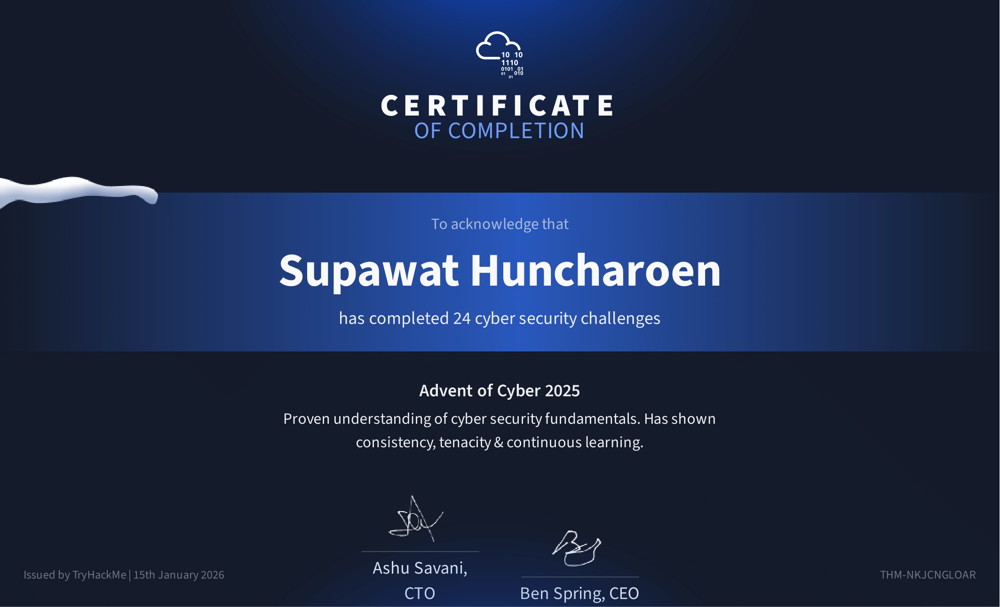

# 🎄 Advent of Cyber 2025 Documentation

**Documentation of my journey through TryHackMe's Advent of Cyber 2025 challenge**

---



[]()
[]()
[]()

## Quick Stats

- **Status:** ✅ All 24 Days Complete
- **Start Date:** December 1, 2025
- **Completion:** 100% (24/24 days)
- **Tools Used:** 50+
- **Categories:** SIEM, Malware Analysis, Web Security, Cloud, AI Security, ICS/OT, Containers, Forensics

---

## 📋 Project Overview

This repository contains comprehensive documentation of all 24 days of the **Advent of Cyber 2025** challenge by TryHackMe. As an ILS (Information and Library Science) student transitioning into cybersecurity, this challenge provided hands-on experience across multiple security domains.

**Challenge Period:** December 1-24, 2025  
**Completion Status:** ✅ 24/24 Days Completed  
**Location:** Bangkok, Thailand  
**Goal:** Build practical cybersecurity skills and earn industry-recognized certification

### What is Advent of Cyber?

Advent of Cyber is TryHackMe's annual beginner-friendly cybersecurity event featuring daily hands-on challenges. The 2025 event covered offensive security, defensive security, DFIR, and cloud security with a focus on real-world scenarios.

---

### My Achievement

- ✅ Completed all 24 daily challenges
- ✅ Earned certificate of completion
- ✅ Invested 60+ hours in practical cybersecurity training
- ✅ Gained hands-on experience with 50+ industry-standard security tools
- ✅ Developed skills across 15+ cybersecurity domains

---

## 📊 Skills Developed (All 24 Days)

### Defensive Security


- SIEM (Splunk, Microsoft Sentinel) - Days 3, 10, 15
- Email Security (Phishing Detection) - Days 2, 12
- Alert Triaging (Azure Sentinel) - Day 10
- YARA Rules (Malware Detection) - Day 13
- Windows Registry Forensics - Day 16
- Web Attack Forensics (Apache logs, Sysmon) - Day 15
- C2 Detection (RITA, Zeek) - Day 22

### Offensive Security


- Phishing Campaigns (SET) - Day 2
- Web Exploitation (XSS, IDOR, Race Conditions) - Days 5, 11, 20
- Network Scanning (Nmap) - Day 7
- Command-line Web Hacking (cURL) - Day 24

### DFIR & Malware


- Static/Dynamic Analysis (PeStudio, ProcMon) - Day 6
- YARA Pattern Matching - Day 13
- HTA Malware Analysis - Day 21
- Code Obfuscation & Deobfuscation - Day 18
- Registry Forensics - Day 16
- Web Attack Forensics - Day 15

### Cloud & Containers


- AWS IAM Privilege Escalation - Day 23
- Docker Container Escape - Day 14
- Cloud Security Misconfigurations - Days 14, 23

### Emerging Tech


- AI Security & Exploitation - Days 4, 8
- ICS/SCADA/Modbus Security - Day 19

### Cryptography & Encoding


- CyberChef (Encoding/Decoding) - Day 17
- Password Cracking - Day 9
- Base64, XOR, MD5, ROT13 - Days 17, 18

### Tools & Technologies


## 📖 Repository Structure

```
/AOC-2025-Documentation
│
├── README.md (This file)
├── /01-Executive-Summary
│   └── overview.md
├── /02-Skills-Matrix
│   └── mapping.md
├── /03-Daily-Challenges
│   ├── day-01-linux-cli.md
│   ├── day-02-phishing.md
│   ├── day-03-splunk-basics.md
│   ├── day-04-ai-security.md
│   ├── day-05-idor.md
│   ├── day-06-malware-analysis.md
│   ├── day-07-network-discovery.md
│   ├── day-08-prompt-injection.md
│   ├── day-09-password-cracking.md
│   ├── day-10-soc-alert-triage.md
│   ├── day-11-xss.md
│   ├── day-12-phishing-detection.md
│   ├── day-13-yara-rules.md
│   ├── day-14-containers.md
│   ├── day-15-web-forensics.md
│   ├── day-16-registry-forensics.md
│   ├── day-17-cyberchef.md
│   ├── day-18-obfuscation.md
│   ├── day-19-ics-scada.md
│   ├── day-20-race-conditions.md
│   ├── day-21-hta-malware.md
│   ├── day-22-c2-detection.md
│   ├── day-23-aws-iam.md
│   └── day-24-curl-exploitation.md
├── /04-Case-Studies
│   ├── case-study-splunk-log-analysis.md
│   ├── case-study-soc-alert-triage.md
│   └── case-study-network-discovery.md
├── /05-Technical-Skills
│   └── tools-inventory.md
├── /06-Learning-Journey
│   ├── narrative.md
│   └── reflections.md
├── /07-Screenshots
│   ├── day-01/
│   └── ... (organized by day)
├── /08-Resources
│   └── references.md
└── /09-Certificates
    └── aoc-2025-certificate.pdf
```

## 🎯 Highlighted Case Studies

### [Day 3: Splunk Log Analysis - Did you SIEM?](./04-Case-Studies/case-study-splunk-log-analysis.md)
Analyzed web traffic and firewall logs using Splunk, identified attack chains from reconnaissance to data exfiltration, and detected SQL injection and ransomware staging attempts.

**Skills:** SPL (Search Processing Language), anomaly detection, log correlation, incident investigation

### [Day 10: SOC Alert Triaging](./04-Case-Studies/case-study-soc-alert-triage.md)
Practiced real SOC analyst workflows using Microsoft Sentinel for alert prioritization and investigation in cloud environments.

**Skills:** SIEM analysis, alert triage, Azure security, incident escalation

### [Day 7: Network Discovery with Nmap](./04-Case-Studies/case-study-network-discovery.md)
Performed network reconnaissance using Nmap to discover services, identify open ports, and map network infrastructure.

**Skills:** Network scanning, service enumeration, protocol analysis, reconnaissance

---

## 🛠️ Technical Skills Inventory

### SIEM & Log Analysis
- Splunk (SPL queries, dashboard creation, log correlation)
- Microsoft Sentinel (Azure-based SIEM, KQL queries)
- RITA & Zeek (C2 detection, PCAP analysis)
- Sysmon log analysis
- Apache log forensics
- Anomaly detection and pattern recognition
- Alert triage and investigation

### Network Security
- Nmap (port scanning, service discovery)
- Wireshark (packet analysis)
- RITA (beacon detection, threat hunting)
- Zeek (network monitoring)
- Network protocol understanding
- Traffic pattern analysis

### Offensive Security
- Web exploitation techniques (XSS, IDOR, Race Conditions)
- Command-line exploitation (cURL, bash scripting)
- Phishing campaign creation (Social Engineering Toolkit)
- Brute-force attacks
- User-Agent spoofing
- Cookie/session hijacking

### Cloud Security
- Microsoft Azure security services
- AWS IAM (privilege escalation, role assumption)
- AWS S3 (bucket enumeration, data exfiltration)
- Cloud-based SIEM operations
- Container security (Docker escape)

### Forensics & Malware Analysis
- Windows Registry forensics (Registry Explorer)
- Web attack forensics (Apache + Sysmon correlation)
- HTA malware analysis
- Static malware analysis
- Code obfuscation/deobfuscation
- YARA rules creation
- IOC extraction

### Cryptography & Encoding
- CyberChef (multi-layer deobfuscation)
- Base64, XOR, ROT13, MD5
- Password cracking (John the Ripper, Hashcat)
- Hash identification and cracking

### ICS/OT Security
- SCADA system understanding
- PLC (Programmable Logic Controller) operations
- Modbus TCP protocol
- Python pymodbus library
- Industrial control system security

### Operating Systems
- Linux command-line interface
- Windows security concepts
- Bash scripting
- PowerShell analysis
- System administration tasks

### Incident Response
- Attack chain reconstruction
- Threat hunting methodologies
- C2 (Command & Control) detection
- Forensic investigation techniques
- Multi-source log correlation

---

## 📈 Security+ Certification Alignment

This AOC 2025 experience directly supports my Security+ (SY0-701) preparation with strong coverage of **Domains 2.0 and 4.0, representing 50% of the exam weight.**

| Security+ Domain | Weight | AOC Days | Skills Gained |
|-----------------|--------|----------|---------------|
| **Domain 1.0** - General Security Concepts | 12% | Days 2, 5, 9, 11, 17, 18 | Authentication, authorization, attack types, cryptography |
| **Domain 2.0** - Threats & Vulnerabilities | 22% | Days 2, 5, 6, 11, 12, 13, 14, 15, 18, 19, 20, 21, 22, 23, 24 | Phishing, XSS, IDOR, malware, race conditions, C2, cloud misconfigs |
| **Domain 3.0** - Security Architecture | 18% | Days 7, 10, 14, 16, 19, 23 | Network architecture, cloud security, containers, ICS/OT, forensics |
| **Domain 4.0** - Security Operations | 28% | Days 3, 10, 13, 15, 16, 21, 22 | SIEM, alert triage, threat hunting, C2 detection, forensics, malware analysis |
| **Domain 5.0** - Security Program Management | 20% | Limited coverage | Technical focus |

---

## 📝 Learning Journey

### Why I Participated
As an ILS student transitioning to cybersecurity, I needed practical, hands-on experience to complement my Security+ theoretical studies. AOC 2025 provided structured daily challenges that built progressively from foundational to advanced concepts.

### What I Learned
- **Technical Skills:** SIEM operations, log analysis, network scanning, web exploitation, container security, cloud security, ICS/OT security
- **Problem-Solving:** Systematic investigation methodologies, attack chain analysis, multi-source log correlation
- **Professional Skills:** Documentation, technical writing, time management
- **Tool Proficiency:** Splunk, Nmap, Wireshark, cURL, Azure Sentinel, CyberChef, Burp Suite, Docker, AWS CLI, RITA, Zeek, Registry Explorer

### Growth & Challenges
The event started with accessible Linux basics and gradually increased in complexity. Days 3 (Splunk), 10 (Azure Sentinel), 15 (Web Forensics), 19 (ICS/SCADA), and 22 (C2 Detection) were particularly challenging, requiring deeper understanding of log correlation, cloud security, industrial systems, and network-based threat hunting. These challenges pushed me to research extensively and develop persistence when facing obstacles.

### Connection to Career Goals
Every skill learned aligns directly with SOC Analyst responsibilities: alert triage, log analysis, incident investigation, threat detection, and forensics. This practical experience complements my Security+ preparation and demonstrates to recruiters that I can apply theoretical knowledge in real scenarios.

---

## 📊 Quantifiable Achievements

- ✅ Completed 24 consecutive daily challenges
- ✅ Analyzed 100+ security scenarios across multiple attack vectors
- ✅ Gained hands-on experience with 50+ security tools
- ✅ Invested 60+ hours in practical cybersecurity training
- ✅ Documented comprehensive portfolio with 15,000+ words
- ✅ Created 5+ detailed case studies demonstrating analytical skills
- ✅ Investigated 24 mock security incidents from detection to resolution

---

## 📊 Challenge Overview (All 24 Days)

| Day | Title | Category | Difficulty | Tools | Status |
|-----|-------|----------|------------|-------|--------|
| 1 | Shells Bells | Linux CLI | ★☆☆☆ | Bash, grep, find | ✅ Complete |
| 2 | Merry Clickmas | Phishing | ★★☆☆ | SET, SMTP | ✅ Complete |
| 3 | Did you SIEM? | Splunk SIEM | ★★★☆ | Splunk, SPL | ✅ Complete |
| 4 | old sAlnt nick | AI Security | ★☆☆☆ | AI agents | ✅ Complete |
| 5 | Santa's Little IDOR | IDOR | ★★★☆ | DevTools, Burp | ✅ Complete |
| 6 | Egg-xecutal | Malware Analysis | ★★★☆ | PeStudio, ProcMon | ✅ Complete |
| 7 | Scan-ta Clause | Network Discovery | ★★☆☆ | Nmap, Netcat | ✅ Complete |
| 8 | Sched-yule conflict | Prompt Injection | ★★★☆ | Agentic AI | ✅ Complete |
| 9 | A Cracking Christmas | Password Cracking | ★★★☆ | John, pdfcrack | ✅ Complete |
| 10 | Tinsel Triage | SOC Alert Triage | ★★★★ | MS Sentinel, KQL | ✅ Complete |
| 11 | Merry XSSMas | XSS | ★★★☆ | Browser DevTools | ✅ Complete |
| 12 | Phishmas Greetings | Phishing Detection | ★★★☆ | Email headers | ✅ Complete |
| 13 | YARA mean one! | YARA Rules | ★★★☆ | YARA engine | ✅ Complete |
| 14 | DoorDasher's Demise | Containers | ★★★☆ | Docker | ✅ Complete |
| 15 | Drone Alone | Web Forensics | ★★★★ | Splunk, Sysmon | ✅ Complete |
| 16 | Registry Furensics | Windows Forensics | ★★★☆ | Registry Explorer | ✅ Complete |
| 17 | Hoperation Save McSkidy | CyberChef | ★★★☆ | CyberChef | ✅ Complete |
| 18 | The Egg Shell File | Obfuscation | ★★★☆ | CyberChef, PowerShell | ✅ Complete |
| 19 | Claus for Concern | ICS/SCADA | ★★★★ | Python, Modbus | ✅ Complete |
| 20 | Toy to The World | Race Conditions | ★★★☆ | Burp Suite | ✅ Complete |
| 21 | Malhare.exe | HTA Malware | ★★★★ | pluma, CyberChef | ✅ Complete |
| 22 | Command & Carol | C2 Detection | ★★★☆ | RITA, Zeek | ✅ Complete |
| 23 | S3cret Santa | AWS Security | ★★★☆ | AWS CLI | ✅ Complete |
| 24 | Hoperation Eggsploit | cURL Exploitation | ★★★☆ | cURL, bash | ✅ Complete |

**Legend:** ★☆☆☆ Easy | ★★☆☆ Easy-Medium | ★★★☆ Medium | ★★★★ Medium-Hard

---

## 🔗 Connect With Me

- **GitHub:** [github.com/uriel0byte](https://github.com/uriel0byte)
- **LinkedIn:** []
- **TryHackMe:** []
- **Email:** poseidon.smash@gmail.com

## 📜 License

This documentation is for educational and portfolio purposes. All challenges and content belong to TryHackMe. No flags or direct solutions are shared in compliance with TryHackMe's policies.

---

*Last Updated: January 17, 2026*
