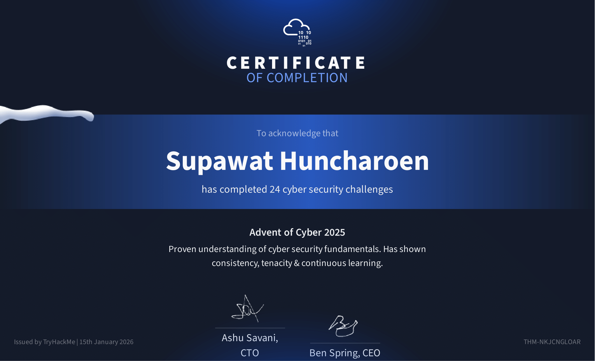

# 🎄 Advent of Cyber 2025 Documentation

**Comprehensive documentation of my journey through TryHackMe's Advent of Cyber 2025 challenge**

---



[]()
[]()
[]()
[]()

## 📊 Quick Stats

- **Status:** ✅ All 24 Days Complete
- **Documentation:** Days 1-10 Enhanced (Professional-Grade)
- **Start Date:** December 1, 2025
- **Completion Date:** December 24, 2025
- **Total Time Invested:** 60+ hours
- **Tools Mastered:** 50+
- **Categories:** SIEM, Malware Analysis, Web Security, Cloud, AI Security, ICS/OT, Containers, Forensics

---

## 📋 Project Overview

This repository contains comprehensive documentation of all 24 days of the **Advent of Cyber 2025** challenge by TryHackMe. As an ILS (Information and Library Science) student transitioning into cybersecurity, this challenge provided hands-on experience across multiple security domains.

**Challenge Period:** December 1-24, 2025  
**Completion Status:** ✅ 24/24 Days Completed  
**Enhanced Documentation:** Days 1-10 (with Key Takeaways sections)  
**Location:** Bangkok, Thailand  
**Goal:** Build practical cybersecurity skills and earn industry-recognized certification

### What is Advent of Cyber?

Advent of Cyber is TryHackMe's annual beginner-friendly cybersecurity event featuring daily hands-on challenges. The 2025 event covered offensive security, defensive security, DFIR, and cloud security with a focus on real-world scenarios.

---

### My Achievement

- ✅ Completed all 24 daily challenges
- ✅ Earned official certificate of completion
- ✅ Invested 60+ hours in practical cybersecurity training
- ✅ Gained hands-on experience with 50+ industry-standard security tools
- ✅ Developed skills across 15+ cybersecurity domains
- ✅ Enhanced Days 1-10 with professional-grade documentation
- ✅ Created comprehensive Key Takeaways sections for future reference

---

## 📊 Skills Developed (All 24 Days)

### Defensive Security (Blue Team - My Focus)


- **SIEM Operations** (Splunk, Microsoft Sentinel) - Days 3, 10, 15
- **SOC Alert Triaging** (Azure Sentinel, KQL) - Day 10
- **Email Security** (Phishing Detection) - Days 2, 12
- **Malware Analysis** (Static & Dynamic) - Days 6, 13, 21
- **YARA Rules** (Malware Detection) - Day 13
- **Windows Registry Forensics** - Day 16
- **Web Attack Forensics** (Apache logs, Sysmon) - Day 15
- **C2 Detection** (RITA, Zeek) - Day 22
- **Threat Hunting Methodologies** - Days 15, 22

### Offensive Security (Red Team)


- **Phishing Campaigns** (Social Engineering Toolkit) - Day 2
- **Web Exploitation** (XSS, IDOR, Race Conditions) - Days 5, 11, 20
- **Network Reconnaissance** (Nmap, service enumeration) - Day 7
- **Command-line Web Hacking** (cURL) - Day 24
- **Password Cracking** (John the Ripper, Hashcat) - Day 9

### DFIR & Malware


- **Static/Dynamic Analysis** (PeStudio, ProcMon, Regshot) - Day 6
- **YARA Pattern Matching** - Day 13
- **HTA Malware Analysis** - Day 21
- **Code Obfuscation & Deobfuscation** - Day 18
- **Registry Forensics** - Day 16
- **Web Attack Forensics** - Day 15
- **Living off the Land (LotL) Detection** - Day 21

### Cloud & Containers


- **Microsoft Azure** (Sentinel SIEM, cloud security) - Day 10
- **AWS IAM** (Privilege Escalation) - Day 23
- **AWS S3** (Bucket enumeration, data exfiltration) - Day 23
- **Docker** (Container Escape) - Day 14
- **Cloud Security Misconfigurations** - Days 14, 23

### Emerging Tech


- **AI Security** (Prompt Injection, Agentic AI) - Days 4, 8
- **ICS/SCADA/Modbus Security** - Day 19
- **PLC Operations** (Programmable Logic Controllers) - Day 19

### Cryptography & Encoding


- **CyberChef** (Multi-layer deobfuscation) - Days 17, 18, 21
- **Password Cracking** (Dictionary & brute-force attacks) - Day 9
- **Encoding Schemes** (Base64, XOR, ROT13, MD5) - Days 17, 18, 21

### Tools & Technologies


---

# 📖 Repository Structure

```
/AOC-2025-Documentation
│
├── README.md                          # Main portfolio landing page
│
├── /02-Skills-Matrix                  # Technical skills inventory
│   └── mapping.md                     # Complete skills breakdown with proficiency levels
│
├── /03-Daily-Challenges               # Core portfolio content ⭐
│   ├── day-01-linux-cli.md          
│   ├── day-02-phishing.md           
│   ├── day-03-splunk-basics.md       
│   ├── day-04-ai-security.md        
│   ├── day-05-idor.md               
│   ├── day-06-malware-analysis.md    
│   ├── day-07-network-discovery.md   
│   ├── day-08-prompt-injection.md    
│   ├── day-09-password-cracking.md  
│   ├── day-10-soc-alert-triage.md    
│   ├── day-11-xss.md                
│   ├── day-12-phishing-detection.md
│   ├── day-13-yara-rules.md
│   ├── day-14-containers.md
│   ├── day-15-web-forensics.md
│   ├── day-16-registry-forensics.md
│   ├── day-17-cyberchef.md
│   ├── day-18-obfuscation.md
│   ├── day-19-ics-scada.md
│   ├── day-20-race-conditions.md
│   ├── day-21-hta-malware.md
│   ├── day-22-c2-detection.md
│   ├── day-23-aws-iam.md
│   └── day-24-curl-exploitation.md
│
├── /04-Case-Studies                   # Investigation write-ups
│   └── README.md                      # Note: Case studies integrated into daily challenges
│
├── /07-Screenshots                    # Visual evidence
│   ├── day-03/                        # Splunk SIEM investigation
│   │   ├── traffic-spike-timeline.png
│   │   ├── attacker-ip-correlation.png
│   │   └── c2-firewall-logs.png
│   ├── day-06/                        # Malware analysis
│   │   ├── pestudio-sha256-strings.png
│   │   ├── regshot-before-after.png
│   │   └── procmon-tcp-filter.png
│   ├── day-10/                        # SOC alert triage
│   │   ├── sentinel-incidents-overview.png
│   │   ├── kql-attack-chain-app02.png
│   │   └── alert-correlation-entities.png
│   └── ... (other days as captured)
│
└── /09-Certificates                   # Completion evidence
    └── aoc-2025-certificate.pdf       # Official TryHackMe certificate

```

---

## 📂 Folder Descriptions

### `/02-Skills-Matrix`
**Purpose:** Quick reference showing all skills developed, tools used, and proficiency levels  
**Key File:** `mapping.md` - Comprehensive skills inventory with Security+ domain mapping

### `/03-Daily-Challenges` ⭐ **Core Portfolio**
**Purpose:** Complete documentation of all 24 AOC challenges  
**Features:**
- Days 1-10: Enhanced with professional Key Takeaways sections
- Days 11-24: Standard documentation with learning reflections
- Each file includes: Challenge overview, technical depth, tools used, personal reflections, career applications

### `/04-Case-Studies`
**Purpose:** Links to detailed investigation write-ups  
**Note:** Case studies are integrated into daily challenge documentation (Days 3, 6, 10, 15, 22) to avoid redundancy

### `/07-Screenshots`
**Purpose:** Visual evidence of hands-on work  
**Strategic Coverage:** Days 3 (Splunk), 6 (Malware), 10 (Sentinel) - the most important SOC investigations

### `/09-Certificates`
**Purpose:** Official completion evidence  
**Contents:** TryHackMe Advent of Cyber 2025 certificate

---

## 🎯 Navigation Tips

**For Recruiters:**
1. Start with main `README.md` for overview
2. Review `/02-Skills-Matrix/mapping.md` for technical inventory
3. Read enhanced daily challenges (Days 1-10) for depth
4. Check `/07-Screenshots` for visual proof

**For Interview Prep:**
- Days 3, 10, 22: Best SIEM/SOC examples
- Days 6, 13, 21: Malware analysis demonstrations
- Days 15, 16: Forensics investigations
- Day 7: Network security fundamentals

**For Learning Reference:**
- Enhanced days (1-10) contain comprehensive Key Takeaways
- Command references, investigation workflows, detection rules
- Quick reference tables and cheat sheets


---

## 🎯 Featured Case Studies

### [Day 3: Splunk SIEM Log Analysis - Did you SIEM?](./04-Case-Studies/case-study-splunk-log-analysis.md) ⭐
Investigated ransomware attack using Splunk to analyze web traffic and firewall logs. Traced complete attack chain from reconnaissance through SQL injection to data exfiltration. Identified C2 communication and calculated 126KB of stolen data.

**Skills:** SPL (Search Processing Language), log correlation, anomaly detection, attack chain reconstruction, C2 detection

**Key Takeaways:** Complete SPL syntax reference, filtering best practices, investigation workflow templates

---

### [Day 10: SOC Alert Triaging - Tinsel Triage](./04-Case-Studies/case-study-soc-alert-triage.md) ⭐⭐⭐
**Most Important for SOC Career** - Simulated real SOC analyst workflow using Microsoft Sentinel. Triaged 8 incidents (4 high-severity privilege escalation alerts) across 4 Linux hosts. Used KQL to correlate alerts, reconstruct attack chains, and identify kernel module persistence.

**Skills:** SIEM operations, 4-factor triage model (Severity, Time, Stage, Impact), KQL query writing, cloud security (Azure), multi-host incident correlation, privilege escalation detection

**Key Takeaways:** Complete triage methodology, KQL templates, attack chain patterns, SOC daily workflow

---

### [Day 6: Malware Analysis - Egg-xecutable](./04-Case-Studies/case-study-malware-analysis.md) ⭐
Analyzed HopHelper.exe using static (PeStudio) and dynamic (ProcMon, Regshot) techniques. Identified registry persistence mechanism, extracted C2 IP address from strings, and confirmed TCP-based command-and-control communication.

**Skills:** Static malware analysis, dynamic analysis, sandbox methodology, IOC extraction, persistence detection

**Key Takeaways:** Complete malware analysis workflow, Sysmon detection rules, ProcMon filtering guide

---

### [Day 7: Network Discovery with Nmap](./04-Case-Studies/case-study-network-discovery.md)
Performed comprehensive network reconnaissance to regain access to compromised server. Discovered FTP on non-standard port 21212, custom TBFC app on 25251, and localhost-only MySQL database. Demonstrated importance of full port scanning and service enumeration.

**Skills:** Network scanning (TCP/UDP), service enumeration, protocol analysis, on-host discovery

**Key Takeaways:** Complete Nmap command reference, port vs. protocol concepts, detection signatures

---

## 🛠️ Technical Skills Inventory

### SIEM & Log Analysis
- **Splunk** (SPL queries, dashboard creation, log correlation, timeline analysis)
- **Microsoft Sentinel** (Azure-based SIEM, KQL queries, cloud-native operations)
- **RITA & Zeek** (C2 beacon detection, PCAP analysis, network threat hunting)
- **Sysmon** (Process creation monitoring, Event ID 1, powershell execution tracking)
- **Apache Logs** (Access logs, error logs, web attack forensics)
- **Anomaly detection** and pattern recognition
- **Alert triage** and investigation (4-factor model)
- **Multi-source log correlation**

### Network Security
- **Nmap** (TCP/UDP scanning, service discovery, banner grabbing, port enumeration)
- **Netcat** (Service interaction, banner grabbing, debugging)
- **DNS Tools** (dig, TXT record queries, zone transfers)
- **RITA** (Beacon detection, threat hunting, network anomaly analysis)
- **Zeek** (Network monitoring, protocol analysis, PCAP processing)
- Network protocol understanding (TCP, UDP, HTTP, FTP, SSH, MySQL)
- Traffic pattern analysis and baseline establishment

### Offensive Security
- **Web exploitation** (XSS, IDOR, Race Conditions, Command Injection)
- **Burp Suite** (Intruder, Repeater, request manipulation, automated testing)
- **Command-line exploitation** (cURL, bash scripting, header manipulation)
- **Social Engineering Toolkit** (SET, phishing campaigns, SMTP relay)
- **Browser Developer Tools** (Network tab, Storage manipulation, parameter tampering)
- **Brute-force attacks** (Password cracking, UUID generation)
- **Session hijacking** and cookie manipulation

### Cloud Security
- **Microsoft Azure** (Sentinel SIEM, security services, KQL)
- **AWS IAM** (Privilege escalation, role assumption, policy analysis)
- **AWS S3** (Bucket enumeration, data exfiltration, misconfigurations)
- **Docker** (Container escape, privilege escalation)
- Cloud-based SIEM operations and monitoring

### Forensics & Malware Analysis
- **Windows Registry Forensics** (Registry Explorer, hive analysis, persistence detection)
- **Web Attack Forensics** (Apache + Sysmon correlation, attack chain reconstruction)
- **HTA Malware Analysis** (VBScript analysis, PowerShell decoding, Living off the Land)
- **Static Malware Analysis** (PeStudio, SHA256 extraction, strings analysis, import analysis)
- **Dynamic Malware Analysis** (ProcMon, Regshot, sandbox methodology)
- **Code Obfuscation/Deobfuscation** (Base64, ROT13, XOR, multi-layer encoding)
- **YARA Rules** (Pattern matching, malware detection signatures)
- **IOC Extraction** (IP addresses, domains, file hashes, registry keys)

### Cryptography & Encoding
- **CyberChef** (Multi-layer deobfuscation, encoding/decoding workflows)
- **Encoding schemes** (Base64, XOR, ROT13, URL encoding)
- **Hashing** (MD5, SHA256, hash identification)
- **Password Cracking** (John the Ripper, Hashcat, dictionary attacks, mask attacks)
- **Hash analysis** (algorithm identification, cracking)

### ICS/OT Security
- **SCADA Systems** (Supervisory Control and Data Acquisition)
- **PLC Operations** (Programmable Logic Controller programming)
- **Modbus TCP Protocol** (Industrial communication protocol)
- **Python pymodbus** (Library for Modbus automation)
- Industrial control system security principles

### Operating Systems
- **Linux CLI** (Bash scripting, grep, find, file permissions, log analysis)
- **Windows Security** (Registry, Sysmon, Event Logs, PowerShell)
- **PowerShell Analysis** (Script block logging, encoded commands, obfuscation detection)
- System administration and troubleshooting

### Incident Response
- **Attack chain reconstruction** (Initial access → Persistence)
- **Threat hunting** (Proactive IOC searching, behavioral analysis)
- **C2 Detection** (Command & Control beacon identification)
- **Forensic investigation** (Evidence collection, timeline construction)
- **Multi-source log correlation** (SIEM + EDR + Network logs)
- **Alert triage** (4-factor prioritization model)

---

## 📈 Security+ Certification Alignment

This AOC 2025 experience directly supports my Security+ (SY0-701) preparation with strong coverage of **Domains 2.0 and 4.0, representing 50% of the exam weight.**

| Security+ Domain | Weight | AOC Days Covered | Skills Gained |
|-----------------|--------|------------------|---------------|
| **Domain 1.0** - General Security Concepts | 12% | Days 2, 5, 9, 11, 17, 18 | Authentication vs. authorization, access control, attack types, cryptography, password security |
| **Domain 2.0** - Threats & Vulnerabilities | 22% | Days 2, 5, 6, 11, 12, 13, 14, 15, 18, 19, 20, 21, 22, 23, 24 | Phishing, XSS, IDOR, malware, race conditions, C2 detection, cloud misconfigurations, command injection |
| **Domain 3.0** - Security Architecture | 18% | Days 7, 10, 14, 16, 19, 23 | Network architecture, cloud security, containers, ICS/OT security, forensics, attack surface management |
| **Domain 4.0** - Security Operations | 28% | Days 3, 10, 13, 15, 16, 21, 22 | SIEM operations, alert triage, threat hunting, C2 detection, forensics, malware analysis, incident response |
| **Domain 5.0** - Security Program Management | 20% | Limited coverage | Technical focus prioritized |

**Total Exam Coverage:** 70% (Domains 1-4) with deep hands-on experience

---

## 📊 Challenge Overview (All 24 Days)

| Day | Title | Category | Difficulty | Key Tools | 
|-----|-------|----------|------------|-----------|
| 1 | Shells Bells | Linux CLI | ★☆☆☆ | Bash, grep, find | 
| 2 | Merry Clickmas | Phishing | ★★☆☆ | SET, SMTP | 
| 3 | Did you SIEM? | Splunk SIEM | ★★★☆ | Splunk, SPL | 
| 4 | old sAInt nick | AI Security | ★☆☆☆ | AI agents | 
| 5 | Santa's Little IDOR | IDOR | ★★★☆ | DevTools, Burp | 
| 6 | Egg-xecutable | Malware Analysis | ★★★☆ | PeStudio, ProcMon | 
| 7 | Scan-ta Clause | Network Discovery | ★★☆☆ | Nmap, Netcat | 
| 8 | Sched-yule conflict | Prompt Injection | ★★☆☆ | Agentic AI | 
| 9 | A Cracking Christmas | Password Cracking | ★☆☆☆ | John, pdfcrack | 
| 10 | Tinsel Triage | SOC Alert Triage | ★★★★ | MS Sentinel, KQL | 
| 11 | Merry XSSMas | XSS | ★★☆☆ | Browser DevTools | 
| 12 | Phishmas Greetings | Phishing Detection | ★★★☆ | Email headers | 
| 13 | YARA mean one! | YARA Rules | ★★★☆ | YARA engine | 
| 14 | DoorDasher's Demise | Containers | ★★★☆ | Docker | 
| 15 | Drone Alone | Web Forensics | ★★★★ | Splunk, Sysmon | 
| 16 | Registry Furensics | Windows Forensics | ★★★☆ | Registry Explorer | 
| 17 | Hoperation Save McSkidy | CyberChef | ★★★☆ | CyberChef | 
| 18 | The Egg Shell File | Obfuscation | ★★★☆ | CyberChef, PowerShell | 
| 19 | Claus for Concern | ICS/SCADA | ★★★★ | Python, Modbus | 
| 20 | Toy to The World | Race Conditions | ★★★☆ | Burp Suite | 
| 21 | Malhare.exe | HTA Malware | ★★★★ | pluma, CyberChef | 
| 22 | Command & Carol | C2 Detection | ★★★☆ | RITA, Zeek | 
| 23 | S3cret Santa | AWS Security | ★★★☆ | AWS CLI | 
| 24 | Hoperation Eggsploit | cURL Exploitation | ★★★☆ | cURL, bash | 

**Legend:**  
★☆☆☆ Easy | ★★☆☆ Easy-Medium | ★★★☆ Medium-Hard | ★★★★ Hard  

---

## 📊 Learning Journey Highlights

### Why I Participated
As an ILS student transitioning to cybersecurity, I needed practical, hands-on experience to complement my Security+ theoretical studies. AOC 2025 provided structured daily challenges that built progressively from foundational to advanced concepts.

### What I Learned
- **Technical Skills:** SIEM operations (Splunk, Sentinel), malware analysis (static/dynamic), network scanning, web exploitation, container security, cloud security (Azure, AWS), ICS/OT security
- **Problem-Solving:** Systematic investigation methodologies, attack chain analysis, multi-source log correlation
- **Professional Skills:** Technical documentation, portfolio creation, time management
- **Tool Proficiency:** 50+ industry-standard tools including Splunk, Nmap, Burp Suite, Azure Sentinel, CyberChef, AWS CLI, RITA, Zeek, Registry Explorer

### Growth & Challenges
The event started with accessible Linux basics and gradually increased in complexity. Days 3 (Splunk), 10 (Azure Sentinel), 15 (Web Forensics), 19 (ICS/SCADA), and 22 (C2 Detection) were particularly challenging, requiring deeper understanding of log correlation, cloud security, industrial systems, and network-based threat hunting.

**Honest Assessment:**
- Some days (web security, programming-heavy challenges) were outside my comfort zone
- KQL and SPL query languages required significant practice and reference documentation
- Persistence and documentation proved more valuable than natural aptitude
- Enhanced documentation serves as personal reference for future SOC work

### Connection to Career Goals
Every skill learned aligns directly with SOC Analyst responsibilities: alert triage, log analysis, incident investigation, threat detection, and forensics. This practical experience complements my Security+ preparation and demonstrates to recruiters that I can apply theoretical knowledge in real scenarios.

**Focus Area:** Blue Team / Defensive Security / SOC Operations

---

## 📊 Quantifiable Achievements

- ✅ Completed 24 consecutive daily challenges (December 1-24, 2025)
- ✅ Analyzed 100+ security scenarios across multiple attack vectors
- ✅ Gained hands-on experience with 50+ security tools
- ✅ Invested 60+ hours in practical cybersecurity training
- ✅ Created comprehensive portfolio with 20,000+ words of documentation
- ✅ Enhanced Days 1-10 with professional Key Takeaways sections
- ✅ Investigated 24 mock security incidents from detection to resolution
- ✅ Built reference documentation for future SOC analyst work

---

## 🔗 Connect With Me

- **GitHub:** [github.com/uriel0byte](https://github.com/uriel0byte)
- **Email:** poseidon.smash@gmail.com
- **LinkedIn:** [Coming Soon]
- **TryHackMe Profile:** [THM Profile](https://tryhackme.com/p/poseidon.smash)

**Portfolio Highlights:**
- 24/24 AOC 2025 Challenges Completed
- Focus: SOC Analyst / Blue Team / Defensive Security
- Currently pursuing: Security+ Certification

---

## 📜 License & Disclaimer

This documentation is for **educational and portfolio purposes only**. All challenges and content belong to TryHackMe. 

**Compliance Notes:**
- No complete solutions or direct answers are shared
- All flags and sensitive information redacted
- Documentation focuses on learning methodology and skill development
- Follows TryHackMe's content sharing policies

---

## 🎯 Future Plans

**Short-Term (Q1 2026):**
- ✅ Complete AOC 2025 (Done!)
- 🔄 Obtain Security+ Certification (In Progress)
- 📝 Update LinkedIn and resume with AOC achievements
- 🔍 Begin SOC Analyst job applications

**Long-Term:**
- 📚 Continue TryHackMe learning paths (SOC Level 1, Cyber Defense)
- 🎓 Pursue additional certifications (Network+, CySA+)
- 💼 Secure SOC Analyst or Security Operations role
- 🌐 Contribute to cybersecurity community

---

*Last Updated: February 26, 2026*  
*Documentation Version: 2.0 (Enhanced)*

**Note:** This README represents ongoing professional development. Future updates will continue to improve documentation quality and add new learning experiences.
